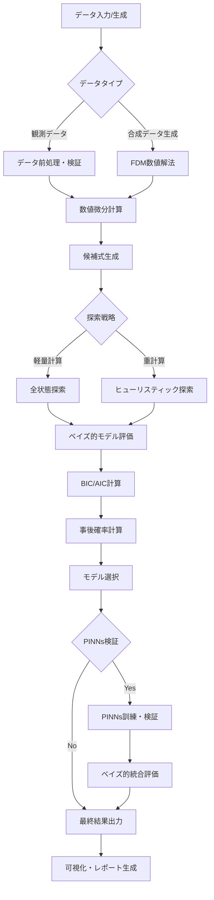
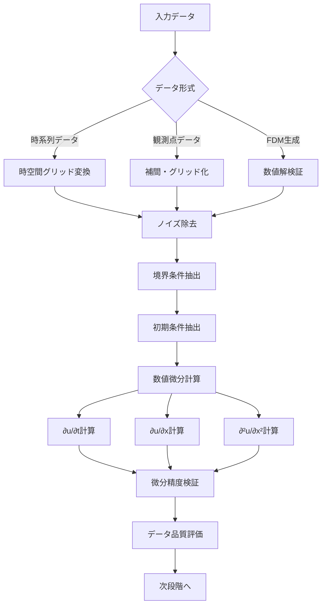
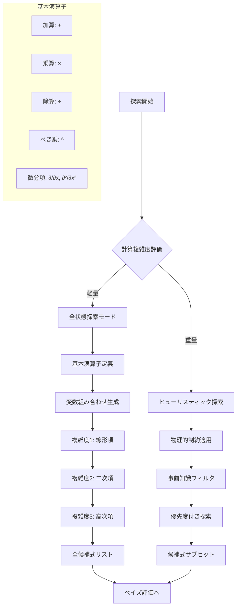

# 偏微分方程式発見システム：ベイズ的モデル選択フローチャート

## 概要

本文書は、偏微分方程式（PDE）発見システムにおけるベイズ的モデル選択手法と複雑度正則化を含む包括的な計算フローチャートを示します。システムは有限差分法（FDM）による疑似データ生成から、物理情報ニューラルネットワーク（PINNs）による方程式発見、そしてベイズ情報量規準（BIC）を用いた最適モデル選択まで、統合的なワークフローを提供します。

## システム全体フローチャート



## 詳細フローチャート

### 1. データ処理・前処理段階



### 2. 候補式生成・探索戦略



### 3. ベイズ的モデル評価システム

```mermaid
flowchart TD
    A[候補式リスト] --> B[各候補式に対して]
    B --> C[パラメータ最適化]
    C --> D[尤度計算]
    D --> E[複雑度ペナルティ]
    
    E --> F[BIC計算]
    E --> G[AIC計算]
    
    F --> H[BIC = -2ln(L) + k×ln(n)]
    G --> I[AIC = -2ln(L) + 2k]
    
    H --> J[モデル重み計算]
    I --> J
    
    J --> K[w_i = exp(-0.5×ΔBIC_i)]
    K --> L[正規化: Σw_i = 1]
    
    L --> M[事後確率計算]
    M --> N[P(M_i|data) = w_i]
    
    N --> O[モデル平均化]
    O --> P[不確実性定量化]
    
    P --> Q[最適モデル選択]
    
    subgraph "評価指標"
        R[尤度: L(θ|data)]
        S[パラメータ数: k]
        T[データ点数: n]
        U[複雑度: C(model)]
    end
```

### 4. 複雑度正則化システム

```mermaid
flowchart TD
    A[候補式] --> B[構造複雑度計算]
    B --> C[演算子数カウント]
    C --> D[変数数カウント]
    D --> E[ネスト深度計算]
    
    E --> F[複雑度スコア]
    F --> G[C = w1×ops + w2×vars + w3×depth]
    
    G --> H[正則化項計算]
    H --> I[λ×C(model)]
    
    I --> J[総合スコア計算]
    J --> K[Score = -ln(L) + λ×C + BIC_penalty]
    
    K --> L[ハイパーパラメータ調整]
    L --> M{交差検証}
    M -->|最適化継続| L
    M -->|収束| N[最終スコア]
    
    N --> O[モデルランキング]
    
    subgraph "複雑度要素"
        P[演算子複雑度]
        Q[項数複雑度]
        R[非線形度]
        S[微分次数]
    end
```

### 5. PINNs統合検証システム

```mermaid
flowchart TD
    A[選択されたモデル] --> B[PINNs構造設計]
    B --> C[物理制約組み込み]
    C --> D[損失関数定義]
    
    D --> E[L = L_data + λ_pde×L_pde + λ_bc×L_bc]
    
    E --> F[ニューラルネットワーク訓練]
    F --> G[収束監視]
    G --> H{収束判定}
    
    H -->|未収束| I[ハイパーパラメータ調整]
    I --> F
    H -->|収束| J[予測精度評価]
    
    J --> K[残差解析]
    K --> L[物理的妥当性検証]
    L --> M[不確実性定量化]
    
    M --> N[ベイズ的統合評価]
    N --> O[P(model|data_fdm, data_pinns)]
    
    O --> P[最終モデル確定]
    
    subgraph "PINNs損失項"
        Q[データ適合: L_data]
        R[PDE残差: L_pde]
        S[境界条件: L_bc]
        T[初期条件: L_ic]
    end
```

## 実装仕様

### ベイズ的モデル選択クラス

```python
class BayesianModelSelector:
    """ベイズ的モデル選択システム"""
    
    def __init__(self, alpha_complexity=0.01, beta_bic=1.0):
        self.alpha = alpha_complexity  # 複雑度ペナルティ重み
        self.beta = beta_bic          # BIC重み
        self.models = []
        self.model_weights = []
        
    def calculate_bic(self, likelihood, n_params, n_data):
        """BIC計算: -2ln(L) + k×ln(n)"""
        return -2 * np.log(likelihood) + n_params * np.log(n_data)
    
    def calculate_aic(self, likelihood, n_params):
        """AIC計算: -2ln(L) + 2k"""
        return -2 * np.log(likelihood) + 2 * n_params
    
    def calculate_model_weights(self, bic_scores):
        """モデル重み計算"""
        delta_bic = bic_scores - np.min(bic_scores)
        weights = np.exp(-0.5 * delta_bic)
        return weights / np.sum(weights)
    
    def exhaustive_search(self, max_complexity=5):
        """全状態探索"""
        # 実装詳細は後述
        pass
    
    def heuristic_search(self, n_candidates=100):
        """ヒューリスティック探索"""
        # 実装詳細は後述
        pass
```

### 複雑度計算システム

```python
class ComplexityCalculator:
    """モデル複雑度計算"""
    
    def __init__(self):
        self.operator_weights = {
            'add': 1, 'mul': 1, 'div': 2, 'pow': 3,
            'sin': 2, 'cos': 2, 'exp': 3, 'log': 3,
            'diff1': 2, 'diff2': 3  # 微分項
        }
    
    def calculate_structural_complexity(self, expression):
        """構造的複雑度計算"""
        # SymPy式の解析
        operators = self._count_operators(expression)
        variables = len(expression.free_symbols)
        depth = self._calculate_depth(expression)
        
        complexity = (
            sum(self.operator_weights.get(op, 1) * count 
                for op, count in operators.items()) +
            0.5 * variables +
            0.3 * depth
        )
        return complexity
    
    def calculate_differential_complexity(self, pde_terms):
        """微分項複雑度計算"""
        complexity = 0
        for term in pde_terms:
            if 'diff1' in term:
                complexity += 2
            if 'diff2' in term:
                complexity += 3
            if 'nonlinear' in term:
                complexity += 2
        return complexity
```

## 使用例・実行フロー

### 基本的な使用例

```python
# 1. データ準備
fdm_solver = DiffusionFDM(L=0.02, T_final=1000, nx=30, nt=50, D=1e-11)
u_data = fdm_solver.solve()

# 2. ベイズ的モデル選択器初期化
selector = BayesianModelSelector(alpha_complexity=0.01, beta_bic=1.0)

# 3. 候補式生成・評価
if computational_cost < threshold:
    candidates = selector.exhaustive_search(max_complexity=4)
else:
    candidates = selector.heuristic_search(n_candidates=50)

# 4. ベイズ評価
results = selector.evaluate_candidates(candidates, u_data)

# 5. 最適モデル選択
best_model = selector.select_best_model(results)

# 6. PINNs検証（オプション）
if use_pinns_validation:
    pinns_result = validate_with_pinns(best_model, u_data)
    final_model = integrate_bayesian_results(results, pinns_result)
else:
    final_model = best_model
```

## 評価指標・出力

### 主要評価指標

1. **ベイズ情報量規準 (BIC)**
   - `BIC = -2ln(L) + k×ln(n)`
   - モデル複雑度と適合度のバランス

2. **赤池情報量規準 (AIC)**
   - `AIC = -2ln(L) + 2k`
   - より寛容な複雑度ペナルティ

3. **事後確率**
   - `P(M_i|data) = exp(-0.5×ΔBIC_i) / Σexp(-0.5×ΔBIC_j)`
   - モデルの相対的確からしさ

4. **複雑度正則化スコア**
   - `Score = MSE + α×Complexity + β×BIC_penalty`
   - 統合的評価指標

### 出力レポート形式

```
=== ベイズ的PDE発見結果 ===

最適モデル: ∂u/∂t = 1.02e-11 × ∂²u/∂x²
事後確率: 0.847
BIC: -2847.3
AIC: -2851.7
複雑度: 3.2

候補モデル比較:
1. ∂u/∂t = c₁×∂²u/∂x²           (P=0.847, BIC=-2847.3)
2. ∂u/∂t = c₁×∂²u/∂x² + c₂×u    (P=0.098, BIC=-2834.1)
3. ∂u/∂t = c₁×∂²u/∂x² + c₂×∂u/∂x (P=0.055, BIC=-2829.8)

不確実性定量化:
- パラメータ信頼区間: D = 1.02e-11 ± 0.05e-11
- モデル不確実性: σ_model = 0.023
- 予測不確実性: σ_pred = 0.031
```

## 計算複雑度・性能考慮

### 全状態探索の適用条件

- 変数数 ≤ 3
- 最大複雑度 ≤ 4
- データ点数 ≤ 1000
- 推定計算時間 ≤ 10分

### ヒューリスティック探索の戦略

1. **物理的制約フィルタ**
   - 次元解析による候補式絞り込み
   - 物理的妥当性チェック

2. **段階的複雑度増加**
   - 複雑度1から順次探索
   - 早期停止条件の適用

3. **遺伝的アルゴリズム**
   - 候補式の交叉・突然変異
   - エリート保存戦略

## 今後の拡張予定

1. **マルチモーダル分布対応**
   - 複数の有力候補モデルの統合
   - モデル平均化による予測

2. **階層ベイズモデル**
   - ハイパーパラメータの不確実性考慮
   - 事前分布の学習

3. **オンライン学習対応**
   - 逐次データ更新
   - リアルタイムモデル選択

4. **分散計算対応**
   - 並列候補式評価
   - GPUアクセラレーション
