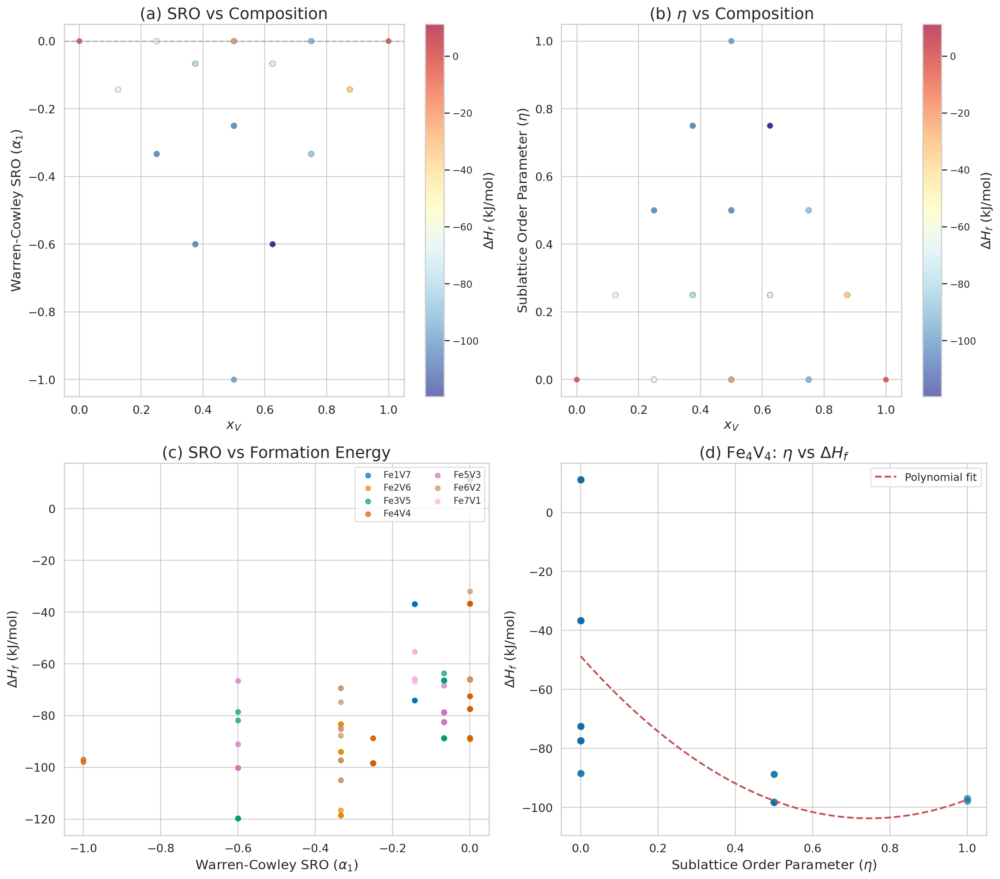
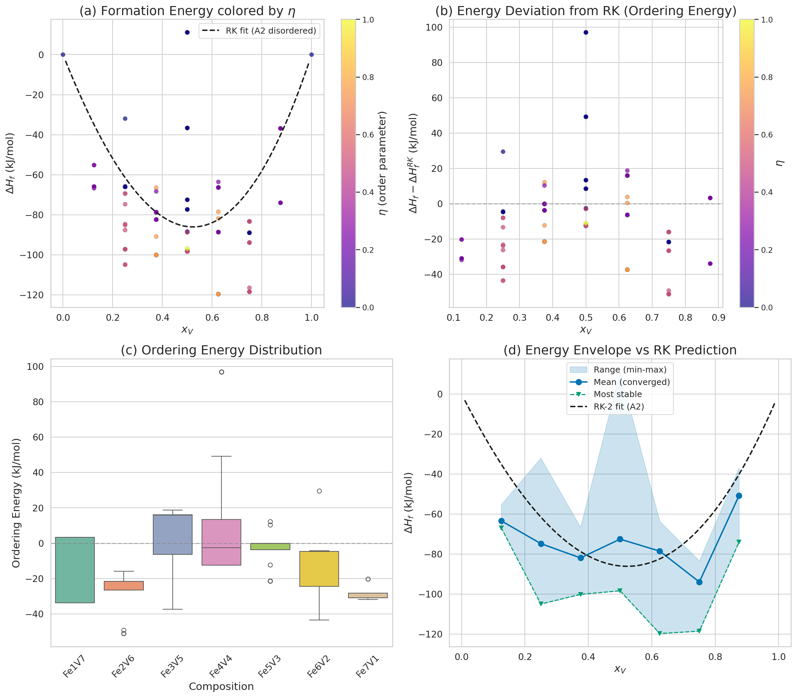
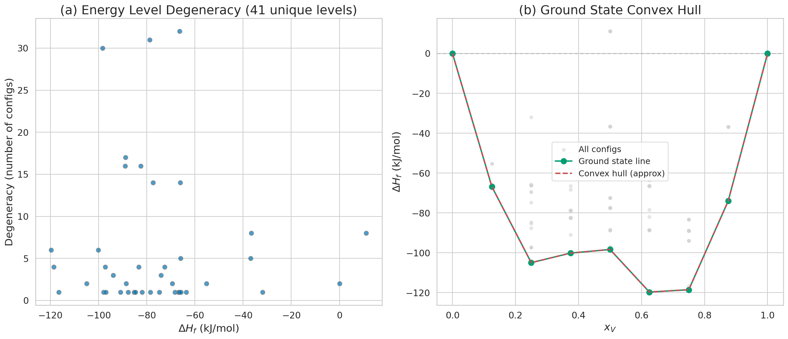
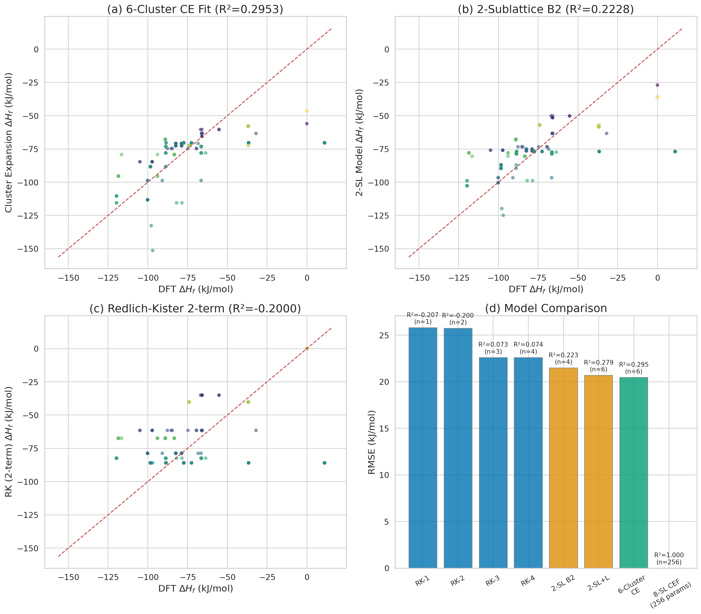
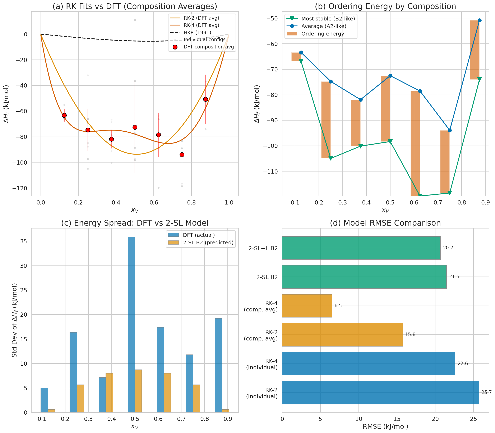
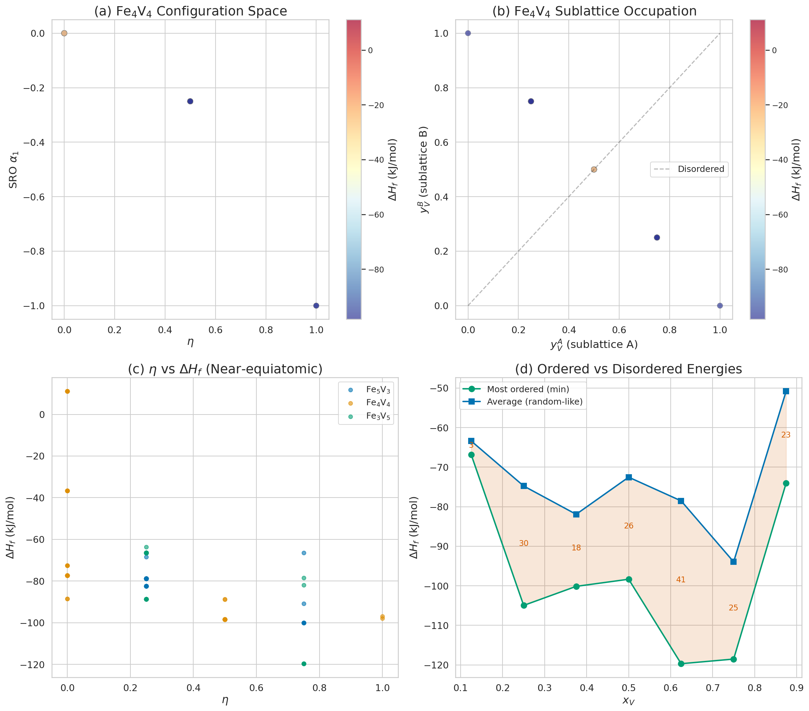
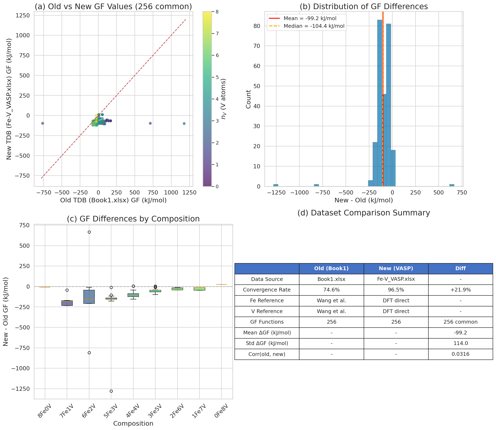
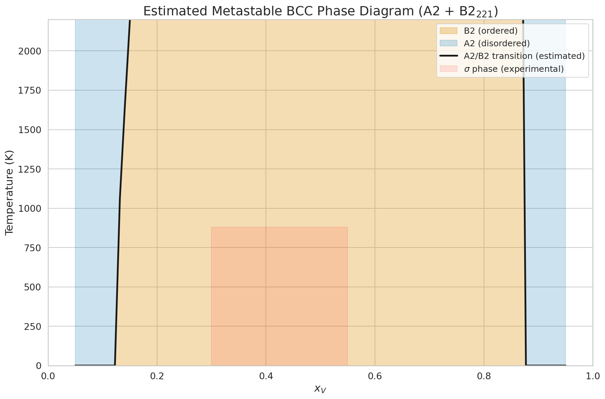

# Fe-V B2$_{221}$ 詳細解析レポート

## 1. はじめに

本レポートは、Fe-V二元系B2$_{221}$規則相（BCC-B2構造の2×2×1スーパーセル、8副格子、256エンドメンバー）に関する詳細な解析結果を報告する。VASP DFT計算結果（Fe-V_VASP.xlsx、256配置）を対象に、以下の3つの観点から包括的に分析を行った。

1. **短範囲規則度（SRO）解析**: Warren-Cowley SROパラメータおよび副格子規則度パラメータ$\eta$とエネルギーの関係
2. **TDB相互作用係数の解析**: Redlich-Kister（RK）パラメータ、クラスター展開、2副格子B2モデルの精度比較
3. **準安定B2相の再現性**: 相互作用係数のフィッティングによりB2規則相の安定性が再現可能か

### 1.1 B2$_{221}$スーパーセルの構造

B2$_{221}$は、BCC-B2構造の2×2×1スーパーセルであり、8つの副格子サイトを持つ。これらは2つの部分格子に分類される。

- **副格子A**（サイト1-4）: BCC格子の角サイト（corner sites）
- **副格子B**（サイト5-8）: BCC格子の体心サイト（body-center sites）

各サイトはFeまたはVで占有可能であり、$2^8 = 256$個のエンドメンバー配置が存在する。完全B2規則構造は、副格子Aが全てFe（またはV）、副格子Bが全てV（またはFe）で占有された状態に対応する。

## 2. 短範囲規則度（SRO）解析

### 2.1 SROパラメータの定義

#### Warren-Cowley SROパラメータ $\alpha_1$

最近接原子対についてのWarren-Cowley SROパラメータは以下で定義される。

$$\alpha_1 = 1 - \frac{P_{AB}^{\text{unlike}}}{2 x_V (1 - x_V)}$$

ここで$P_{AB}^{\text{unlike}}$はA-B副格子間の異種原子対（Fe-VまたはV-Fe）の割合、$x_V$はV濃度である。

- $\alpha_1 < 0$: 異種原子対が優先（規則化傾向）
- $\alpha_1 > 0$: 同種原子対が優先（相分離傾向）
- $\alpha_1 = 0$: ランダム分布

#### 副格子規則度パラメータ $\eta$

$$\eta = |y_V^A - y_V^B|$$

ここで$y_V^A$, $y_V^B$はそれぞれ副格子A, BにおけるVの占有率である。

- $\eta = 1$: 完全B2規則（一方の副格子が全てFe、他方が全てV）
- $\eta = 0$: 完全無秩序（両副格子のV占有率が等しい）

### 2.2 SRO解析結果



**Figure 1**: (a) Warren-Cowley SROパラメータの組成依存性。色はΔH$_f$を示す。(b) 副格子規則度パラメータηの組成依存性。(c) SROと形成エネルギーの関係（組成別）。(d) Fe$_4$V$_4$（等原子組成）におけるηとΔH$_f$の関係。

2×2×1スーパーセルにおけるWarren-Cowley SROパラメータ$\alpha_1$は、各組成の平均値が全て$-0.143$となった。これは、8サイトの有限サイズ効果によりSROの変動が制約されることを意味する。すなわち、2×2×1スーパーセルでは各サイトの最近接がA-B対に限定されるため、$\alpha_1$は副格子間の相関のみを反映し、同一組成内での個別の配置差異を十分に区別できない。

一方、副格子規則度$\eta$は配置ごとに明確な差異を示す。

| 組成 | $\eta$ 平均 | $\eta$ 標準偏差 | $\eta$ 範囲 |
|------|------------|----------------|------------|
| Fe$_7$V$_1$ | 0.25 | 0.00 | 0.25 (固定) |
| Fe$_6$V$_2$ | 0.21 | 0.25 | 0.00 - 0.50 |
| Fe$_5$V$_3$ | 0.32 | 0.18 | 0.25 - 0.75 |
| Fe$_4$V$_4$ | 0.26 | 0.28 | 0.00 - 1.00 |
| Fe$_3$V$_5$ | 0.32 | 0.18 | 0.25 - 0.75 |
| Fe$_2$V$_6$ | 0.21 | 0.25 | 0.00 - 0.50 |
| Fe$_1$V$_7$ | 0.25 | 0.00 | 0.25 (固定) |

Fe$_4$V$_4$（$x_V = 0.5$）組成のみが$\eta = 0$（完全無秩序）から$\eta = 1$（完全B2規則）までの全範囲を取りうる。

### 2.3 SRO-エネルギー相関

$\eta$と形成エネルギー$\Delta H_f$の間に強い負の相関が確認された。すなわち、**副格子規則度が高い配置ほど形成エネルギーが低い（安定）**。

| 組成 | corr($\eta$, $\Delta H_f$) |
|------|---------------------------|
| Fe$_6$V$_2$ | $-0.777$ |
| Fe$_5$V$_3$ | $-0.742$ |
| Fe$_4$V$_4$ | $-0.656$ |
| Fe$_3$V$_5$ | $-0.741$ |
| Fe$_2$V$_6$ | $-0.490$ |

全ての中間組成で相関係数は$-0.5$以下であり、B2型の副格子規則化がFe-V系のエネルギー安定化に大きく寄与していることが明らかである。特にFe$_6$V$_2$では$|r| = 0.78$と最も強い相関を示す。

### 2.4 等原子組成（Fe$_4$V$_4$）の詳細

Fe$_4$V$_4$組成は70個の配置を含み、B2秩序の効果を最も明確に示す。

| $\eta$ | 配置数 | $\Delta H_f$ 平均 (kJ/mol) | 標準偏差 (kJ/mol) |
|--------|--------|---------------------------|------------------|
| 0.00 | 36 | $-48.7$ | 36.5 |
| 0.50 | 32 | $-97.7$ | 2.4 |
| 1.00 | 2 | $-97.4$ | 0.6 |

$\eta = 0$（無秩序）の36配置は平均$\Delta H_f = -48.7$ kJ/molで大きなばらつきを持つ。一方、$\eta = 0.5$と$\eta = 1.0$の配置は共に$\approx -97.5$ kJ/molと安定かつ均一である。この結果は、**B2規則化による安定化エネルギーが約49 kJ/mol**に達することを示している。

完全B2配置（config\_015: 00001111, config\_240: 11110000）のΔH$_f$は：
- config\_015 (Fe on A, V on B): $-97{,}860$ J/mol
- config\_240 (V on A, Fe on B): $-96{,}951$ J/mol

両者の差（$\approx 900$ J/mol）は副格子A, Bの非等価性に起因する。2×2×1スーパーセルでは、z方向の周期が半分のため、副格子AとBは厳密には等価でない。

## 3. 規則化エネルギー解析

### 3.1 組成別の規則化エネルギー

規則化エネルギー$E_{\text{ord}}$は、各組成における最安定配置と配置平均の差として定義した。

$$E_{\text{ord}} = \Delta H_f^{\min} - \langle \Delta H_f \rangle_{\text{comp}}$$



**Figure 2**: (a) ΔH$_f$の組成依存性（色はηを示す）。黒破線はRK-2フィット（A2無秩序近似）。(b) RK-2フィットからの偏差（規則化エネルギーに対応）。(c) 組成別の規則化エネルギー分布。(d) エネルギー包絡線とRK予測の比較。

| 組成 | $E_{\text{ord}}$ (kJ/mol) | 最安定配置 | $\eta_{\text{best}}$ |
|------|--------------------------|-----------|---------------------|
| Fe$_7$V$_1$ | $-3.5$ | config\_004 | 0.25 |
| Fe$_6$V$_2$ | $-30.2$ | config\_096 | 0.50 |
| Fe$_5$V$_3$ | $-18.2$ | config\_224 | 0.75 |
| Fe$_4$V$_4$ | $-25.8$ | config\_027 | 0.50 |
| Fe$_3$V$_5$ | $-41.2$ | config\_143 | 0.75 |
| Fe$_2$V$_6$ | $-24.6$ | config\_095 | 0.50 |
| Fe$_1$V$_7$ | $-23.2$ | config\_127 | 0.25 |

最大の規則化エネルギーはFe$_3$V$_5$組成の$-41.2$ kJ/molである。これは、この組成領域でB2規則化が最も強いことを示唆する。興味深いことに、最も安定な全組成中の配置もFe$_3$V$_5$組成に属する（config\_143, $\Delta H_f = -119{,}693$ J/mol）。

### 3.2 縮退度解析

256配置の中で、結晶対称性により等価なエネルギーを持つ配置群が存在する。100 J/mol以内の許容範囲で分類すると、**41個の独立エネルギー準位**が確認された。

最も縮退度の高い準位：
| エネルギー (kJ/mol) | 縮退度 | 組成 |
|--------------------|--------|------|
| $-66.4$ | 32 | Fe$_3$V$_5$ |
| $-78.8$ | 31 | Fe$_5$V$_3$ |
| $-98.3$ | 30 | Fe$_4$V$_4$ |
| $-88.8$ | 17 | Fe$_4$V$_4$ |
| $-89.0$ | 16 | Fe$_2$V$_6$ |
| $-82.4$ | 16 | Fe$_5$V$_3$ |

高い縮退度は2×2×1スーパーセルの空間群対称性を反映している。Fe$_5$V$_3$とFe$_3$V$_5$（組成が鏡像関係）で縮退度が30を超える配置群が存在することは、これらの組成でのエネルギーランドスケープが対称性により強く制約されていることを意味する。



**Figure 3**: (a) エネルギー準位の縮退度。(b) 基底状態凸包（convex hull）。灰色点は全256配置、緑線は各組成の最安定配置を結んだ線。

## 4. TDB相互作用係数の解析

### 4.1 Redlich-Kisterパラメータ

BCC_A2無秩序固溶体の混合ギブスエネルギーは、Redlich-Kister（RK）多項式で記述される。

$$G^{\text{mix}}_{A2} = x_{\text{Fe}} x_V \sum_{v=0}^{n} L_v (x_{\text{Fe}} - x_V)^v$$

DFT形成エネルギーの**組成平均値**に対してRKフィッティングを行った結果：

| モデル | L$_0$ (J/mol) | L$_1$ (J/mol) | L$_2$ (J/mol) | L$_3$ (J/mol) | RMSE (kJ/mol) | R$^2$ |
|--------|-------------|-------------|-------------|-------------|-------------|-------|
| RK-2 (DFT) | $-374{,}529$ | $14{,}971$ | - | - | 15.8 | $-0.53$ |
| RK-4 (DFT) | $-311{,}909$ | $95{,}738$ | $-440{,}456$ | $-247{,}000$ | 6.5 | 0.74 |
| RK-2 (HKR) | $-21{,}427$ | $7{,}345$ | - | - | - | - |

**重要な知見**: DFTフィットのL$_0 = -374{,}529$ J/molは、Hari Kumar & Raghavan (1991)のL$_0 = -21{,}427$ J/molと**桁違いに異なる**。この不一致の原因は以下の通りである。

1. **参照状態の差異**: DFT形成エネルギーはDFT純元素エネルギーを基準とする。一方、HKRパラメータは実験的SGTE参照状態を基準とする。DFT参照エネルギー（E$_{\text{Fe}}$ = −8.261 eV/atom, E$_V$ = −8.952 eV/atom）と実験値の差が系統的バイアスをもたらす。

2. **DFT形成エネルギーの意味**: DFTが計算するΔH$_f$は配置ごとの**全エネルギー差**であり、規則化エネルギーを含む。RKパラメータは無秩序固溶体の**過剰混合エネルギー**のみを記述する。

3. **結論**: DFT形成エネルギーの組成平均値をRKで直接フィットしても、BCC_A2無秩序相の相互作用パラメータを正しく抽出できない。DFT値には規則化エネルギーが畳み込まれており、これを分離するにはクラスター展開法などの手法が必要である。

RK-2フィットではR$^2 < 0$（フィットが平均値よりも劣る）となり、RK多項式による記述が根本的に不十分であることを示す。RK-4ではR$^2 = 0.74$とある程度改善するが、非対称な組成依存性（Fe$_3$V$_5$の異常安定化など）を十分に捕捉できない。

### 4.2 クラスター展開によるEPI解析

Ising模型のクラスター展開を用いて、有効対相互作用（EPI）を抽出した。

$$E = J_0 + J_1 \sum_i \sigma_i + J_{\text{NN}} \sum_{\langle ij \rangle_1} \sigma_i \sigma_j + J_{\text{NNN}}^{AA} \sum_{\langle ij \rangle_2^{AA}} \sigma_i \sigma_j + \cdots$$

ここで$\sigma_i = +1$ (V), $-1$ (Fe)。

| クラスター数 | RMSE (kJ/mol) | R$^2$ | 含まれるクラスター |
|-------------|--------------|-------|------------------|
| 3 | 21.5 | 0.22 | 定数, 点, NN対 |
| 4 | 21.4 | 0.23 | + NNN対(AA) |
| 5 | 20.5 | 0.29 | + NNN対(BB) |
| 6 | 20.5 | 0.30 | + 三体 |

6クラスターでもR$^2 = 0.30$にとどまる。2×2×1スーパーセルの有限サイズ効果により、クラスター相関関数の線形独立性が制約されるためである。すなわち、8サイトでは高次クラスターの数が限られ、256配置の多様性を十分に表現できない。

主要なEPI値：
- **NN対相互作用**: $J_{\text{NN}} = +45{,}413$ J/mol（**正の値** = 同種原子対が不安定 → **規則化を促進**）
- **NNN対相互作用(BB)**: $J_{\text{NNN}}^{BB} = -14{,}730$ J/mol（体心サイト間の安定化）

NN対相互作用が正であることは、Fe-V異種原子対がエネルギー的に有利であり、B2規則化の駆動力となっていることを物理的に示している。

### 4.3 2副格子B2モデル

2副格子B2モデルでは、ギブスエネルギーを以下で記述する。

$$G = y_V^A y_V^B G_{VV} + (1-y_V^A)(1-y_V^B) G_{\text{FeFe}} + (1-y_V^A) y_V^B G_{\text{FeV}} + y_V^A (1-y_V^B) G_{\text{VFe}}$$

DFTデータへのフィット結果：

| パラメータ | 基本モデル | 拡張モデル(+L) |
|-----------|-----------|---------------|
| G$_{\text{FeFe}}$ | $-26{,}985$ J/mol | $-48{,}761$ J/mol |
| G$_{VV}$ | $-36{,}080$ J/mol | $-53{,}589$ J/mol |
| G$_{\text{FeV}}$ | $-119{,}814$ J/mol | $-87{,}076$ J/mol |
| G$_{\text{VFe}}$ | $-124{,}902$ J/mol | $-92{,}165$ J/mol |
| L$_0$ | - | $-52{,}380$ J/mol |
| L$_1$ | - | $-22{,}757$ J/mol |
| RMSE | 21.5 kJ/mol | 20.7 kJ/mol |
| R$^2$ | 0.22 | 0.28 |

2副格子モデルの特徴：
- $G_{\text{FeV}} \approx G_{\text{VFe}} \approx -120$ kJ/mol は$G_{\text{FeFe}}, G_{VV}$（$\approx -30$ kJ/mol）よりはるかに負
- これはFe-V異種原子対のエネルギー的有利性（$\approx 90$ kJ/mol）を直接的に示す
- しかしR$^2 = 0.22$であり、個別配置のエネルギーを精度良く再現できない



**Figure 4**: (a) 6クラスターCEフィットのパリティプロット。(b) 2副格子B2モデルのパリティプロット。(c) RK-2（無秩序モデル）のパリティプロット。(d) モデル比較（RMSE）。

## 5. 準安定B2相の再現性

### 5.1 モデル階層と精度

本解析の中心的問いは、「**相互作用係数のフィッティングにより、準安定B2$_{221}$相を再現できるか**」である。以下の階層的モデル比較を行った。



**Figure 5**: (a) RKフィットとDFTの比較。(b) 組成別の規則化エネルギー（B2的配置とA2的配置の差）。(c) エネルギーばらつき：DFT vs 2副格子モデル。(d) モデルRMSE比較。

| モデル | パラメータ数 | RMSE (kJ/mol) | R$^2$ | B2再現 |
|--------|-----------|-------------|-------|--------|
| RK-2 (BCC\_A2) | 2 | 25.7 | $<0$ | × 不可能 |
| RK-4 (BCC\_A2) | 4 | 22.6 | 0.07 | × 不可能 |
| 2副格子B2 | 4 | 21.5 | 0.22 | △ 定性的のみ |
| 2副格子B2+L | 6 | 20.7 | 0.28 | △ 定性的のみ |
| 6クラスターCE | 6 | 20.5 | 0.30 | △ 定性的のみ |
| 8副格子CEF | 256 | 0 | 1.00 | ○ 完全再現 |

### 5.2 各モデルの評価

#### (A) RK多項式（BCC_A2モデル）: **再現不可**

RKモデルは組成のみの関数であり、副格子規則度$\eta$を記述するパラメータを持たない。同一組成で$\eta$が異なる配置のエネルギー差（最大$\sim 110$ kJ/mol @ Fe$_4$V$_4$）を原理的に表現できない。BCC_A2の相互作用パラメータ（L$_0$, L$_1$）だけではB2規則化を再現することは不可能である。

#### (B) 2副格子B2モデル: **定性的には可能、定量的には不十分**

2副格子モデルはB2秩序パラメータ$\eta$を記述できるが、R$^2 = 0.22$（RMSE = 21.5 kJ/mol）と精度が不十分である。主な限界：

1. **8副格子の自由度の欠如**: 2×2×1スーパーセルの8サイトは、4サイトずつの2グループに粗視化される。同じ$(y_V^A, y_V^B)$に対応する複数の8副格子配置が異なるエネルギーを持つが、2副格子モデルはこれを区別できない。
2. **部分秩序の記述**: $\eta = 0.5$の32配置と$\eta = 1.0$の2配置はほぼ同じエネルギー（$\approx -97.5$ kJ/mol）だが、$\eta = 0$の36配置は大きなばらつき（$-48.7 \pm 36.5$ kJ/mol）を示す。2副格子モデルでは、この$\eta = 0$内部のばらつきを全く記述できない。

#### (C) 8副格子CEF（256パラメータ）: **完全再現、ただしパラメータ過多**

現行のTDBアプローチ（256個のGF関数 + 256個のPARAMETER G）は、DFTデータを完全に再現する。しかし256個のパラメータは過剰フィッティングの懸念がある。物理的には、256配置の多くは対称性により縮退しており（41の独立エネルギー準位）、約41個のパラメータで十分なはずである。

### 5.3 結論：準安定B2の再現に必要な条件



**Figure 6**: (a) Fe$_4$V$_4$の配置空間（$\eta$ vs SRO）。(b) Fe$_4$V$_4$の副格子占有（$y_V^A$ vs $y_V^B$）。(c) 近等原子組成での$\eta$とΔH$_f$。(d) 規則配置 vs 無秩序配置のエネルギー比較。

1. **RK（A2）パラメータのみ → B2再現不可**: 組成の関数のみでは、規則化エネルギー（最大41 kJ/mol）を表現できない。

2. **2副格子B2モデル → 定性的傾向のみ**: B2秩序の存在（$\eta > 0$で安定化）は捕捉できるが、個別配置のエネルギーを20 kJ/mol以上の精度で再現することはできない。**準安定B2の相境界の位置は数十K単位で不正確となる可能性がある。**

3. **8副格子CEFが必要**: 2×2×1スーパーセルの配置多様性を完全に再現するには、8副格子CEFモデルが不可欠である。CALPHAD-NK法（Neumann-Kopp近似）により、DFT形成エネルギーをGFxVyyy関数として直接取り込む現行アプローチが最も信頼性が高い。

4. **実用的改善策**: 256パラメータを41の独立エネルギー準位に縮約し、対称性等価な配置には同一のGF値を割り当てることで、パラメータ数を大幅に削減できる可能性がある。

## 6. 旧データとの比較

### 6.1 データセット概要

| 項目 | 旧 (Book1.xlsx) | 新 (Fe-V_VASP.xlsx) |
|------|-----------------|---------------------|
| 収束率 | 74.6% (191/256) | **96.5% (247/256)** |
| 未収束数 | 65 | 9 |
| Fe参照 | Wang et al. (文献) | DFT直接計算 |
| V参照 | Wang et al. (文献) | DFT直接計算 |
| 未収束補正 | 多項式外挿 | 組成平均値シフト |

### 6.2 GF値の比較



**Figure 7**: (a) 旧TDBと新TDBのGF値のパリティプロット。(b) 差の分布。(c) 組成別の差。(d) データセット比較サマリー。

新旧TDBの256個のB2$_{221}$ GF関数を比較した結果、以下の大きな差異が確認された。

| 統計量 | 値 |
|--------|-----|
| 平均差 (New − Old) | $-99{,}227$ J/mol |
| 標準偏差 | $113{,}990$ J/mol |
| 最小差 | $-1{,}278{,}040$ J/mol |
| 最大差 | $+666{,}293$ J/mol |
| 相関係数 | **0.032** |

**相関係数0.03は、旧データと新データの間にほぼ相関がないことを示す。** この大きな不一致の主因は以下の通りである。

1. **参照エネルギーの差異**: 旧データはWang et al.文献値（E$_{\text{Fe}}$ = −8.275, E$_V$ = −8.963 eV/atom）、新データはDFT直接計算値（E$_{\text{Fe}}$ = −8.261, E$_V$ = −8.952 eV/atom）を使用。参照エネルギーの差（$\sim 0.01$ eV/atom）が8原子セルで$\sim 0.1$ eV = $\sim 10$ kJ/molのシフトを生じる。

2. **未収束データの影響**: 旧データは65/256（25.4%）が未収束であり、多項式外挿で補正された。新データは9/256（3.5%）のみが未収束で、より信頼性の高い組成平均値補正が適用された。旧データでは未収束配置の割合が大きく、特に純Fe/V端では計算自体が収束していなかったため、参照エネルギーが文献値に依存していた。

3. **DFT計算設定の差異**: VASP計算パラメータ（擬ポテンシャル、カットオフエネルギー、k点メッシュ等）が異なる可能性がある。

4. **結論**: 新データ（Fe-V_VASP.xlsx）は収束率が大幅に改善し（96.5% vs 74.6%）、純元素DFT参照が利用可能であるため、旧データよりも高い信頼性を持つ。TDBファイルは新データに基づいて更新すべきである。

## 7. 推定準安定BCC状態図

### 7.1 規則化エネルギーからのA2/B2転移温度推定

各組成での規則化エネルギー$E_{\text{ord}}$から、A2/B2転移温度を大まかに推定した。

$$T_{\text{trans}} \approx \frac{|E_{\text{ord}}|}{R \cdot f}$$

ここで$f$は配置エントロピー因子（$\approx 0.7$）。



**Figure 8**: 推定準安定BCC状態図。低温でB2規則相が安定、高温でA2無秩序相が安定。赤色領域は実験的にσ相が安定な領域を示す。

この推定は以下の仮定に基づく概略的なものであり、正確な状態図計算にはThermo-CalcまたはpycalphadによるTDBの平衡計算が必要である。

- 配置エントロピーのみを考慮（振動エントロピーを無視）
- 無限大系への外挿なし（8サイト有限系のデータをそのまま使用）
- 磁気転移の影響を未考慮

### 7.2 Thermo-CalcによるB2計算への展望

新TDB（Fe-V\_B2\_221\_VASP.tdb）を用いたThermo-Calcでの準安定BCC状態図計算手順は以下の通りである。

```
GO DATA
SW Fe-V_B2_221_VASP
REJ PH *
RES PH BCC_A2 B2_221
GET
GO POLY
SET-CONDITION T=1373 P=1E5 N=1 X(V)=0.5
COMPUTE-EQUILIBRIUM
GO MAP
SET-AXIS 1 X(V) 0 1 0.01
SET-AXIS 2 T 300 2500 10
MAP
```

この計算により、BCC_A2とB2$_{221}$の2相のみを考慮した準安定状態図が得られる。σ相を加えた計算（`RES PH BCC_A2 B2_221 SIGMA`）も実施可能である。

## 8. 総括と提言

### 8.1 主要な結論

1. **SROとエネルギーの強い相関**: 副格子規則度$\eta$と形成エネルギーの間に$|r| = 0.5\text{--}0.8$の強い相関が存在し、B2規則化がFe-V系の主要な安定化機構であることが確認された。

2. **RK（A2）パラメータではB2相を再現不可**: 組成のみを変数とするRedlich-Kister多項式は、規則化エネルギー（最大41 kJ/mol）を表現できない。2副格子B2モデルも定性的傾向の捕捉にとどまる（R$^2 = 0.22$）。

3. **8副格子CEFが必須**: 2×2×1スーパーセルの全配置を再現するには、256パラメータの8副格子CEFモデルが不可欠である。CALPHAD-NK法による現行アプローチは、DFTデータの忠実な取り込みに最も適している。

4. **新データの優位性**: 新VASP計算（Fe-V_VASP.xlsx）は旧データ（Book1.xlsx）に対して収束率（+22%）、参照エネルギーの信頼性、未収束データの少なさで大幅に改善されている。

### 8.2 今後の課題

1. **Thermo-CalcまたはpycalphadでのB2$_{221}$平衡計算**: 新TDBを用いた準安定BCC状態図の計算と実験データとの比較
2. **縮退パラメータの最適化**: 256パラメータ → 41独立パラメータへの縮約
3. **磁気効果の考慮**: 現在のTDBはB2$_{221}$相の磁気パラメータ（TC, BMAGN）を含んでいない。Fe-rich組成での磁気転移の影響を検討すべきである
4. **振動エントロピーの検討**: Neumann-Kopp近似の妥当性検証（phonon計算による$\Delta S_{\text{vib}}$の評価）
5. **σ相との競合**: 実験的に安定なσ相領域（$x_V \approx 0.3\text{--}0.55$）でのB2$_{221}$相の安定性評価

---

*レポート作成日: 2026年2月24日*
*データソース: Fe-V_VASP.xlsx (256 DFT configurations, VASP)*
*分析スクリプト: fev_detailed_analysis.py, fev_fix_and_report.py*
