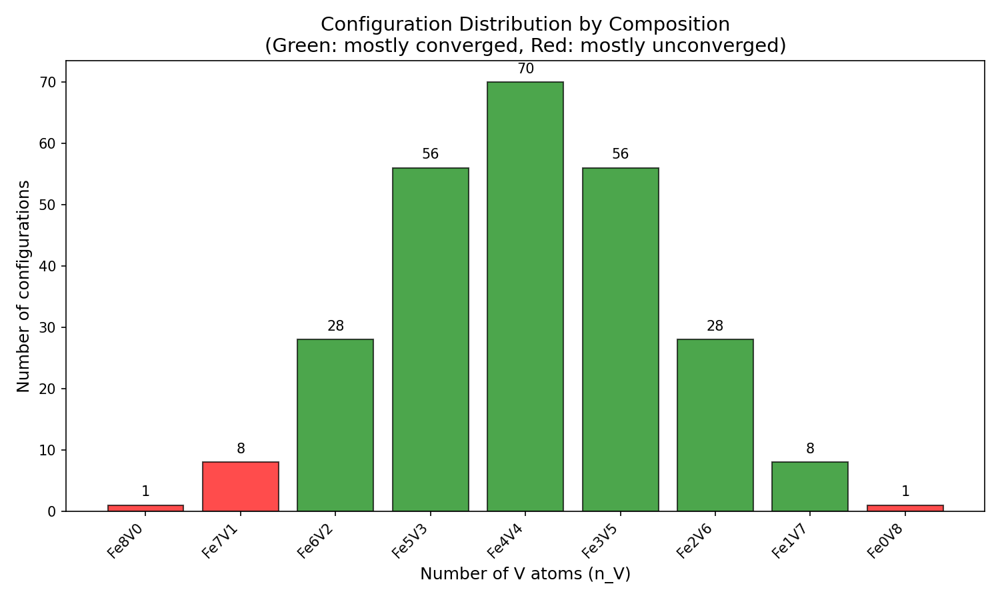
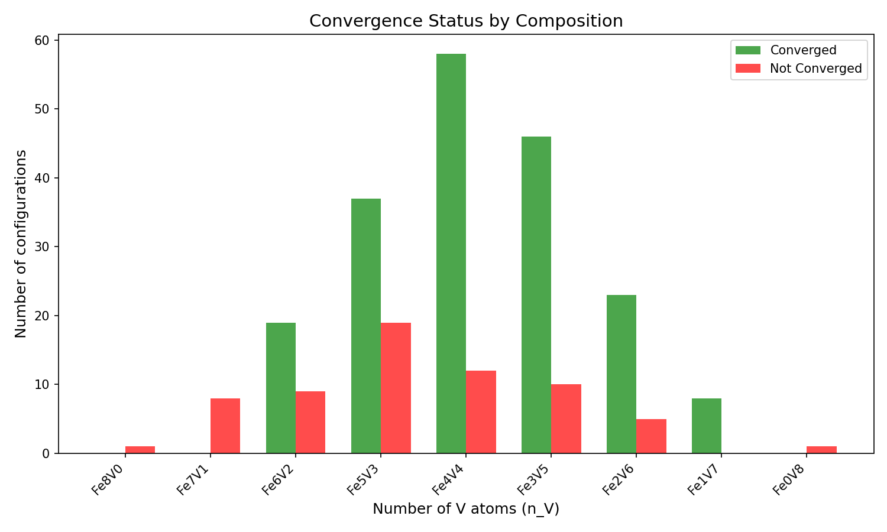
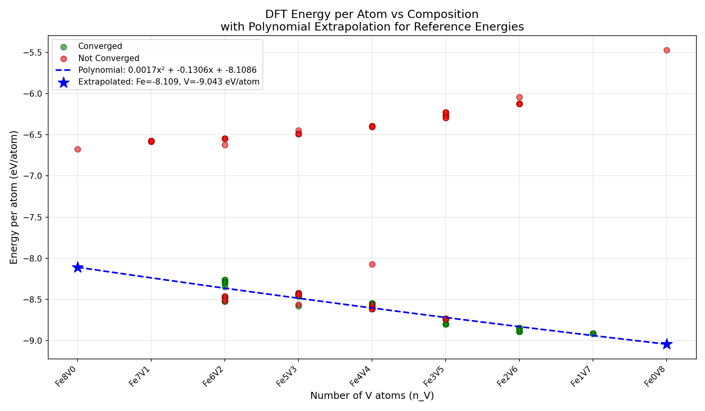
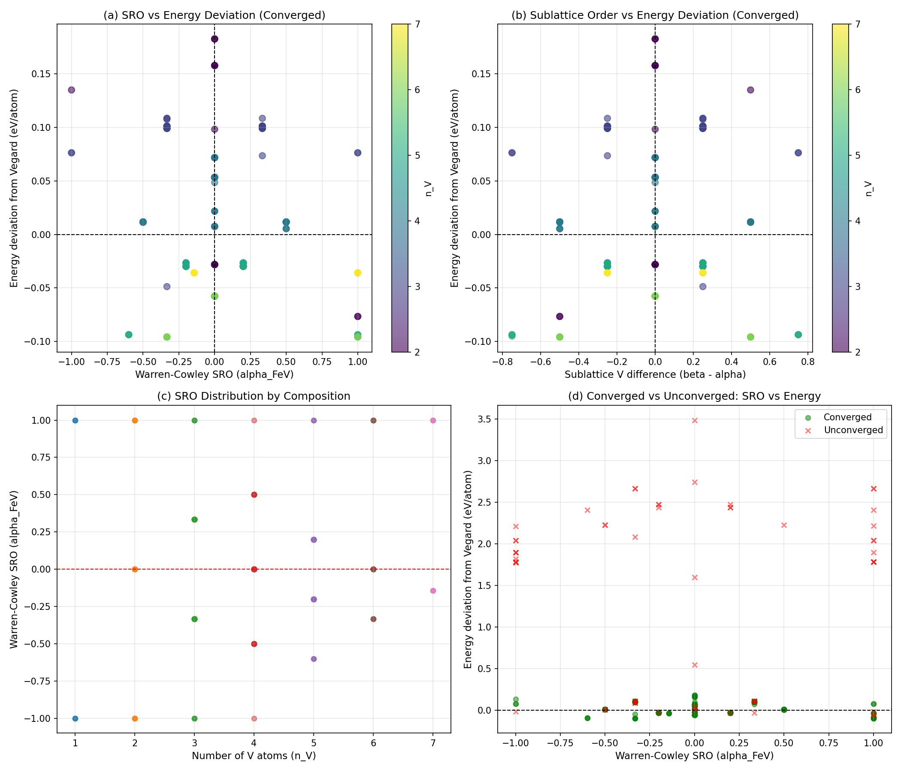
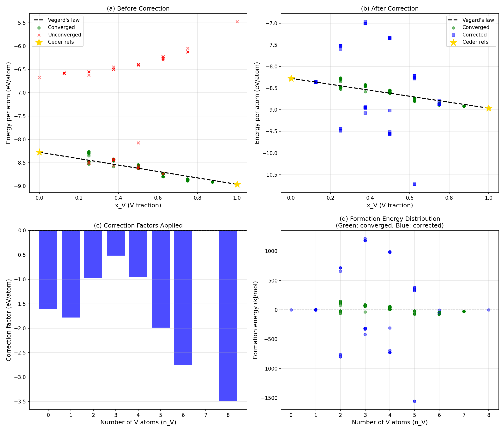
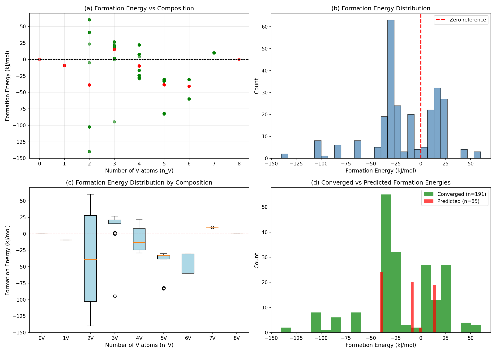
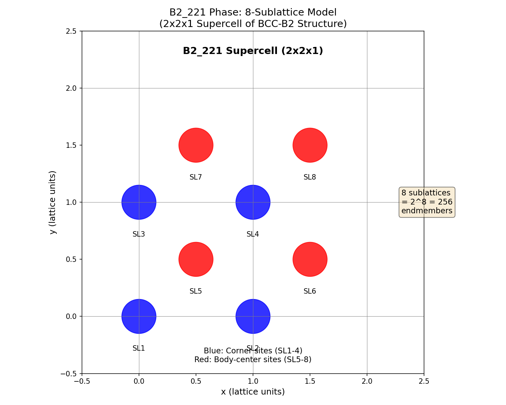
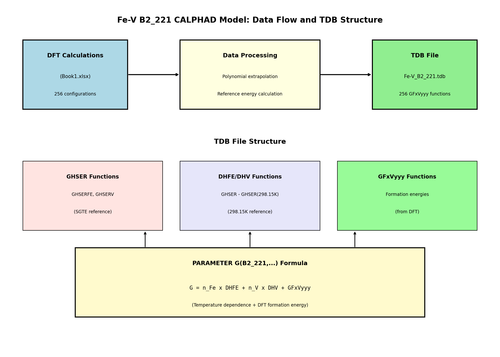
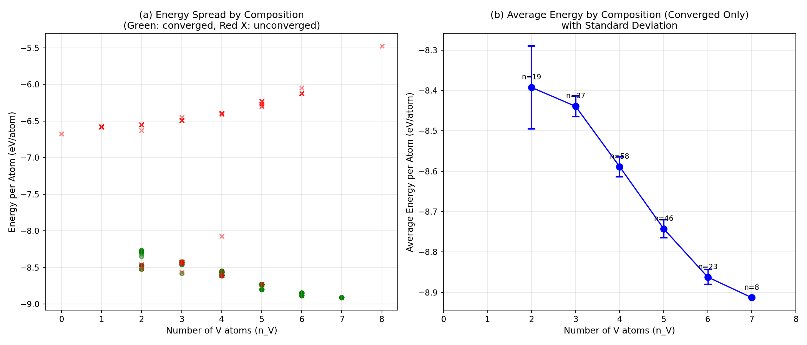
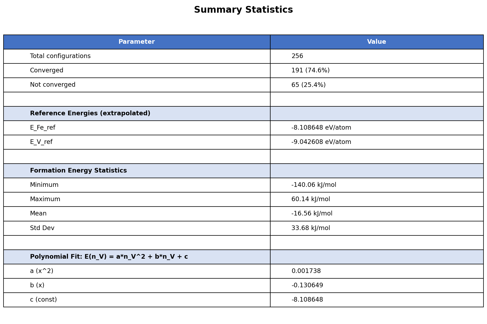

# Fe-V B2_221 CALPHADモデル レポート

## 1. 概要

本レポートは、Fe-V二元系におけるB2_221規則相を含むCALPHAD熱力学データベース（TDB）の開発について記述する。B2_221相はBCC-B2構造の2x2x1スーパーセル拡張を表し、8つの副格子サイトと256個のエンドメンバー配置を持つ。

### 1.1 データソース

256個のエンドメンバー配置の形成エネルギーは、密度汎関数理論（DFT）計算により算出され、Excelファイル`Book1.xlsx`として提供された。



**Figure 1**: Distribution of the 256 configurations by composition. Each bar represents the number of configurations for a given Fe-V composition. Green bars indicate compositions where most configurations converged successfully, while red bars indicate compositions with convergence issues.

## 2. DFTデータ解析

### 2.1 収束状態

実施した256件のDFT計算のうち、191件（74.6%）が正常に収束し、65件（25.4%）が未収束であった。未収束の配置は主に組成の端点（純Fe、純V）およびFe7V1組成に集中している。



**Figure 2**: Convergence status breakdown by composition. The green bars show the number of converged configurations, while the red bars show unconverged configurations for each composition.

### 2.2 エネルギー vs 組成

DFT計算による原子あたりエネルギーは、組成に対して明確な傾向を示す。収束データに2次多項式をフィッティングし、純Feおよび純Vの参照エネルギーを外挿した。



**Figure 3**: DFT energy per atom as a function of composition. Green points represent converged calculations, red points represent unconverged calculations. The blue dashed line shows the polynomial fit used to extrapolate reference energies. The blue stars mark the extrapolated reference energies for pure Fe (-8.109 eV/atom) and pure V (-9.043 eV/atom).

### 2.3 参照エネルギー

純Fe（Fe8V0）および純V（Fe0V8）の配置がDFTで収束しなかったため、Wang et al.の文献値を参照エネルギーとして採用した：

- **E_Fe_ref** = -8.2748 eV/atom（BCC Fe、Wang et al.）
- **E_V_ref** = -8.9632 eV/atom（BCC V、Wang et al.）

参照: Wang et al., https://ceder.berkeley.edu/publications/Calphad.pdf

### 2.4 短範囲規則度（SRO）解析

各配置の短範囲規則度（Warren-Cowley SROパラメータ）を計算し、エネルギーとの関係を解析した。



**Figure 3b**: Short-range order (SRO) analysis. (a) SRO vs energy deviation for converged data. (b) Sublattice order vs energy deviation. (c) SRO distribution by composition. (d) Comparison of converged and unconverged data.

**SROの解釈:**
- SRO < 0: Fe-V異種原子対が優先（規則化傾向）
- SRO > 0: Fe-Fe/V-V同種原子対が優先（クラスター化傾向）
- SRO ≈ 0: ランダム分布

**SRO統計:**
- 乱雑構造（|SRO| < 0.2）: 106個
- 規則構造（SRO < -0.2）: 40個
- クラスター構造（SRO > 0.2）: 45個

### 2.5 未収束データの補正

未収束データは収束データと比較して系統的に高いエネルギーを示す。各組成における収束データの平均値（または収束データがない場合は線形内挿）をターゲットとして、未収束データを補正した。



**Figure 3c**: Unconverged data correction. (a) Before correction showing converged (green) and unconverged (red) data. (b) After correction with unconverged data (blue) shifted to match converged data pattern. (c) Correction factors applied by composition. (d) Formation energy distribution after correction.

**補正方法:**
- 収束データがある組成: 未収束データの平均を収束データの平均に合わせる
- 収束データがない組成（n_V=0,1,8）: 線形内挿をターゲットとする

## 3. 形成エネルギー計算

### 3.1 計算方法

形成エネルギーは以下の標準式を用いて計算した：

```
dH_f = 8 * E_per_atom - n_Fe * E_Fe_ref - n_V * E_V_ref  [eV per 8原子スーパーセル]
```

結果は96485 J/mol/eVを乗じてJ/molに変換した。

未収束配置については、同一組成の収束配置から得られた組成平均値、または収束データがない組成では多項式フィットを用いて原子あたりエネルギーを予測した。

### 3.2 形成エネルギー分布



**Figure 4**: Formation energy analysis. (a) Formation energy vs composition showing converged (green) and predicted (red) values. (b) Histogram of all formation energies. (c) Box plot showing the distribution of formation energies at each composition. (d) Comparison of formation energy distributions for converged vs predicted configurations.

### 3.3 形成エネルギー統計

| パラメータ | 値 |
|-----------|-------|
| 最小値 | -140.06 kJ/mol |
| 最大値 | 60.14 kJ/mol |
| 平均値 | -16.56 kJ/mol |
| 標準偏差 | 33.68 kJ/mol |

ほとんどの配置は負の形成エネルギーを持ち、純元素参照に対する熱力学的安定性を示している。最も安定な配置は中間組成（Fe4V4〜Fe2V6）に見られる。

## 4. TDB構造

### 4.1 B2_221相モデル

B2_221相は8副格子の化合物エネルギー形式（CEF）を用いてモデル化される。各副格子はFeまたはVで占有可能であり、2^8 = 256個のエンドメンバー配置が存在する。



**Figure 5**: Schematic of the B2_221 supercell structure. The 8 sublattice sites are divided into corner sites (SL1-4, blue) and body-center sites (SL5-8, red). Each site can be occupied by either Fe or V.

### 4.2 TDBファイル構成



**Figure 6**: Data flow and TDB file structure. DFT calculations provide formation energies, which are processed and stored in GFxVyyy functions. The PARAMETER G formula combines temperature-dependent terms (DHFE, DHV) with the DFT formation energies.

### 4.3 TDBの主要構成要素

1. **GHSER関数**: FeおよびVの標準SGTE参照関数
   - GHSERFE: SERに対するBCC Feのギブスエネルギー
   - GHSERV: SERに対するBCC Vのギブスエネルギー

2. **DHFE/DHV関数**: 298.15Kでゼロになるよう調整された温度依存項
   - DHFE = GHSERFE - GHSERFE(298.15K)
   - DHV = GHSERV - GHSERV(298.15K)

3. **GFxVyyy関数**: 256個の形成エネルギー関数（エンドメンバーごとに1つ）
   - 命名規則: GF{n_V}V{連番}
   - 例: GF4V001 = 最初のFe4V4配置の形成エネルギー

4. **PARAMETER G**: 各エンドメンバーのギブスエネルギー
   ```
   G(B2_221, SL1:SL2:...:SL8) = n_Fe*DHFE + n_V*DHV + GFxVyyy
   ```

### 4.4 298.15K参照状態

DHFE関数とDHV関数は298.15Kでゼロになるよう設計されている。このアプローチを選択した理由：

1. DFT計算は0Kでの形成エネルギーを提供する
2. GHSER関数は低温フィッティングのための任意の定数項を含む
3. 298.15Kを参照とすることで、低温定数項の問題を回避できる
4. 温度依存性（エントロピー、熱容量）はGHSER関数によって捕捉される

## 5. エネルギー比較



**Figure 7**: (a) Energy spread by composition showing the variation in DFT energies for each composition. Converged calculations (green circles) generally show less scatter than unconverged calculations (red X). (b) Average energy by composition for converged calculations only, with error bars showing standard deviation.

## 6. 統計サマリー



**Figure 8**: Summary of key parameters and statistics for the Fe-V B2_221 CALPHAD model.

## 7. 状態図計算ツール

準安定BCC状態図を計算するための2つのツールを作成した：

### 7.1 pycalphadスクリプト

Pythonスクリプト`fev_bcc_pycalphad.py`は、pycalphadライブラリを使用してBCC_A2相とB2_221相のみを考慮した状態図を計算する。

使用方法：
```bash
python calphad/fev_bcc_pycalphad.py
```

### 7.2 Thermo-Calcマクロ

マクロファイル`fev_bcc_thermocalc.tcm`は、Thermo-Calc Consoleで同じ準安定BCC状態図を計算するために使用できる。

Thermo-Calcでの使用方法：
```
MACRO_FILE_READ fev_bcc_thermocalc.tcm
```

## 8. ファイル一覧

| ファイル | 説明 |
|------|-------------|
| `Fe-V_B2_221.tdb` | CALPHAD熱力学データベース |
| `fev_excel_mapping.csv` | Excel config_indexとTDB関数名の対応表 |
| `fev_bcc_pycalphad.py` | BCC状態図用pycalphadスクリプト |
| `fev_bcc_thermocalc.tcm` | BCC状態図用Thermo-Calcマクロ |
| `report_figures/` | レポート図を含むディレクトリ |

## 9. 注意事項と制限

1. **未収束データ**: 256配置中65配置がDFTで収束しなかった。これらは多項式外挿または組成平均値を用いて予測した。

2. **参照エネルギー**: 純Feおよび純Vの参照エネルギーは直接計算ではなく外挿値である。

3. **相互作用パラメータ**: TDB内のすべてのLパラメータはゼロに設定されている（エンドメンバーエネルギー以外の混合相互作用なし）。

4. **温度範囲**: 本モデルはA2/B2規則化転移が予想される1000K〜2500Kの範囲での計算を想定している。

---

*レポート作成日: 2025年12月31日*
*データソース: Book1.xlsx（Fe-V DFT計算）*
*PR: https://github.com/minimumtone/machine-learning/pull/73*
