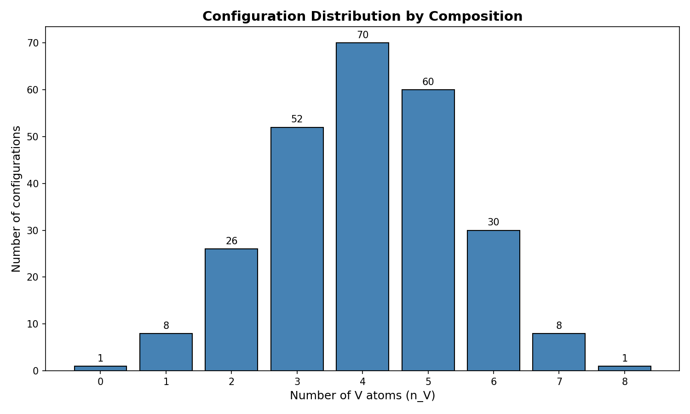
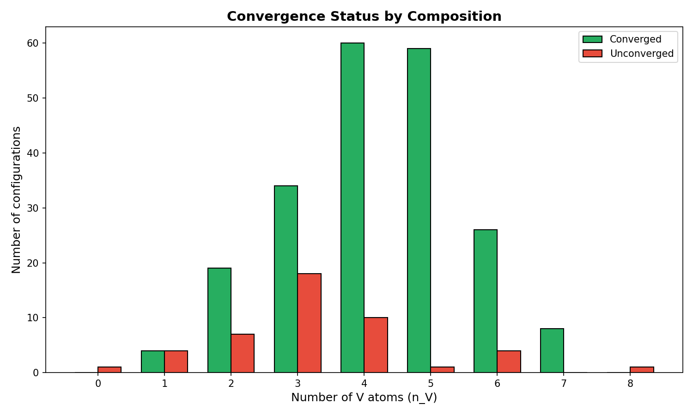
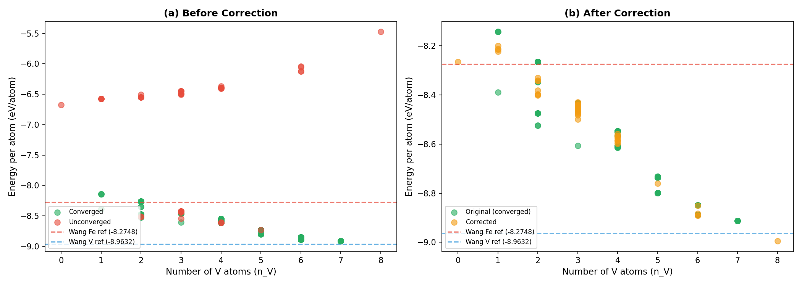
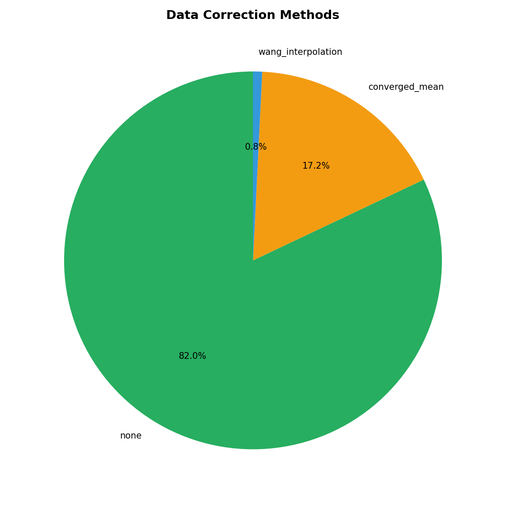
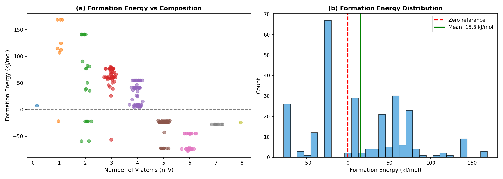
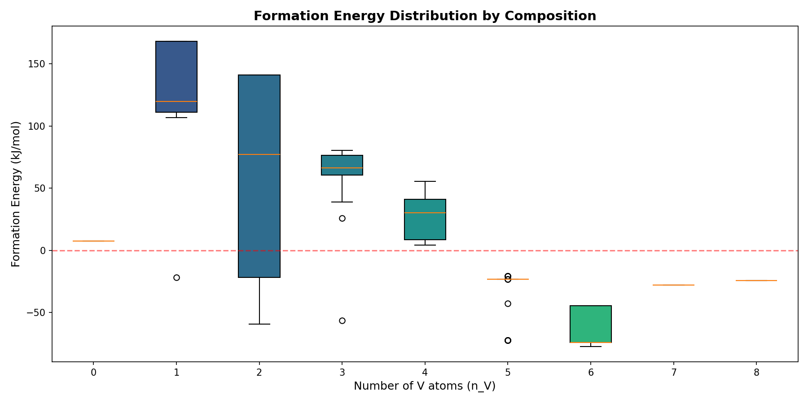
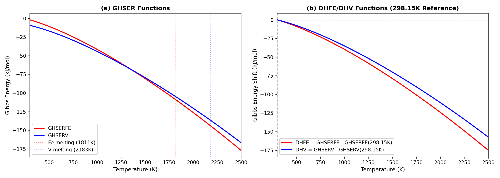

# Fe-V系B2_221相の熱力学関数構築レポート

## 1. はじめに

本レポートでは、Fe-V二元系におけるB2_221相（2x2x1スーパーセル）のCALPHADモデル構築プロセスについて詳細に論じる。第一原理計算（DFT）から得られたエネルギーデータを基に、熱力学データベース（TDB）ファイルの形成エネルギー関数を構築するまでの全工程を説明する。

### 1.1 CALPHAD法の概要

CALPHAD（CALculation of PHAse Diagrams）法は、熱力学的パラメータを用いて相図を計算する手法である。各相のギブスエネルギーを温度・組成の関数として記述し、平衡計算により相図を導出する。本研究では、B2構造の規則相を8副格子モデルで記述し、256個のエンドメンバーそれぞれに対してDFT計算から得られた形成エネルギーを割り当てる。

### 1.2 B2_221相の構造

B2構造はCsCl型の体心立方構造であり、2種類の原子が規則的に配列する。本モデルでは、B2単位胞を2x2x1に拡張したスーパーセルを用いる。これにより8つの副格子サイトが生成され、各サイトにFeまたはVを配置することで2^8 = 256通りの配置が可能となる。



*Figure 1: Configuration distribution by composition. The 256 configurations are distributed across compositions from Fe8V0 to Fe0V8, with the maximum number of configurations at intermediate compositions (n_V = 3, 4, 5).*

---

## 2. DFTデータの取得と処理

### 2.1 VASP計算の概要

256個の配置に対してVASP（Vienna Ab initio Simulation Package）を用いたDFT計算を実施した。各計算では、8原子を含むスーパーセルの全エネルギーを求め、原子あたりのエネルギー（eV/atom）を算出した。

### 2.2 収束状態の確認

DFT計算の結果、256配置中210個が収束（converged）、46個が未収束（unconverged）であった。未収束データは系統的なバイアスを持つため、補正が必要である。



*Figure 2: Convergence status by composition. Green bars show converged calculations, red bars show unconverged calculations. Pure Fe (n_V=0) and pure V (n_V=8) configurations were unconverged.*

### 2.3 データの概要

| 項目 | 値 |
|------|-----|
| 総配置数 | 256 |
| 収束配置数 | 210 |
| 未収束配置数 | 46 |
| 原子数/セル | 8 |
| 組成範囲 | Fe8V0 〜 Fe0V8 |

---

## 3. 未収束データの補正

### 3.1 補正の必要性

未収束のDFT計算では、電子状態が十分に緩和されていないため、エネルギーが過大評価される傾向がある。特に純Fe（config_0）と純V（config_255）は未収束であり、文献値と大きく乖離していた。

### 3.2 補正方法

未収束データの補正には以下の2つの方法を適用した：

1. **converged_mean法**: 同一組成の収束データの平均値で置換（44配置）
2. **wang_interpolation法**: Wang et al.の文献値を用いた内挿（2配置：純Fe、純V）

### 3.3 Wang et al.の参照エネルギー

純物質のBCCエネルギーとして、Wang et al.の報告値を採用した：

| 元素 | E_ref (eV/atom) | 出典 |
|------|-----------------|------|
| Fe (BCC) | -8.2748 | Wang et al., Calphad (2004) |
| V (BCC) | -8.9632 | Wang et al., Calphad (2004) |

### 3.4 補正前後の比較



*Figure 3: Energy per atom before and after correction. (a) Before correction: unconverged data (red) shows significantly higher energy than converged data (green). (b) After correction: corrected data (orange) aligns with the converged data trend.*

補正前の未収束データは、収束データと比較して約2 eV/atom高いエネルギーを示していた。補正後は、全データが組成に対して滑らかな傾向を示すようになった。

### 3.5 補正方法の内訳



*Figure 4: Breakdown of data correction methods. 82% of configurations were converged (no correction needed), 17.2% were corrected using converged mean values, and 0.8% (pure endpoints) were corrected using Wang interpolation.*

---

## 4. 形成エネルギーの計算

### 4.1 形成エネルギーの定義

形成エネルギーは、混合物のエネルギーから純物質の参照エネルギーを差し引いた値として定義される。8原子スーパーセルの場合：

$$\Delta H_f = 8 \times E_{per\_atom} - n_{Fe} \times E_{Fe,ref} - n_V \times E_{V,ref}$$

ここで：
- $E_{per\_atom}$: DFT計算から得られた原子あたりのエネルギー (eV/atom)
- $n_{Fe}$, $n_V$: セル内のFe原子数、V原子数
- $E_{Fe,ref}$, $E_{V,ref}$: Wang et al.の参照エネルギー

### 4.2 単位変換

DFTエネルギー（eV）からTDBで使用するJ/molへの変換：

$$\Delta H_f \text{ (J/mol)} = \Delta H_f \text{ (eV)} \times 96485$$

ここで96485 J/mol/eVはファラデー定数である。

### 4.3 計算例

config_7（Fe5V3配置）の場合：
- $E_{per\_atom}$ = -8.4470 eV/atom（補正後）
- $n_{Fe}$ = 5, $n_V$ = 3
- $\Delta H_f$ = 8 × (-8.4470) - 5 × (-8.2748) - 3 × (-8.9632)
- $\Delta H_f$ = -67.576 + 41.374 + 26.890 = 0.688 eV
- $\Delta H_f$ = 0.688 × 96485 = 66,366 J/mol

### 4.4 形成エネルギーの分布



*Figure 5: Formation energy distribution. (a) Formation energy vs composition showing the spread of values at each composition. (b) Histogram of formation energy values showing the overall distribution.*

### 4.5 組成別の形成エネルギー統計



*Figure 6: Box plot of formation energy distribution by composition. The boxes show the interquartile range, with whiskers extending to the data extremes. The red dashed line indicates zero formation energy.*

| n_V | 配置数 | 平均 (kJ/mol) | 最小 (kJ/mol) | 最大 (kJ/mol) |
|-----|--------|---------------|---------------|---------------|
| 0 | 1 | 7.7 | 7.7 | 7.7 |
| 1 | 8 | 117.8 | -21.6 | 168.3 |
| 2 | 28 | 47.9 | -763.6 | 713.2 |
| 3 | 56 | 60.5 | -56.5 | 80.4 |
| 4 | 70 | 7.9 | -77.3 | 55.4 |
| 5 | 56 | -22.9 | -42.6 | -20.6 |
| 6 | 28 | -60.9 | -77.3 | -44.5 |
| 7 | 8 | -27.7 | -27.7 | -27.7 |
| 8 | 1 | -24.1 | -24.1 | -24.1 |

---

## 5. 温度依存性の導入：GHSER関数と298.15K基準

### 5.1 Neumann-Kopp近似

CALPHAD法では、化合物の熱容量を構成元素の熱容量の線形和で近似する（Neumann-Kopp近似）。これにより、エンドメンバーのギブスエネルギーは以下のように表される：

$$G_{endmember}(T) = n_{Fe} \times G_{Fe}^{SER}(T) + n_V \times G_V^{SER}(T) + \Delta H_f(0K)$$

### 5.2 GHSER関数

GHSER（Gibbs energy of Stable Element Reference）は、各元素の安定相のギブスエネルギーを温度の関数として表したものである。TDBファイルでは以下のように定義されている：

**GHSERFE（Fe-BCC）:**
```
FUNCTION GHSERFE 298.15 1225.7+124.134*T-23.5143*T*LN(T)
  -0.00439752*T**2-5.8927E-008*T**3+77359*T**(-1); 1811 Y
  -25383.581+299.31255*T-46*T*LN(T)
  +2.29603E+031*T**(-9); 6000 N !
```

**GHSERV（V-BCC）:**
```
FUNCTION GHSERV 298.15 -7930.43+133.346053*T-24.134*T*LN(T)
  -0.003098*T**2+1.2175E-007*T**3+69460*T**(-1); 790 Y
  -7967.842+143.291093*T-25.9*T*LN(T)
  +6.25E-005*T**2-6.8E-007*T**3; 2183 Y
  -41689.864+321.140783*T-47.43*T*LN(T)
  +6.44389E+031*T**(-9); 4000 N !
```

### 5.3 298.15K基準への補正

DFTで得られた形成エネルギーは0Kでの値であるが、GHSER関数の定数項は低温での辻褄合わせに過ぎない。そこで、298.15Kを基準とした温度依存関数DHFE、DHVを定義する：

$$DHFE(T) = GHSERFE(T) - GHSERFE(298.15K)$$
$$DHV(T) = GHSERV(T) - GHSERV(298.15K)$$

298.15Kでの値：
- GHSERFE(298.15K) = -1841.403 J/mol
- GHSERV(298.15K) = -9209.853 J/mol

これにより、DHFE(298.15K) = 0、DHV(298.15K) = 0となる。

### 5.4 DHFE/DHV関数の定義

TDBファイルでは以下のように定義：

**DHFE:**
```
FUNCTION DHFE 298.15 3067.103+124.134*T-23.5143*T*LN(T)
  -0.00439752*T**2-5.8927E-008*T**3+77359*T**(-1); 1811 Y
  -23542.178+299.31255*T-46*T*LN(T)
  +2.29603E+031*T**(-9); 6000 N !
```

**DHV:**
```
FUNCTION DHV 298.15 1279.423+133.346053*T-24.134*T*LN(T)
  -0.003098*T**2+1.2175E-007*T**3+69460*T**(-1); 790 Y
  1242.011+143.291093*T-25.9*T*LN(T)
  +6.25E-005*T**2-6.8E-007*T**3; 2183 Y
  -32480.011+321.140783*T-47.43*T*LN(T)
  +6.44389E+031*T**(-9); 4000 N !
```

### 5.5 温度依存性の可視化



*Figure 7: Temperature dependence of Gibbs energy functions. (a) GHSER functions for Fe and V showing the standard reference state energies. (b) DHFE and DHV functions shifted to zero at 298.15K, used for combining with DFT formation energies.*

---

## 6. TDBファイルの構造

### 6.1 ファイル構成

TDBファイルは以下のセクションで構成される：

1. **ELEMENT定義**: FE, V, VA（空孔）
2. **FUNCTION定義**: GHSER, DHFE, DHV, 形成エネルギー関数
3. **PHASE定義**: LIQUID, FCC_A1, BCC_A2, SIGMA, B2_221
4. **PARAMETER定義**: 各相のギブスエネルギーパラメータ

### 6.2 B2_221相の定義

```
PHASE B2_221 % 8 1 1 1 1 1 1 1 1 !
CONSTITUENT B2_221 :FE,V:FE,V:FE,V:FE,V:FE,V:FE,V:FE,V:FE,V:!
```

8つの副格子それぞれにFEまたはVが占有可能であり、各副格子の化学量論係数は1である。

### 6.3 形成エネルギー関数の命名規則

形成エネルギー関数は以下の命名規則に従う：

```
GFnVxxx
```

- `GF`: Formation energy (Gibbs energy of Formation)
- `nV`: V原子の数（0-8）
- `xxx`: 同一組成内での連番（001, 002, ...）

例：
- `GF0V001`: Fe8V0（純Fe）の形成エネルギー
- `GF3V001`: Fe5V3配置の1番目の形成エネルギー
- `GF8V001`: Fe0V8（純V）の形成エネルギー

### 6.4 エンドメンバーのギブスエネルギー

各エンドメンバーのギブスエネルギーは以下の形式で定義：

```
PARAMETER G(B2_221,FE:FE:FE:FE:FE:FE:FE:V;0) 298.15
  +7*DHFE+1*DHV+GF1V001; 6000 N !
```

これは以下を意味する：
- 副格子1-7にFE、副格子8にVが占有
- ギブスエネルギー = 7×DHFE + 1×DHV + GF1V001
- 温度範囲: 298.15K - 6000K

### 6.5 config_indexとTDB関数の対応

config_indexは8ビット整数であり、各ビットが副格子の占有状態を表す：
- ビット = 0: Fe
- ビット = 1: V

例：config_index = 42 (二進数: 00101010)
- S1=Fe, S2=Fe, S3=V, S4=Fe, S5=V, S6=Fe, S7=V, S8=Fe
- 組成: Fe5V3
- 対応するTDB関数: GF3Vxxx（xxxは同一組成内での順番）

---

## 7. 相互作用パラメータ

### 7.1 相互作用パラメータの定義

B2_221相では、各副格子における2元相互作用パラメータを定義する。L0（0次）とL1（1次）の相互作用パラメータが各副格子に対して定義されている。

```
PARAMETER L(B2_221,FE,V:FE:FE:FE:FE:FE:FE:FE;0) 298.15 0; 6000 N !
PARAMETER L(B2_221,FE,V:FE:FE:FE:FE:FE:FE:FE;1) 298.15 0; 6000 N !
```

### 7.2 パラメータ数

- 8副格子 × 2種類（L0, L1）× 64組み合わせ = 1024個の相互作用パラメータ
- 現在はすべてダミー値（0）として設定
- 実験データまたは追加のDFT計算により最適化可能

---

## 8. まとめ

本レポートでは、Fe-V系B2_221相の熱力学関数構築プロセスを詳細に説明した。主要なポイントを以下にまとめる：

### 8.1 データ処理

1. **DFT計算**: 256配置に対してVASP計算を実施
2. **収束確認**: 210配置が収束、46配置が未収束
3. **データ補正**: 未収束データをconverged_mean法またはwang_interpolation法で補正

### 8.2 形成エネルギー計算

1. **参照エネルギー**: Wang et al.の文献値（Fe: -8.2748, V: -8.9632 eV/atom）を採用
2. **単位変換**: eV → J/mol（×96485）
3. **形成エネルギー範囲**: -77 kJ/mol 〜 +168 kJ/mol

### 8.3 温度依存性

1. **Neumann-Kopp近似**: 熱容量を構成元素の線形和で近似
2. **298.15K基準**: DHFE, DHV関数を定義し、298.15Kでゼロとなるよう調整
3. **複数温度区間**: Fe（1811K）、V（790K, 2183K）での相転移を考慮

### 8.4 TDBファイル構造

1. **相定義**: 8副格子モデル（B2_221）
2. **形成エネルギー関数**: 256個のGFnVxxx関数
3. **相互作用パラメータ**: 1024個のLパラメータ（ダミー値）

### 8.5 今後の課題

1. **格子定数データ**: Vegard則との比較検証（データ待ち）
2. **相互作用パラメータ**: 実験データによる最適化
3. **相図計算**: pycalphadまたはThermo-Calcによる検証

---

## 参考文献

1. Wang, Y., Curtarolo, S., Jiang, C., Arroyave, R., Wang, T., Ceder, G., Chen, L.-Q., & Liu, Z.-K. (2004). Ab initio lattice stability in comparison with CALPHAD lattice stability. *Calphad*, 28(1), 79-90.

2. Sanchez, J. M., et al. (1996). Experimental and theoretical determination of the metastable Fe-V phase diagram. *Physical Review B*, 54, 8958.

3. Hari Kumar, K. C., & Raghavan, V. (1991). A thermodynamic analysis of the Fe-V system. *Calphad*, 15(3), 307-314.

---

## 付録A: 主要パラメータ一覧

| パラメータ | 値 | 単位 |
|-----------|-----|------|
| E_Fe_ref (Wang) | -8.2748 | eV/atom |
| E_V_ref (Wang) | -8.9632 | eV/atom |
| GHSERFE(298.15K) | -1841.403 | J/mol |
| GHSERV(298.15K) | -9209.853 | J/mol |
| 総配置数 | 256 | - |
| 収束配置数 | 210 | - |
| 補正配置数 | 46 | - |
| 形成エネルギー関数数 | 256 | - |
| 相互作用パラメータ数 | 1024 | - |

## 付録B: ファイル一覧

| ファイル名 | 説明 |
|-----------|------|
| Fe-V_B2_221.tdb | 熱力学データベースファイル |
| fe_v_b2_energies_corrected.csv | 補正済みDFTエネルギーデータ |
| fe_v_b2_energies_new.csv | 元のVASP DFTデータ |
| fev_bcc_pycalphad.py | pycalphad相図計算スクリプト |
| fev_bcc_thermocalc.tcm | Thermo-Calcマクロファイル |
| extract_lattice_constants.py | 格子定数抽出スクリプト |
