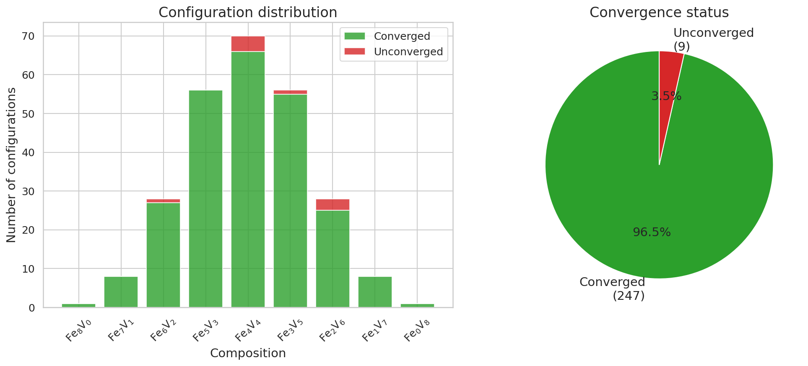
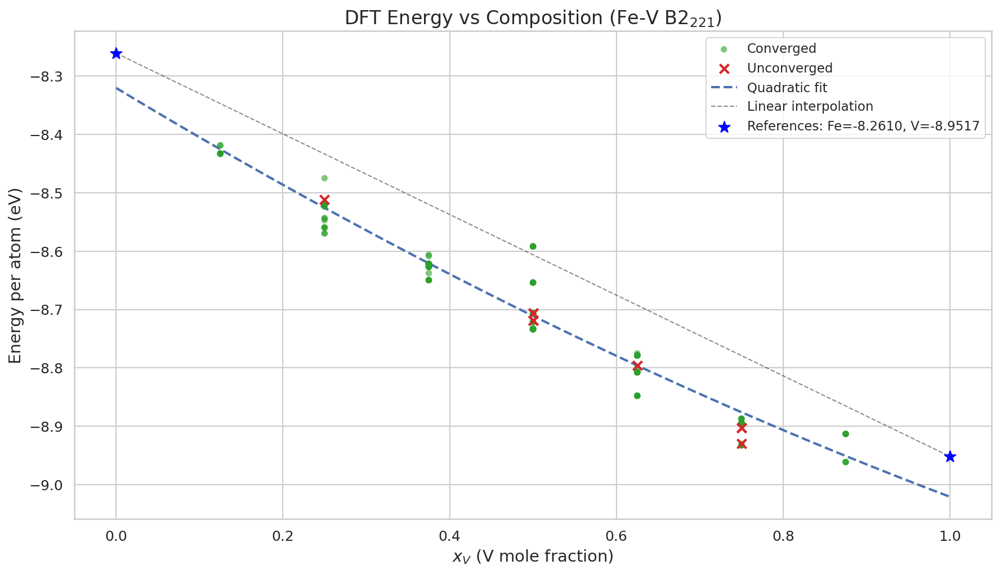
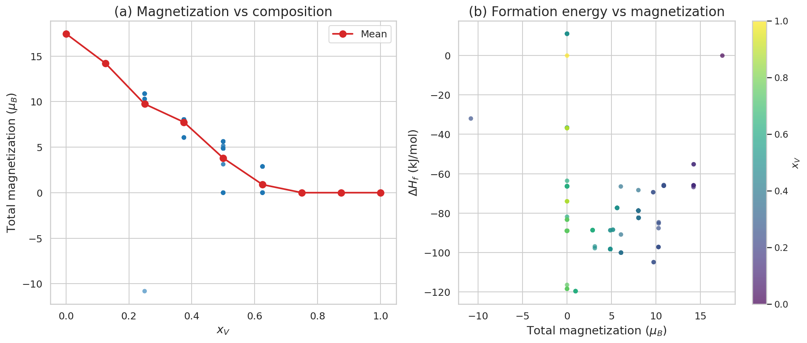
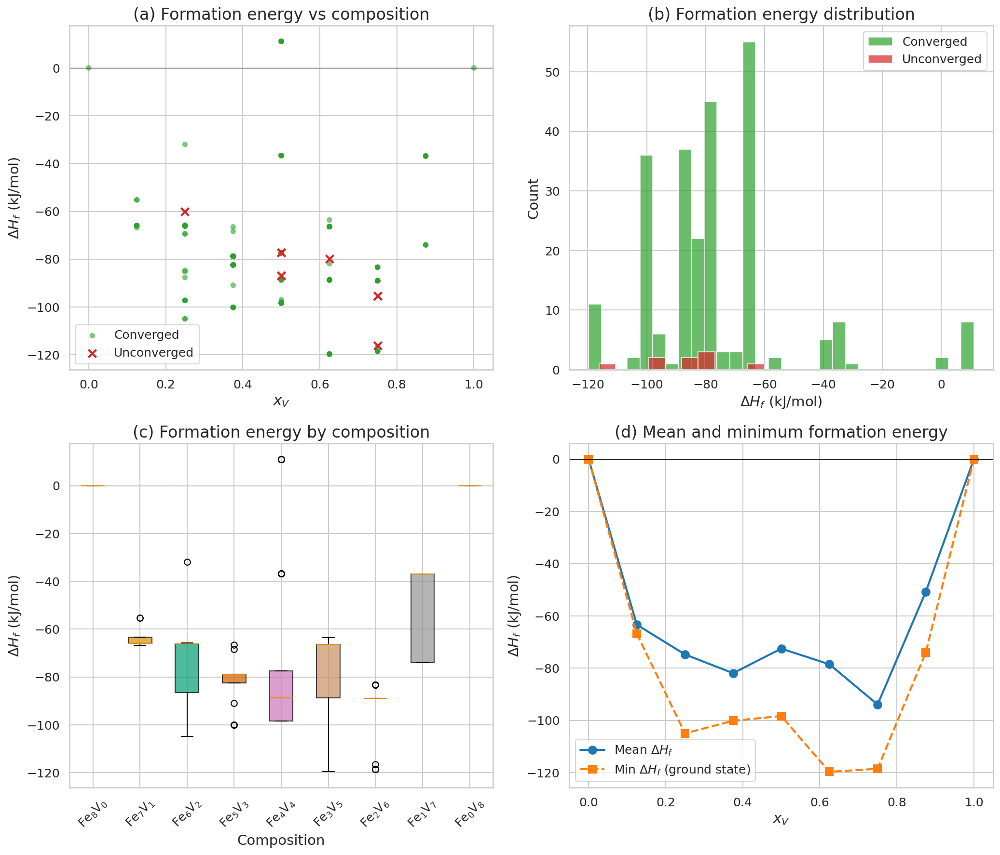
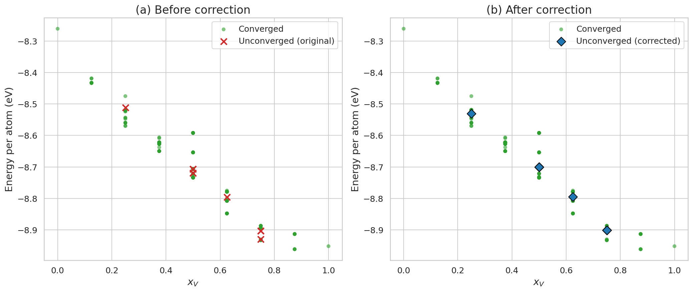
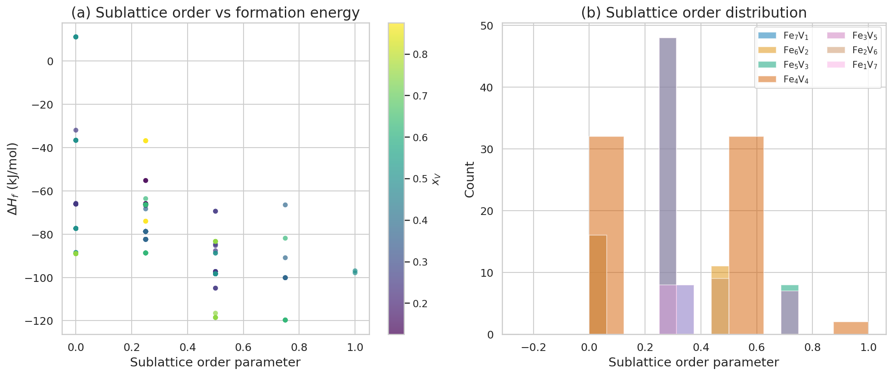
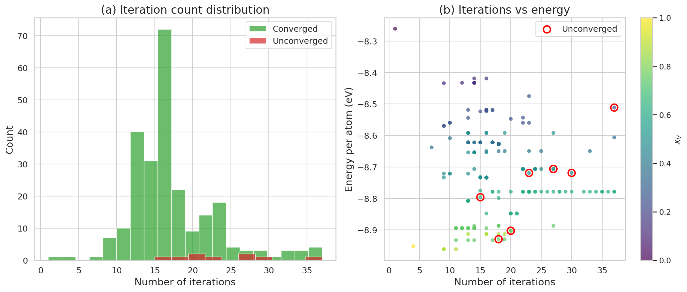

# Fe-V B2$_{221}$ CALPHADモデル レポート

## 1. 概要

本レポートは、Fe-V二元系におけるB2$_{221}$規則相を含むCALPHAD熱力学データベース（TDB）の開発について記述する。B2$_{221}$相はBCC-B2構造の2x2x1スーパーセル拡張を表し、8つの副格子サイトと256個のエンドメンバー配置を持つ。

### 1.1 データソース

256個のエンドメンバー配置の形成エネルギーは、VASP密度汎関数理論（DFT）計算により算出され、Excelファイル`Fe-V_VASP.xlsx`として提供された。



**Figure 1**: 左: 組成別の配置分布と収束状態。緑色は収束した配置、赤色は未収束の配置を示す。右: 収束率の円グラフ（96.5%が正常収束）。

## 2. DFTデータ解析

### 2.1 収束状態

実施した256件のDFT計算のうち、**247件（96.5%）** が正常に収束し、**9件（3.5%）** が未収束であった。前回のデータセット（74.6%収束）と比較して大幅に改善されている。

未収束の配置は主にFe$_4$V$_4$（4件）、Fe$_2$V$_6$（3件）、Fe$_6$V$_2$（1件）、Fe$_3$V$_5$（1件）組成に分散している。

| 組成 | 収束 | 未収束 | 計 | 収束率 |
|------|------|--------|-----|--------|
| Fe$_8$V$_0$ | 1 | 0 | 1 | 100% |
| Fe$_7$V$_1$ | 8 | 0 | 8 | 100% |
| Fe$_6$V$_2$ | 27 | 1 | 28 | 96% |
| Fe$_5$V$_3$ | 56 | 0 | 56 | 100% |
| Fe$_4$V$_4$ | 66 | 4 | 70 | 94% |
| Fe$_3$V$_5$ | 55 | 1 | 56 | 98% |
| Fe$_2$V$_6$ | 25 | 3 | 28 | 89% |
| Fe$_1$V$_7$ | 8 | 0 | 8 | 100% |
| Fe$_0$V$_8$ | 1 | 0 | 1 | 100% |

### 2.2 エネルギー vs 組成

DFT計算による原子あたりエネルギーは、組成に対して明確な下に凸の傾向を示す。純Fe（-8.261 eV/atom）から純V（-8.952 eV/atom）に向かってエネルギーが低下し、V-rich組成で特に安定化が顕著である。



**Figure 2**: 組成に対するDFTエネルギー。緑点は収束した計算、赤×は未収束の計算を示す。青破線は2次多項式フィット、灰色破線は線形内挿を示す。

### 2.3 参照エネルギー

本データセットでは、純Fe（Fe$_8$V$_0$）および純V（Fe$_0$V$_8$）のDFT計算がともに収束しているため、DFT参照エネルギーを直接使用した。

| パラメータ | 値 | ソース |
|-----------|------|--------|
| E$_{Fe,ref}$ | -8.260987 eV/atom | DFT（本研究） |
| E$_{V,ref}$ | -8.951673 eV/atom | DFT（本研究） |

参考として、Wang et al.の文献値（E$_{Fe}$ = -8.2748, E$_{V}$ = -8.9632 eV/atom）との比較：
- Fe: 差 = +0.014 eV/atom（本研究の方がわずかに高い）
- V: 差 = +0.012 eV/atom（本研究の方がわずかに高い）

両者の差はDFT計算のセットアップ（擬ポテンシャル、カットオフエネルギー等）の違いによるものと考えられる。

### 2.4 磁気モーメント解析

Fe-rich組成では大きな磁気モーメントが観測され、V添加に伴い単調減少する。Fe$_3$V$_5$付近で磁性がほぼ消失する。

| 組成 | 平均磁気モーメント ($\mu_B$) |
|------|----------------------------|
| Fe$_8$V$_0$ | 17.458 |
| Fe$_7$V$_1$ | 14.225 |
| Fe$_6$V$_2$ | 9.745 |
| Fe$_5$V$_3$ | 7.744 |
| Fe$_4$V$_4$ | 3.801 |
| Fe$_3$V$_5$ | 0.889 |
| Fe$_2$V$_6$ | -0.001 |
| Fe$_1$V$_7$ | 0.000 |
| Fe$_0$V$_8$ | 0.000 |



**Figure 3**: 左: 組成に対する磁気モーメント。右: 形成エネルギーと磁気モーメントの関係（色はV濃度）。

## 3. 形成エネルギー計算

### 3.1 計算方法

形成エネルギーは以下の標準式を用いて計算した：

```
dH_f = 8 * E_per_atom - n_Fe * E_Fe_ref - n_V * E_V_ref  [eV per 8原子スーパーセル]
```

結果は96485 J/mol/eVを乗じてJ/molに変換した。

### 3.2 形成エネルギー分布



**Figure 4**: (a) 組成に対する形成エネルギー。(b) 形成エネルギーのヒストグラム。(c) 組成別のボックスプロット。(d) 平均および最小形成エネルギー。

### 3.3 形成エネルギー統計

| パラメータ | 値 |
|-----------|-------|
| 最小値 | -119.69 kJ/mol |
| 最大値 | 11.11 kJ/mol |
| 平均値 | -76.81 kJ/mol |

ほとんどの配置は負の形成エネルギーを持ち、純元素参照に対する熱力学的安定性を示している。最も安定な配置はFe$_3$V$_5$組成に見られる（-119.69 kJ/mol）。

### 3.4 組成別形成エネルギー

| 組成 | 平均 (kJ/mol) | 最小 (kJ/mol) | 最大 (kJ/mol) | 配置数 |
|------|--------------|--------------|--------------|--------|
| Fe$_8$V$_0$ | 0.00 | 0.00 | 0.00 | 1 |
| Fe$_7$V$_1$ | -63.37 | -66.82 | -55.22 | 8 |
| Fe$_6$V$_2$ | -74.76 | -104.96 | -31.98 | 27 |
| Fe$_5$V$_3$ | -81.91 | -100.14 | -66.50 | 56 |
| Fe$_4$V$_4$ | -72.53 | -98.33 | 11.11 | 66 |
| Fe$_3$V$_5$ | -78.52 | -119.69 | -63.60 | 55 |
| Fe$_2$V$_6$ | -93.93 | -118.52 | -83.36 | 25 |
| Fe$_1$V$_7$ | -50.80 | -74.04 | -36.85 | 8 |
| Fe$_0$V$_8$ | 0.00 | 0.00 | 0.00 | 1 |

## 4. 未収束データの補正

### 4.1 補正方法

9件の未収束データは、同一組成の収束データの平均エネルギーに補正した。すべての未収束組成に収束データが存在するため、線形内挿は不要であった。



**Figure 5**: (a) 補正前のエネルギー分布。(b) 補正後。未収束データ（菱形）は同一組成の収束データ平均に補正されている。

### 4.2 補正の詳細

| config | 組成 | 原子あたりエネルギー差 (eV) | 備考 |
|--------|------|---------------------------|------|
| 012 | Fe$_6$V$_2$ | +0.019 | 収束平均より高い |
| 079 | Fe$_3$V$_5$ | -0.002 | 収束平均よりわずかに低い |
| 086 | Fe$_4$V$_4$ | -0.006 | 収束平均よりわずかに低い |
| 099 | Fe$_4$V$_4$ | -0.006 | config_086と同一の差 |
| 111 | Fe$_2$V$_6$ | -0.002 | 収束平均よりわずかに低い |
| 150 | Fe$_4$V$_4$ | -0.019 | 収束平均より低い |
| 153 | Fe$_4$V$_4$ | -0.019 | config_150と同一の差 |
| 159 | Fe$_2$V$_6$ | -0.002 | config_111と同一の差 |
| 249 | Fe$_2$V$_6$ | -0.029 | 最大の差 |

未収束データのエネルギー差は概ね小さく（<0.03 eV/atom）、前回データセットと比較して収束品質が大幅に向上している。

## 5. 副格子規則度解析



**Figure 6**: (a) 副格子規則度と形成エネルギーの関係。(b) 組成別の副格子規則度分布。

## 6. TDB構造

### 6.1 B2$_{221}$相モデル

B2$_{221}$相は8副格子の化合物エネルギー形式（CEF）を用いてモデル化される。各副格子はFeまたはVで占有可能であり、2$^8$ = 256個のエンドメンバー配置が存在する。

### 6.2 TDBの主要構成要素

1. **GHSER関数**: FeおよびVの標準SGTE参照関数
2. **DHFE/DHV関数**: 298.15Kでゼロになるよう調整された温度依存項
3. **GFxVyyy関数**: 256個の形成エネルギー関数
4. **PARAMETER G**: 各エンドメンバーのギブスエネルギー

### 6.3 PARAMETER G式

```
G(B2_221, SL1:SL2:...:SL8) = n_Fe*DHFE + n_V*DHV + GFxVyyy
```

### 6.4 298.15K参照状態

DHFE = GHSERFE - GHSERFE(298.15K) = GHSERFE - (-1841.403) J/mol
DHV = GHSERV - GHSERV(298.15K) = GHSERV - (-9209.853) J/mol

## 7. 前回データとの比較

| 項目 | 前回 (Book1.xlsx) | 今回 (Fe-V_VASP.xlsx) |
|------|-------------------|----------------------|
| 収束率 | 74.6% (191/256) | **96.5% (247/256)** |
| 未収束数 | 65 | **9** |
| Fe/V参照 | Wang et al. (外挿) | **DFT直接計算** |
| 形成エネルギー最小値 | -140.06 kJ/mol | **-119.69 kJ/mol** |
| 形成エネルギー平均値 | -16.56 kJ/mol | **-76.81 kJ/mol** |

主な改善点：
- 収束率が74.6%から96.5%に大幅改善
- 純元素のDFT計算が収束し、外挿参照が不要に
- 形成エネルギーの平均値が大きく負方向にシフト（DFT参照エネルギーの違いによる）

## 8. イテレーション解析



**Figure 7**: (a) イテレーション回数の分布。(b) イテレーション回数とエネルギーの関係。

| 統計量 | 値 |
|--------|-----|
| 平均 | 17.5回 |
| 中央値 | 16回 |
| 最小 | 1回 |
| 最大 | 37回 |

## 9. ファイル一覧

| ファイル | 説明 |
|------|-------------|
| `Fe-V_B2_221.tdb` | CALPHAD熱力学データベース（新データ） |
| `fev_excel_mapping.csv` | Excel config_indexとTDB関数名の対応表 |
| `fev_corrected_data.csv` | 補正済みDFTデータ |
| `report_figures/` | レポート図を含むディレクトリ |

## 10. 注意事項と制限

1. **未収束データ**: 256配置中9配置がDFTで収束しなかった。これらは同一組成の収束データの平均値に補正した。
2. **参照エネルギー**: 純Fe/Vの参照エネルギーはDFT直接計算値を使用。Wang et al.とは約0.01 eV/atomの差がある。
3. **相互作用パラメータ**: TDB内のBCC_A2, FCC_A1, LIQUID, SIGMAの相互作用パラメータはHari Kumar and Raghavan (1991)に基づく。
4. **温度範囲**: 本モデルはA2/B2規則化転移が予想される1000K〜2500Kの範囲での計算を想定している。

---

*レポート作成日: 2026年2月24日*
*データソース: Fe-V_VASP.xlsx（Fe-V DFT計算）*
