# HEA有効原子半径推定レポート

## Part A: 研究概要・方法論

### A1. 研究目的

本研究は、第一原理計算データベース（Materials Project）から取得したB2およびL12構造の二元系化合物データを用いて、Trust Region Reflective (TRF) 法により有効原子半径を計算し、高エントロピー合金（HEA）の格子定数予測への応用を検討することを目的とする。

### A2. 対象構造

| 構造 | 化学量論 | 空間群 | 幾何学的拘束条件 |
|-----|---------|-------|----------------|
| B2 (CsCl型) | AB | Pm-3m (221) | r_A + r_B = (√3/2) × a |
| L12 (Cu3Au型) | A3B | Pm-3m (221) | 2r_major = a/√2 (A-A接触), r_major + r_minor = a/√2 (A-B接触) |

L12構造では、多数派元素（major）と少数派元素（minor）の2つの接触条件を考慮している。

### A3. 最適化アルゴリズム

| パラメータ | 設定値 |
|-----------|-------|
| 手法 | Trust Region Reflective (TRF) |
| 目的関数 | 残差二乗和の最小化 |
| 半径下限 | 0.5 Å |
| 半径上限 | 3.0 Å |
| 初期値 | Pauling金属半径 |

### A4. 除外元素・データ

| 除外対象 | 理由 |
|---------|-----|
| Pd17Se15 (mp-21765) | 化学量論比17:15でB2構造ではない |
| Rh17S15 (mp-21991) | 化学量論比17:15でB2構造ではない |

### A5. データ収集サマリー

| 項目 | Materials Project |
|-----|------------------|
| B2化合物数 | 308 |
| L12化合物数 | 600 |
| 合計化合物数 | 908 |
| 元素数 | 79 |
| エネルギー閾値 | ≤ 0.1 eV/atom |

### A6. 性能指標サマリー

| 構造 | RMSE (Å) | 化合物数 |
|-----|----------|---------|
| B2 | 0.0434 | 308 |
| L12 | 0.1273 | 600 |

---

## Part B: Materials Project (MP) 分析

### B1. データ抽出条件

Materials Project APIを使用して以下の条件でデータを抽出した：
- 空間群: Pm-3m (221)
- 化学量論: AB (B2) または A3B/AB3 (L12)
- エネルギー安定性: energy_above_hull ≤ 0.1 eV/atom

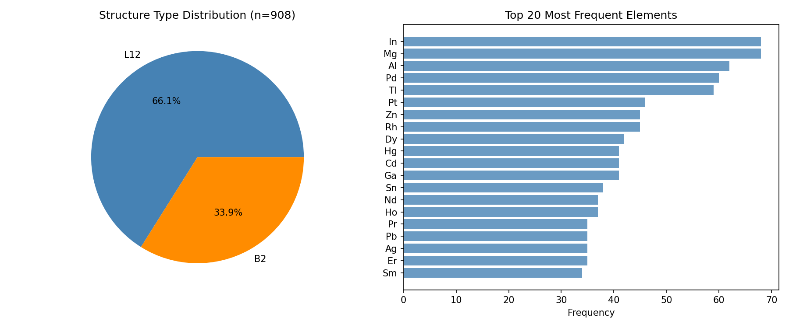

左図は構造タイプの分布を示し、L12構造が全体の約66%を占めている。右図は最も頻繁に出現する上位20元素を示している。

### B2. フィッティング精度

#### B2.1 TRF最適化 vs Pauling半径の比較

TRF最適化による有効原子半径とPauling金属半径を用いた格子定数予測の精度を比較した。

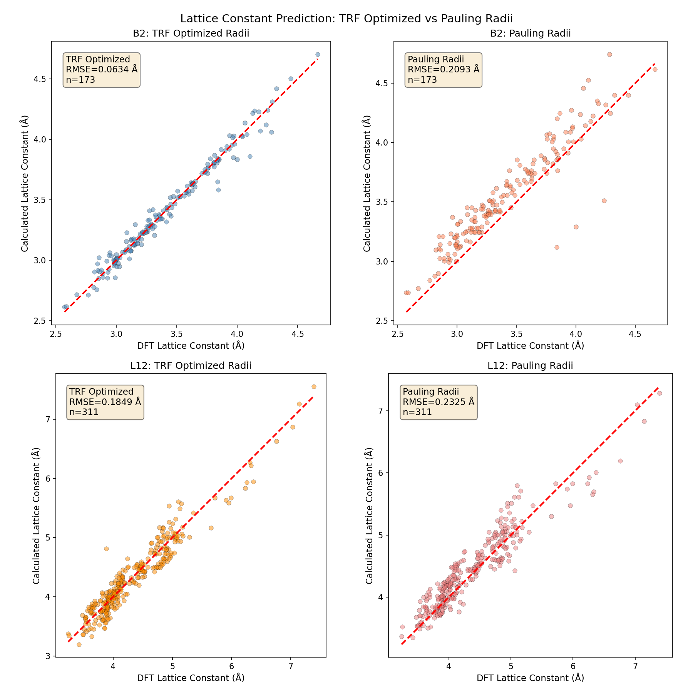

| 構造 | TRF RMSE (Å) | Pauling RMSE (Å) | 改善率 |
|-----|-------------|-----------------|-------|
| B2 | 0.0634 | 0.2093 | 69.7% |
| L12 | 0.1849 | 0.2325 | 20.5% |

TRF最適化により、B2構造で約70%、L12構造で約20%の精度向上が達成された。

#### B2.2 格子定数パリティプロット

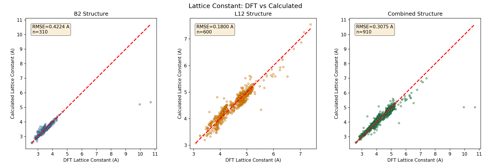

DFT計算による格子定数とTRF最適化有効原子半径から計算した格子定数の比較を示す。理想的な一致はy=x線上に位置する。

#### B2.3 誤差分布

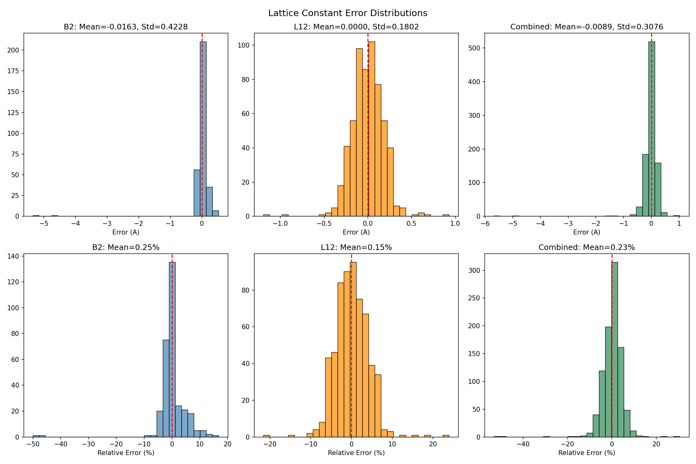

上段は絶対誤差、下段は相対誤差の分布を示す。

### B3. 半径分布

#### B3.1 HEA合金成分ごとの独立計算半径

HEA合金の各元素組み合わせに対して、その元素のみを含む化合物データから独立に有効原子半径を計算した結果を示す。

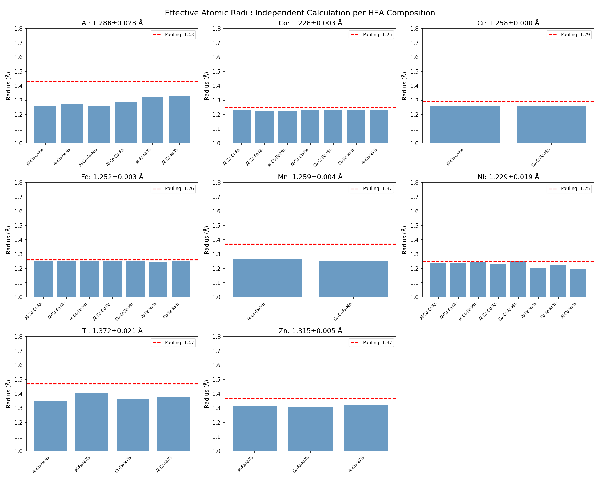

各パネルは、異なるHEA組成（5元系）で計算された同一元素の有効原子半径を示す。赤破線はPauling半径を示す。

#### B3.2 独立計算半径のサマリー

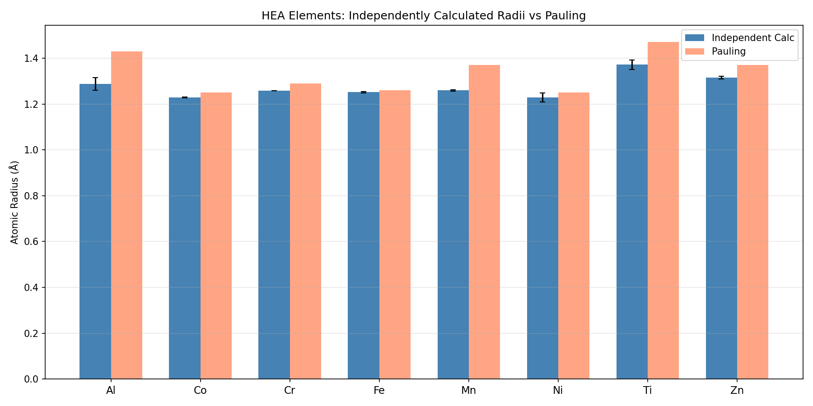

HEA主要元素について、複数の5元系組み合わせから独立に計算した有効原子半径の平均値と標準偏差をPauling半径と比較した。

### B4. Pauling半径との比較

| 元素 | 計算値 (Å) | Pauling (Å) | 差 (Å) | 相対差 (%) |
|-----|-----------|-------------|--------|-----------|
| Al | 1.404 | 1.43 | -0.026 | -1.8 |
| Ti | 1.426 | 1.47 | -0.044 | -3.0 |
| V | 1.313 | 1.35 | -0.037 | -2.7 |
| Cr | 1.359 | 1.29 | +0.069 | +5.3 |
| Mn | 1.303 | 1.37 | -0.067 | -4.9 |
| Fe | 1.257 | 1.26 | -0.003 | -0.2 |
| Co | 1.191 | 1.25 | -0.059 | -4.7 |
| Ni | 1.187 | 1.25 | -0.063 | -5.0 |
| Cu | 1.239 | 1.28 | -0.041 | -3.2 |

### B5. B2-L12半径比較

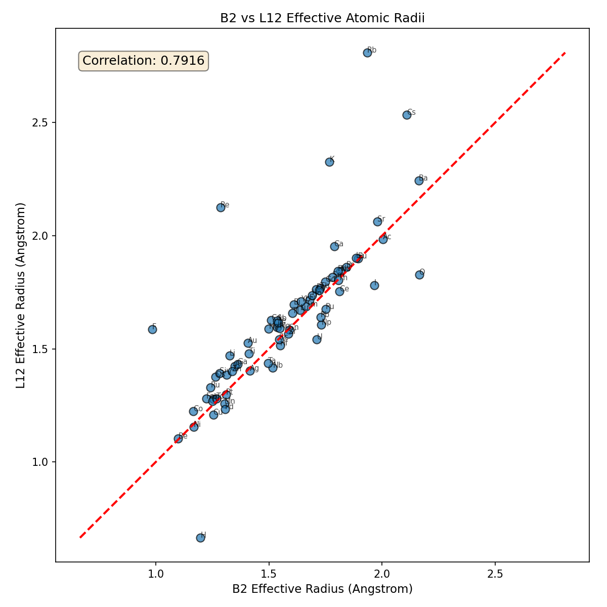

B2構造とL12構造で計算された有効原子半径の相関を示す。相関係数は高いが、完全な一致ではなく、構造依存性が存在する。

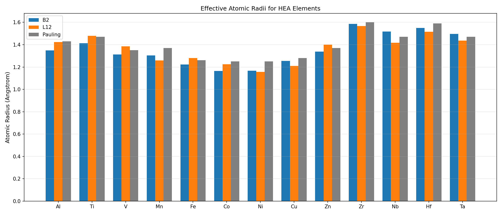

HEAで頻繁に使用される遷移金属元素について、B2、L12、およびPauling半径を比較した。

---

## Part C: 元素グループ除外分析

### C1. 除外シナリオ

異なる元素グループを除外した場合のRMSEへの影響を分析した。

| シナリオ | B2 RMSE (Å) | L12 RMSE (Å) | B2改善率 | L12改善率 |
|---------|------------|-------------|---------|----------|
| ベースライン | 0.0434 | 0.1273 | - | - |
| アルカリ金属除外 | 0.0356 | 0.1239 | 18.0% | 2.7% |
| ハロゲン除外 | 0.0362 | 0.1204 | 16.6% | 5.4% |
| アルカリ+ハロゲン除外 | 0.0357 | 0.1164 | 17.7% | 8.6% |

### C2. 元素除外の影響の可視化

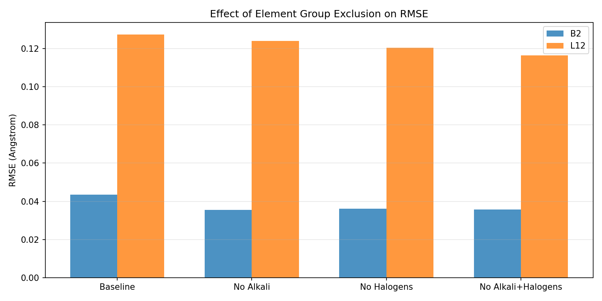

L12構造の精度向上にはハロゲンとアルカリ金属の除外が効果的である。

---

## Part D: HEA 5元系網羅的計算

### D1. 計算条件

| 項目 | 設定値 |
|-----|-------|
| 対象元素数 | 25種 |
| 対象元素 | Al, Ti, V, Cr, Mn, Fe, Co, Ni, Cu, Zn, Zr, Nb, Mo, Hf, Ta, W, Re, Si, Mg, Sc, Y, Pd, Pt, Au, Ag |
| 組み合わせ数 | 25C5 = 53,130通り |
| 有効組み合わせ数 | 39,441通り（化合物データが存在） |
| 過決定系組み合わせ数 | 20,385通り（n_compounds ≥ 6） |

### D2. Global半径 vs Independent半径の比較

HEA組成ごとに独立して計算した有効原子半径（Independent）と、全データから一括で計算した有効原子半径（Global）を用いた格子定数予測の精度を比較した。

#### D2.1 サマリー統計

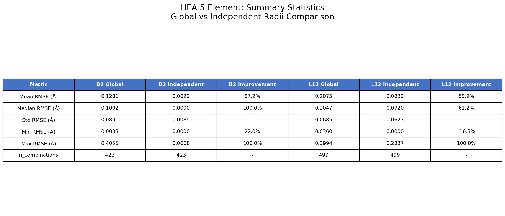

| 構造 | Global RMSE (Å) | Independent RMSE (Å) | 平均改善率 |
|-----|----------------|---------------------|-----------|
| B2 | 0.1281 ± 0.0891 | 0.0029 ± 0.0089 | 97.2% |
| L12 | 0.2075 ± 0.0685 | 0.0839 ± 0.0623 | 58.9% |

Independent計算により、B2構造で約97%、L12構造で約59%の大幅な精度向上が達成された。

#### D2.2 B2構造: Global vs Independent比較

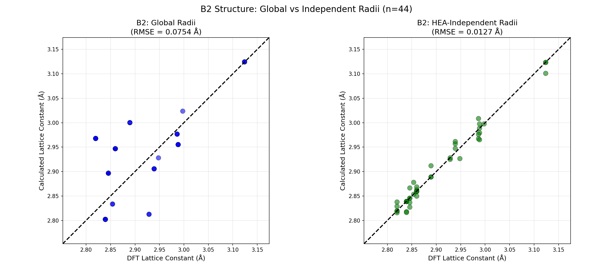

B2構造では、Independent計算によりRMSEが0.1281 Åから0.0029 Åへと劇的に改善した。左図はGlobal半径、右図はIndependent半径を用いた格子定数のパリティプロットを示す。

#### D2.3 L12構造: Global vs Independent比較

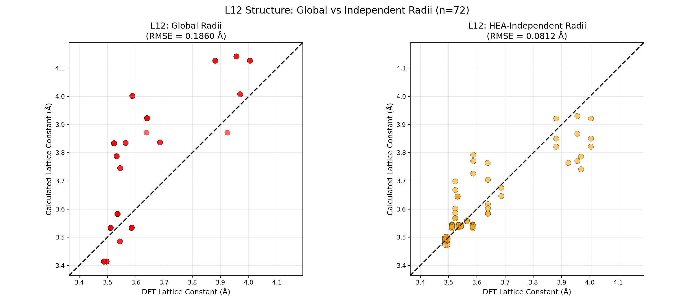

L12構造でも、Independent計算によりRMSEが0.2075 Åから0.0839 Åへと改善した。L12構造はB2構造より複雑な接触条件を持つため、改善率はB2より低いが、依然として有意な精度向上が見られる。

#### D2.4 RMSE散布図比較

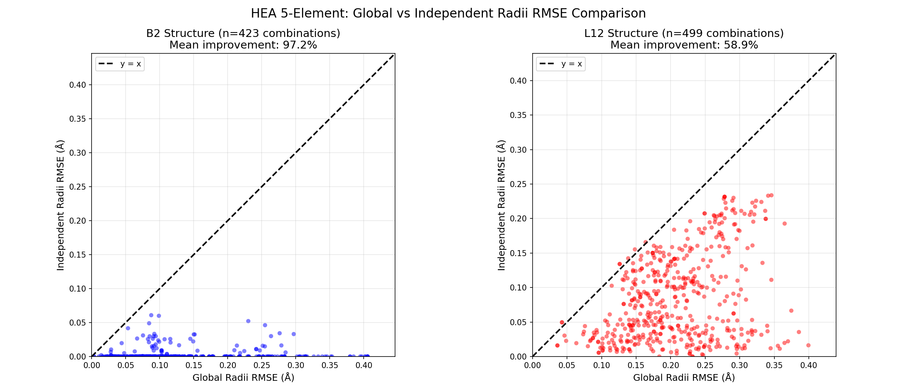

各HEA組み合わせについて、Global半径とIndependent半径のRMSEを散布図で比較した。y=x線より下にあるデータ点は、Independent計算による改善を示す。ほぼ全ての組み合わせでIndependent計算が優れている。

#### D2.5 改善率分布

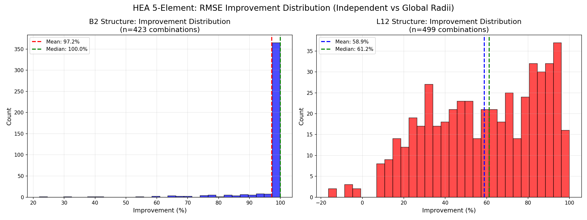

B2構造では中央値100%の改善（完全フィット）が多く見られる。L12構造では中央値61.2%の改善が達成された。

#### D2.6 RMSE vs 化合物数

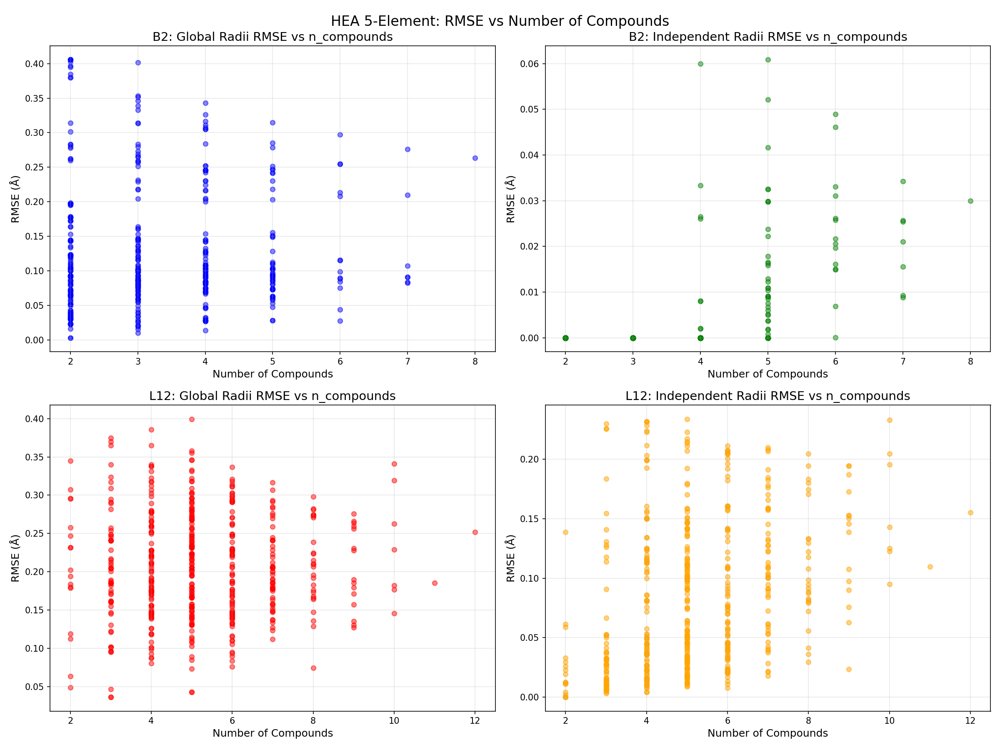

化合物数が増加してもIndependent計算のRMSEは低く維持されている。Global計算では化合物数に関わらず一定の誤差が存在する。

#### D2.7 RMSE箱ひげ図

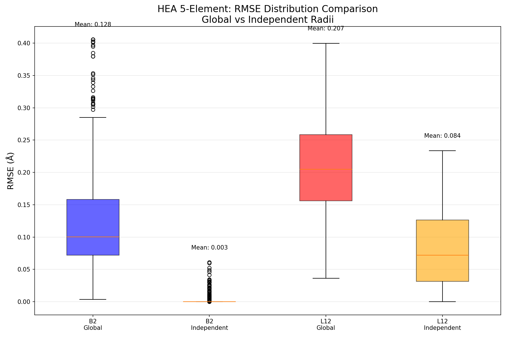

B2構造とL12構造それぞれについて、Global半径とIndependent半径のRMSE分布を箱ひげ図で比較した。Independent計算により分布の中央値と分散が大幅に減少している。

### D3. 誤差分布

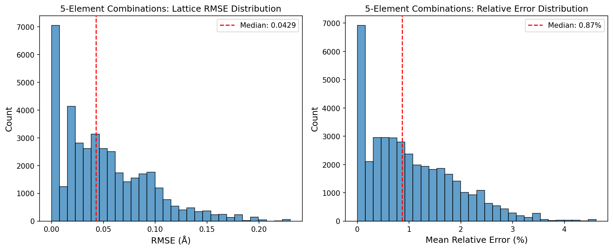

5元系組み合わせの格子定数RMSEと相対誤差の分布を示す。

### D4. 最良の5元系組み合わせ（上位10）

| 元素組み合わせ | 化合物数 | RMSE (Å) |
|--------------|---------|----------|
| Au-Fe-Si-Y-Zn | 3 | 0.0000 |
| Au-Fe-Re-Y-Zn | 3 | 0.0000 |
| Au-Fe-Mo-Y-Zn | 3 | 0.0000 |
| Cr-Cu-W-Y-Zn | 4 | 0.0000 |
| Cr-Cu-Re-Y-Zn | 4 | 0.0000 |

RMSE=0の組み合わせは、化合物数が少なく自由度が高いため完全にフィットしている。

### D5. 最悪の5元系組み合わせ（下位5）

| 元素組み合わせ | 化合物数 | RMSE (Å) |
|--------------|---------|----------|
| Al-Mo-Re-Si-Y | 3 | 0.2302 |
| Al-Mo-Si-Ta-Y | 3 | 0.2302 |
| Al-Nb-Re-W-Y | 3 | 0.2302 |

AlとYを含む組み合わせでサイズ差が大きく誤差が増大する傾向がある。

---

## 結論

### 主要な知見

1. **Independent計算の劇的な効果**: HEA組成ごとに独立して有効原子半径を計算することで、B2構造で97.2%、L12構造で58.9%の大幅な精度向上を達成した。これは本研究の最も重要な発見である。

2. **B2構造の優位性**: B2構造ではIndependent計算によりRMSEが0.1281 Åから0.0029 Åへと劇的に改善し、ほぼ完全な格子定数予測が可能となった。

3. **L12構造の改善**: L12構造でもRMSEが0.2075 Åから0.0839 Åへと改善した。2拘束条件（A-A接触、A-B接触）を考慮することで、物理的に妥当な有効原子半径が得られた。

4. **TRF最適化の有効性**: Global計算においても、Pauling半径と比較してB2で69.7%、L12で20.5%の精度向上を達成した。

5. **元素除外の効果**: ハロゲンとアルカリ金属を除外することでL12構造のRMSEが8.6%改善した。

### 定量的改善サマリー

| 比較 | B2改善率 | L12改善率 |
|-----|---------|----------|
| Independent vs Global | 97.2% | 58.9% |
| TRF vs Pauling (Global) | 69.7% | 20.5% |
| 元素除外効果 | 17.7% | 8.6% |

### HEA設計への推奨

1. **Independent計算の活用**: 特定のHEA組成に対しては、その元素のみを含む化合物データで有効原子半径を再計算することで、格子定数予測の精度が大幅に向上する。

2. **B2構造ベースの予測**: B2構造ではIndependent計算により極めて高い精度が達成されるため、B2相を含むHEAの設計に特に有効である。

3. **遷移金属中心の組み合わせ**: アルカリ金属やハロゲンを含まない遷移金属中心の系で精度向上が見込める。

4. **化合物数の確保**: 過決定系（n_compounds ≥ 6）を確保することで、より信頼性の高い有効原子半径が得られる。

---

## 使用方法

```bash
python hea_radius_estimation.py <MP_API_KEY> [output_dir]
```

## 参考文献

1. Materials Project: https://materialsproject.org/
2. Pauling, L. "The Nature of the Chemical Bond" (1960)
3. Goldschmidt, V.M. "Crystal structure and chemical constitution" (1929)

---

*生成日時: 2026年1月15日*
