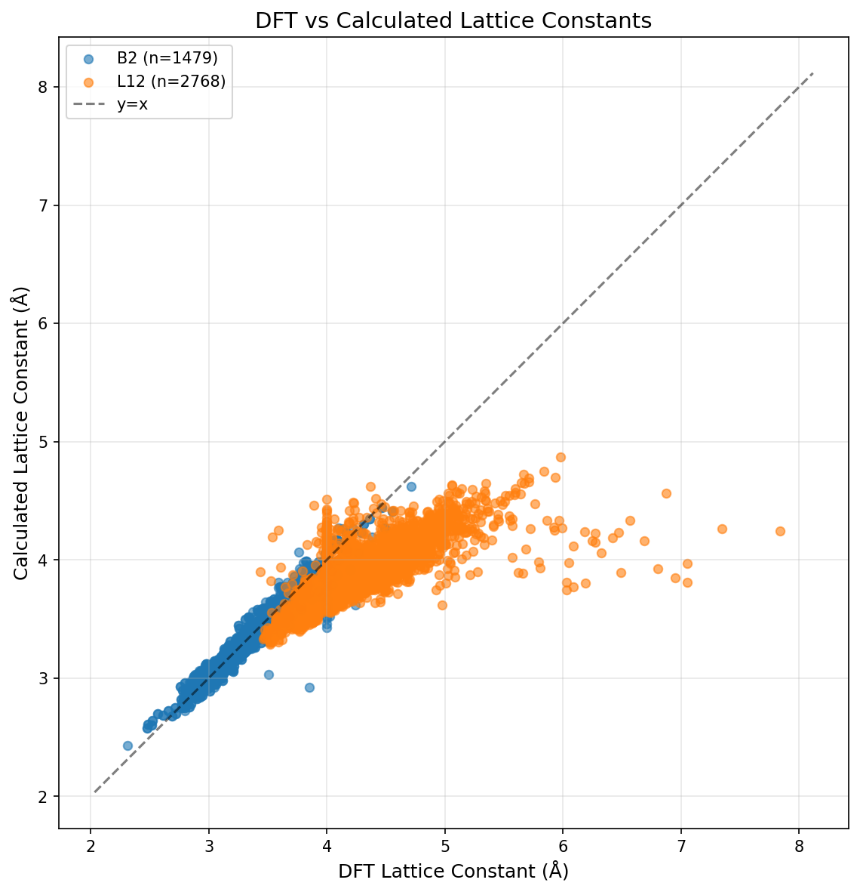
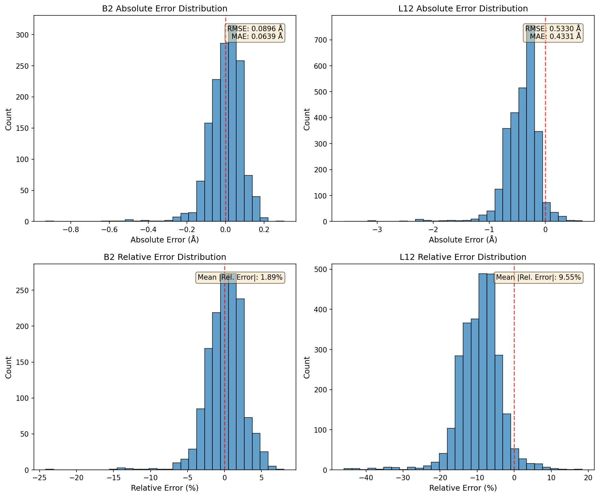
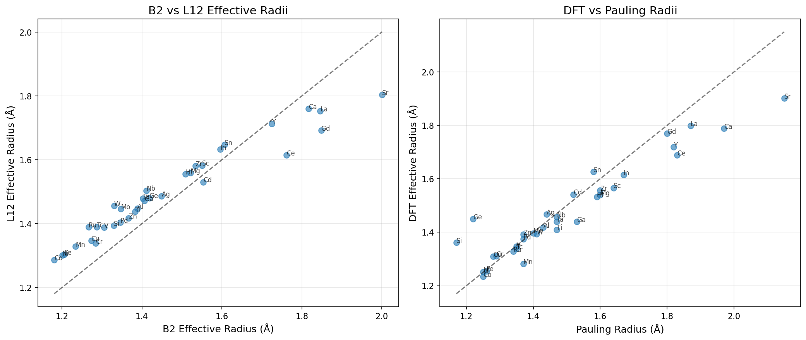

# DFT計算に基づく有効原子半径推定レポート

## 1. 研究概要

本レポートは、ユーザー独自のDFT（密度汎関数理論）計算結果から、B2およびL12構造の二元系化合物の格子定数データを用いて、Trust Region Reflective (TRF) 法により有効原子半径を計算した結果をまとめたものである。

### 1.1 対象構造

| 構造 | 化学量論 | 空間群 | 幾何学的拘束条件 |
|-----|---------|-------|----------------|
| B2 (CsCl型) | AB | Pm-3m (221) | r_A + r_B = (√3/2) × a |
| L12 (Cu3Au型) | A3B | Pm-3m (221) | 2r_major = a/√2 (A-A接触), r_major + r_minor = a/√2 (A-B接触) |

### 1.2 最適化アルゴリズム

| パラメータ | 設定値 |
|-----------|-------|
| 手法 | Trust Region Reflective (TRF) |
| 目的関数 | 残差二乗和の最小化 |
| 半径下限 | 0.5 Å |
| 半径上限 | 3.0 Å |
| 初期値 | Pauling金属半径 |

---

## 2. データサマリー

### 2.1 データ収集統計

| 項目 | B2構造 | L12構造 | 合計 |
|-----|--------|---------|------|
| 化合物数 | 1479 | 2768 | 4247 |
| 元素数 | 39 | 53 | 58 |

### 2.2 フィッティング精度

| 構造 | RMSE (Å) | MAE (Å) |
|-----|----------|---------|
| B2 | 0.0776 | 0.0554 |
| L12 | 0.2276 | 0.1466 |
| Combined | 0.2111 | 0.1357 |

---

## 3. 有効原子半径結果

### 3.1 計算された有効原子半径

| 元素 | B2半径 (Å) | L12半径 (Å) | Combined (Å) | Pauling (Å) | B2-Pauling差 (Å) |
|-----|-----------|------------|--------------|-------------|------------------|
| Ag | 1.4492 | 1.4862 | 1.4763 | 1.4400 | +0.0092 |
| Al | 1.3885 | 1.4475 | 1.4329 | 1.4300 | -0.0415 |
| As | 1.4165 | - | 1.3945 | 1.2100 | +0.2065 |
| Au | - | 1.4883 | 1.4903 | 1.4400 | - |
| B | 1.0521 | - | 1.0302 | 0.9800 | +0.0721 |
| Ba | - | 1.9076 | 1.9096 | 2.2200 | - |
| Ca | 1.8167 | 1.7599 | 1.7683 | 1.9700 | -0.1533 |
| Cd | 1.5532 | 1.5303 | 1.5321 | 1.5200 | +0.0332 |
| Ce | 1.7617 | 1.6148 | 1.6407 | 1.8300 | -0.0683 |
| Co | 1.1807 | 1.2866 | 1.2631 | 1.2500 | -0.0693 |
| Cr | 1.2846 | 1.3380 | 1.3247 | 1.2900 | -0.0054 |
| Cu | 1.2732 | 1.3463 | 1.3293 | 1.2800 | -0.0068 |
| Dy | - | 1.6414 | 1.6434 | 1.7700 | - |
| Er | - | 1.5254 | 1.5274 | 1.7500 | - |
| Eu | - | 1.7027 | 1.7047 | 2.0400 | - |
| Fe | 1.2063 | 1.3038 | 1.2818 | 1.2600 | -0.0537 |
| Ga | 1.4064 | 1.4720 | 1.4563 | 1.5300 | -0.1236 |
| Gd | 1.8482 | 1.6917 | 1.7086 | 1.8000 | +0.0482 |
| Ge | 1.4183 | 1.4806 | 1.4656 | 1.2200 | +0.1983 |
| Hf | 1.5089 | 1.5554 | 1.5434 | 1.5900 | -0.0811 |
| Hg | - | 1.5796 | 1.5815 | 1.5500 | - |
| Ho | - | 1.6201 | 1.6221 | 1.7600 | - |
| In | 1.5963 | 1.6325 | 1.6228 | 1.6700 | -0.0737 |
| Ir | - | 1.3806 | 1.3826 | 1.3600 | - |
| La | 1.8459 | 1.7521 | 1.7677 | 1.8700 | -0.0241 |
| Lu | - | 1.6549 | 1.6569 | 1.7400 | - |
| Mg | 1.5214 | 1.5586 | 1.5486 | 1.6000 | -0.0786 |
| Mn | 1.2338 | 1.3288 | 1.3075 | 1.3700 | -0.1362 |
| Mo | 1.3475 | 1.4462 | 1.4241 | 1.4000 | -0.0525 |
| Na | 1.6970 | - | 1.6751 | 1.9000 | -0.2030 |
| Nb | 1.4110 | 1.5037 | 1.4826 | 1.4700 | -0.0590 |
| Nd | - | 1.6409 | 1.6429 | 1.8100 | - |
| Ni | 1.2006 | 1.3012 | 1.2789 | 1.2500 | -0.0494 |
| Os | - | 1.3918 | 1.3938 | 1.3500 | - |
| Pb | - | 1.7170 | 1.7189 | 1.7500 | - |
| Pd | 1.3459 | 1.4039 | 1.3897 | 1.3700 | -0.0241 |
| Pr | - | 1.6421 | 1.6441 | 1.8200 | - |
| Pt | - | 1.4145 | 1.4164 | 1.3900 | - |
| Re | - | 1.3998 | 1.4017 | 1.3700 | - |
| Rh | - | 1.3635 | 1.3655 | 1.3400 | - |
| Ru | 1.2665 | 1.3895 | 1.3629 | 1.3400 | -0.0735 |
| Sb | 1.6067 | - | 1.5848 | 1.6100 | -0.0033 |
| Sc | 1.5501 | 1.5823 | 1.5732 | 1.6400 | -0.0899 |
| Se | 1.4519 | - | 1.4300 | 1.1700 | +0.2819 |
| Si | 1.3293 | 1.3944 | 1.3788 | 1.1700 | +0.1593 |
| Sm | - | 1.6939 | 1.6956 | 1.8000 | - |
| Sn | 1.6066 | 1.6469 | 1.6362 | 1.5800 | +0.0266 |
| Sr | 2.0004 | 1.8036 | 1.8389 | 2.1500 | -0.1496 |
| Ta | 1.4019 | 1.4786 | 1.4608 | 1.4700 | -0.0681 |
| Tb | - | 1.5918 | 1.5938 | 1.7800 | - |
| Tc | 1.2872 | 1.3891 | 1.3662 | 1.3500 | -0.0628 |
| Ti | 1.3827 | 1.4372 | 1.4238 | 1.4700 | -0.0873 |
| Tm | - | 1.6012 | 1.6032 | 1.7400 | - |
| V | 1.3059 | 1.3877 | 1.3690 | 1.3500 | -0.0441 |
| W | 1.3303 | 1.4559 | 1.4283 | 1.4100 | -0.0797 |
| Y | 1.7243 | 1.7130 | 1.7125 | 1.8200 | -0.0957 |
| Zn | 1.3668 | 1.4168 | 1.4042 | 1.3700 | -0.0032 |
| Zr | 1.5337 | 1.5804 | 1.5684 | 1.6000 | -0.0663 |

---

## 4. 格子定数比較

### 4.1 パリティプロット

DFT計算による格子定数とTRF最適化有効原子半径から計算した格子定数の比較を示す。理想的な一致はy=x線上に位置する。

### 4.2 誤差分布

上段は絶対誤差、下段は相対誤差の分布を示す。

### 4.3 半径比較

左図はB2構造とL12構造で計算された有効原子半径の相関を示す。右図はDFT計算による有効原子半径とPauling半径の比較を示す。

---

## 5. 格子定数予測精度

| 構造 | RMSE (Å) | MAE (Å) | 平均相対誤差 (%) |
|-----|----------|---------|-----------------|
| B2 | 0.0896 | 0.0639 | 1.89 |
| L12 | 0.5330 | 0.4331 | 9.55 |

---

## 6. 結論

### 6.1 主要な知見

1. **B2構造**: 1479個の化合物から39種類の元素の有効原子半径を決定。RMSE = 0.0776 Åの精度を達成。

2. **L12構造**: 2768個の化合物から53種類の元素の有効原子半径を決定。RMSE = 0.2276 Åの精度を達成。

3. **構造依存性**: B2構造とL12構造で計算された有効原子半径には相関があるが、完全な一致ではなく、構造依存性が存在する。

### 6.2 今後の展望

- 高エントロピー合金（HEA）の格子定数予測への応用
- 元素組み合わせごとの独立計算による精度向上の検討
- 他の結晶構造（FCC, BCC, HCP等）への拡張

---

*本レポートは自動生成されました。*
