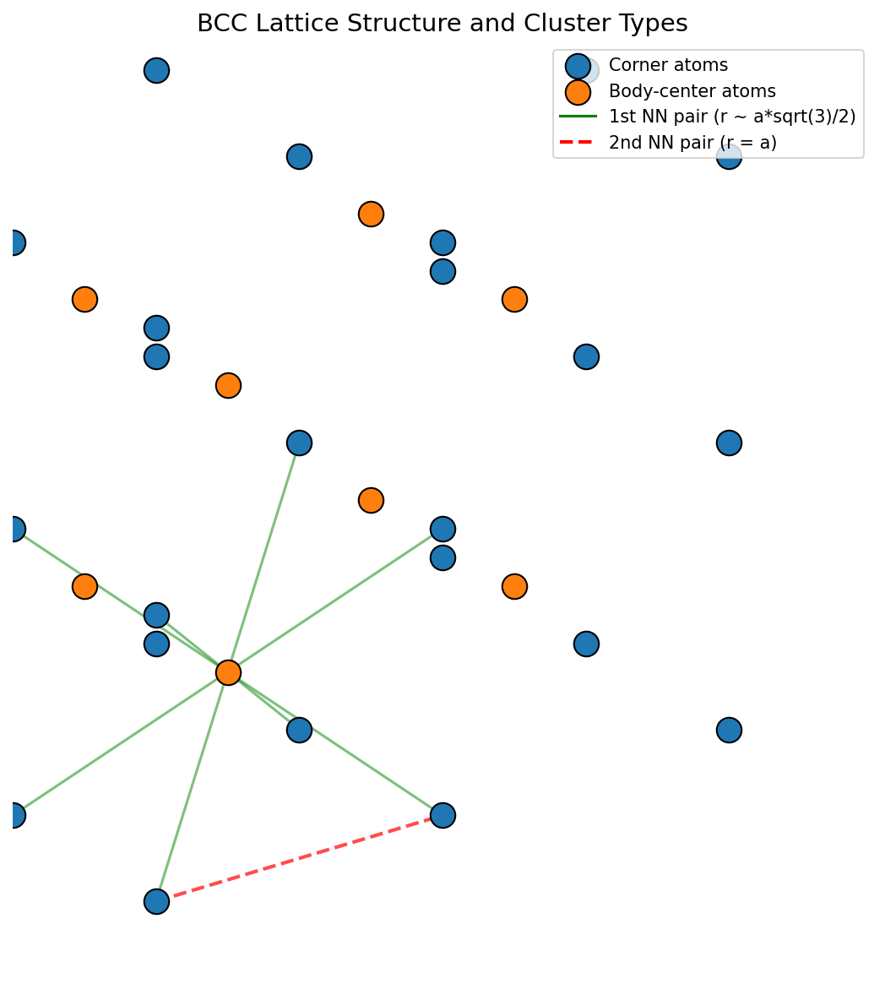
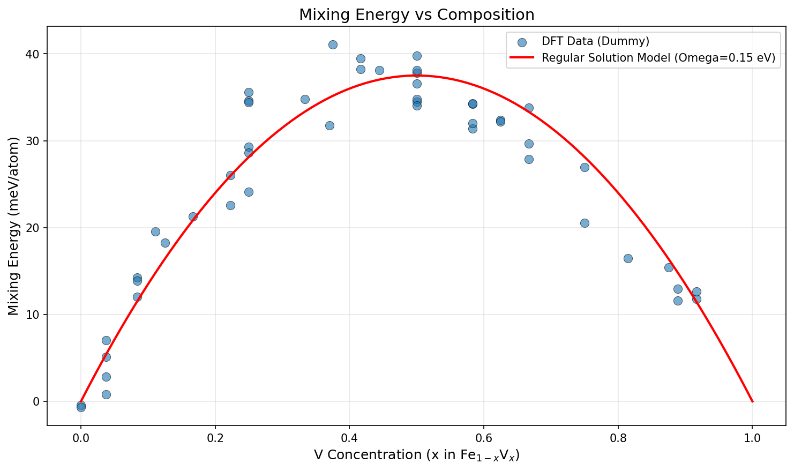
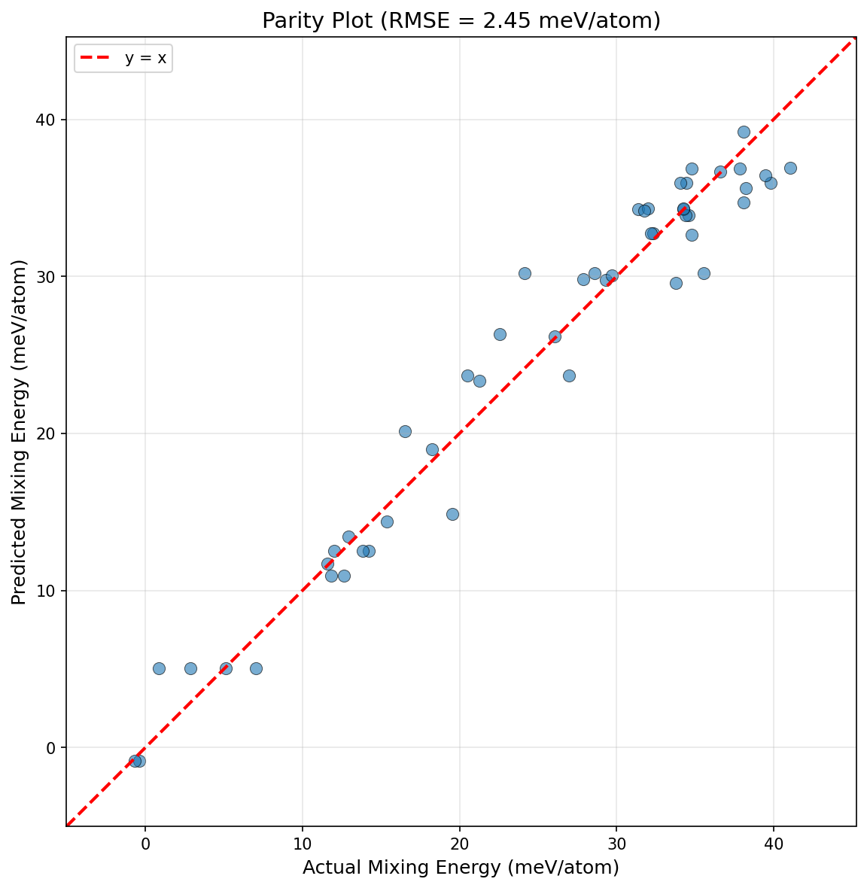
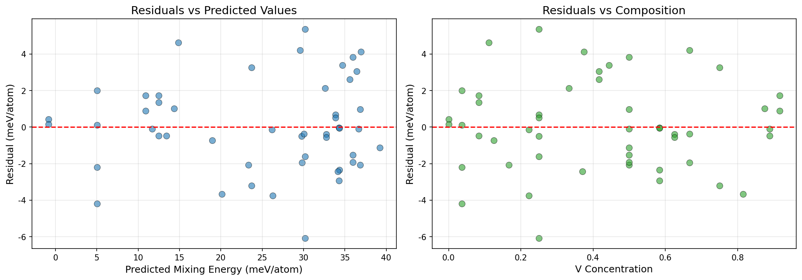
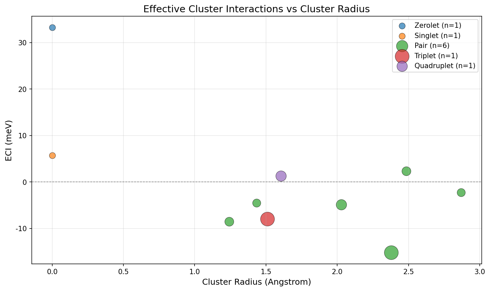
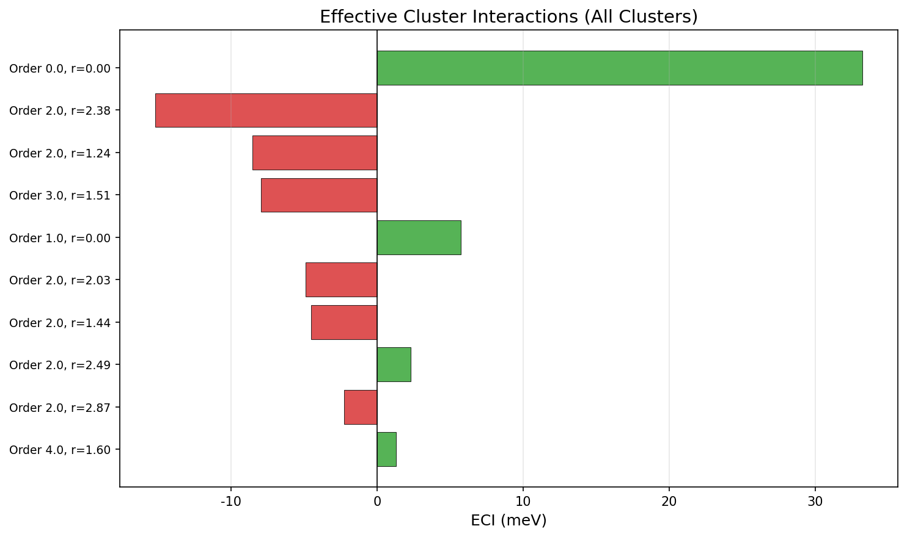
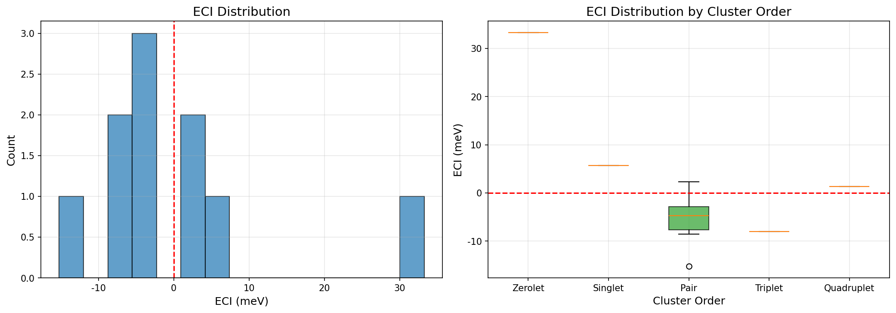

# icet CVM計算 詳細レポート

**生成日時**: 2025-12-30 09:22:33

## 1. 概要

本レポートは、icetライブラリを使用したクラスター展開（Cluster Expansion; CE）計算の結果を報告します。
Fe-V BCC合金系を対象とし、ダミーDFTデータを用いてECI（Effective Cluster Interactions）を抽出しました。

### 1.1 計算条件

| パラメータ | 値 |
|-----------|-----|
| 対象系 | Fe-V BCC合金 |
| 格子定数 | 2.87 A |
| 構造数 | 50 |
| ペアカットオフ | 6.0 A |
| 3体カットオフ | 4.0 A |
| 4体カットオフ | 4.0 A |
| パラメータ数（ECI数） | 10 |
| 回帰モデル | BayesianRidge |

### 1.2 精度指標

| 指標 | 値 |
|------|-----|
| Training RMSE | 2.445 meV/atom |
| CV RMSE (5-fold) | 2.688 meV/atom |

## 2. クラスター空間の構造

### 2.1 BCC格子とクラスタータイプ



BCC（体心立方）格子では、以下のクラスタータイプが定義されます：

- **Zerolet (Order 0)**: 空クラスター（定数項）
- **Singlet (Order 1)**: 点クラスター（濃度依存項）
- **Pair (Order 2)**: ペアクラスター（2体相互作用）
  - 最近接ペア: r ~ a*sqrt(3)/2 ~ 2.49 A
  - 次近接ペア: r = a ~ 2.87 A
- **Triplet (Order 3)**: 3体クラスター
- **Quadruplet (Order 4)**: 4体クラスター

### 2.2 ClusterSpace情報

```
====================================== Cluster Space ======================================
 space group                            : Im-3m (229)
 chemical species                       : ['Fe', 'V'] (sublattice A)
 cutoffs                                : 6.0000 4.0000 4.0000
 total number of parameters             : 10
 number of parameters by order          : 0= 1  1= 1  2= 6  3= 1  4= 1
 fractional_position_tolerance          : 2e-06
 position_tolerance                     : 1e-05
 symprec                                : 1e-05
-------------------------------------------------------------------------------------------
index | order |  radius  | multiplicity | orbit_index | multicomponent_vector | sublattices
-------------------------------------------------------------------------------------------
   0  |   0   |   0.0000 |        1     |      -1     |           .           |      .     
   1  |   1   |   0.0000 |        1     |       0     |          [0]          |      A     
   2  |   2   |   1.2427 |        4     |       1     |        [0, 0]         |     A-A    
   3  |   2   |   1.4350 |        3     |       2     |        [0, 0]         |     A-A    
   4  |   2   |   2.0294 |        6     |       3     |        [0, 0]         |     A-A    
   5  |   2   |   2.3797 |       12     |       4     |        [0, 0]         |     A-A    
   6  |   2   |   2.4855 |        4     |       5     |        [0, 0]         |     A-A    
   7  |   2   |   2.8700 |        3     |       6     |        [0, 0]         |     A-A    
   8  |   3   |   1.5086 |       12     |       7     |       [0, 0, 0]       |    A-A-A   
   9  |   4   |   1.6044 |        6     |       8     |     [0, 0, 0, 0]      |   A-A-A-A  
===========================================================================================
```

## 3. 入力データの分析

### 3.1 混合エネルギー vs 組成



ダミーデータは正規溶体モデル（Regular Solution Model）に基づいて生成されました：

```
E_mix = Omega * c_Fe * c_V + noise
```

ここで Omega = 0.15 eV（正の値 = 相分離傾向）です。

**注意**: このダミーデータは組成のみに依存し、原子配置（短距離秩序）の情報を含みません。
実際のDFTデータでは、同じ組成でも配置によってエネルギーが異なります。

## 4. フィッティング結果

### 4.1 パリティプロット



予測値と実測値の相関を示します。理想的なフィッティングでは、全ての点がy=x線上に乗ります。

### 4.2 残差分析



残差プロットは、モデルの系統的な誤差を検出するのに有用です：

- **左図**: 残差 vs 予測値 - 予測値に依存した系統誤差がないか確認
- **右図**: 残差 vs 濃度 - 特定の濃度領域で誤差が大きくないか確認

## 5. ECI（有効クラスター相互作用）の分析

### 5.1 ECI一覧表

| Orbit ID | Order | Radius (A) | Multiplicity | ECI (meV) |
|----------|-------|------------|--------------|----------|
| 0 | 0 | 0.0000 | 1 | 33.239 |
| 1 | 1 | 0.0000 | 1 | 5.727 |
| 2 | 2 | 1.2427 | 4 | -8.545 |
| 3 | 2 | 1.4350 | 3 | -4.534 |
| 4 | 2 | 2.0294 | 6 | -4.901 |
| 5 | 2 | 2.3797 | 12 | -15.200 |
| 6 | 2 | 2.4855 | 4 | 2.315 |
| 7 | 2 | 2.8700 | 3 | -2.283 |
| 8 | 3 | 1.5086 | 12 | -7.966 |
| 9 | 4 | 1.6044 | 6 | 1.310 |


### 5.2 ECI vs クラスター半径



各クラスターのECI値を半径に対してプロットしています。
点のサイズはmultiplicity（多重度）を表し、色はクラスターの次数（order）を表します。

### 5.3 ECI棒グラフ



全クラスターのECI値を棒グラフで表示しています。
緑色は正のECI、赤色は負のECIを示します。

### 5.4 ECI分布



- **左図**: 全ECIのヒストグラム
- **右図**: クラスター次数別の箱ひげ図

## 6. CVMへの投入に関する注意事項

### 6.1 基底関数の定義

icetはデフォルトで直交基底を使用します。CVMソルバーがIsing型基底（σ = ±1）を
期待する場合は、以下の変換が必要になる場合があります：

```
J_Ising = J_icet * (変換係数)
```

### 6.2 multiplicityの扱い

CVMソルバーの入力形式によって、ECIにmultiplicityを掛ける/割る変換が必要な場合があります：

- 「クラスター1個あたり」の形式: そのまま使用
- 「格子点あたり」の形式: multiplicityで割る

### 6.3 ダミーデータの限界

**重要**: 本レポートのECIはダミーデータ（正規溶体モデル）から得られたものであり、
実際のFe-V合金の相互作用を反映していません。

実際のCVM計算には、DFT計算から得られた配置依存のエネルギーデータが必要です。

## 7. 再現手順

```bash
# 1. 依存パッケージのインストール
pip install icet matplotlib pandas numpy scikit-learn

# 2. 計算の実行
python icet_cvm_calculation.py

# 3. レポートの生成
python generate_icet_cvm_report.py
```

## 8. 出力ファイル

| ファイル | 説明 |
|---------|------|
| fe_v_data.db | ASEデータベース（構造と混合エネルギー） |
| fe_v_eci_for_cvm.csv | ECI値（CSV形式） |
| docs/icet_cvm_calculation_report_ja.md | 本レポート |
| docs/assets/icet_cvm_report/*.png | 可視化図 |

## 9. 参考文献

1. icet公式ドキュメント: https://icet.materialsmodeling.org/
2. Sanchez, J.M., Ducastelle, F., Gratias, D. (1984). Physica A, 128, 334-350.
3. de Fontaine, D. (1994). Solid State Physics, 47, 33-176.

---

*本レポートはgenerate_icet_cvm_report.pyによって自動生成されました。*
