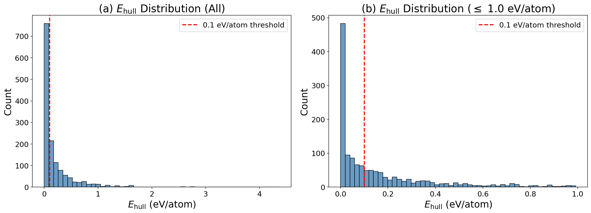
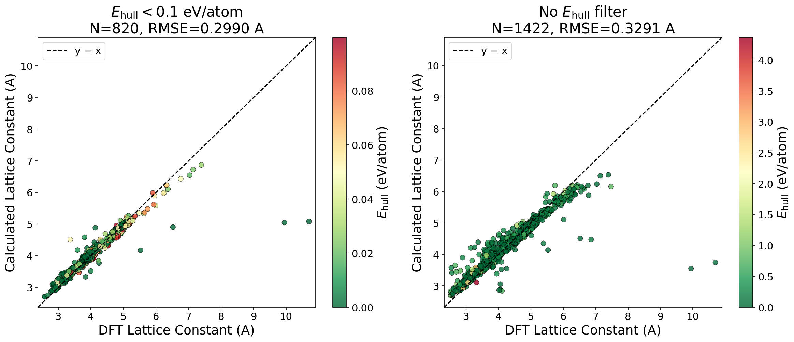
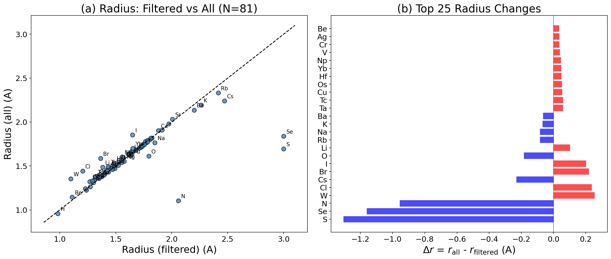
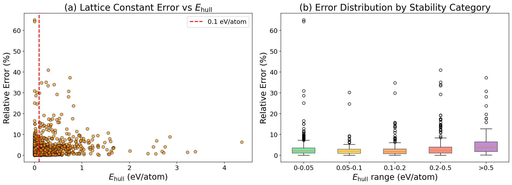
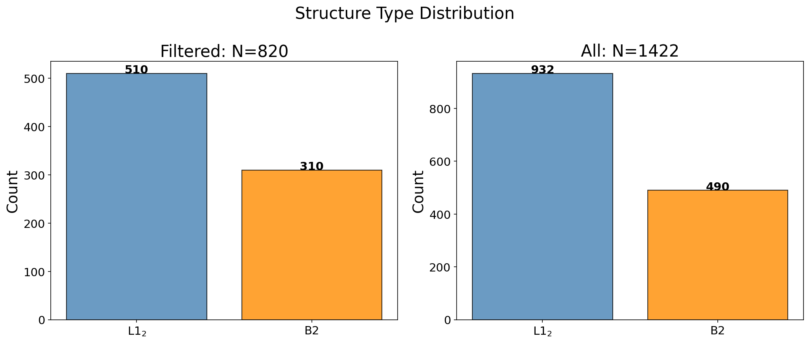

# $E_{\mathrm{hull}}$ フィルタ除去の影響分析レポート

## 1. 概要

B2 / L1$_2$ 構造の二元系化合物について、Materials Project からのデータ抽出時に
適用していた $E_{\mathrm{hull}} < 0.1$ eV/atom フィルタを除去し、
不安定な化合物も含めた計算結果を比較した。

## 2. データセット比較

| 項目 | フィルタあり ($E_{\mathrm{hull}} < 0.1$) | フィルタなし (全データ) |
|:---|:---:|:---:|
| 化合物数 | 820 | 1422 |
| 元素数 | 81 | 84 |
| 追加された化合物 | - | +602 |

### $E_{\mathrm{hull}}$ 分布（全データ）

| カテゴリ | 化合物数 | 割合 |
|:---|:---:|:---:|
| $E_{\mathrm{hull}} = 0$ (凸包上) | 376 | 26.4% |
| $0 < E_{\mathrm{hull}} \leq 0.05$ | 249 | 17.5% |
| $0.05 < E_{\mathrm{hull}} \leq 0.1$ | 170 | 12.0% |
| $0.1 < E_{\mathrm{hull}} \leq 0.5$ | 456 | 32.1% |
| $E_{\mathrm{hull}} > 0.5$ | 171 | 12.0% |

**図1**: 左: 全データの $E_{\mathrm{hull}}$ 分布。右: $\leq$ 1.0 eV/atom の拡大図。赤破線は 0.1 eV/atom 閾値。

## 3. 有効原子半径の最適化結果

| 指標 | フィルタあり | フィルタなし | 変化 |
|:---|:---:|:---:|:---:|
| 半径 RMSE | 0.2283 A | 0.2631 A | +0.0348 A |
| 半径 MAE | 0.1086 A | 0.1433 A | +0.0347 A |
| 格子定数 RMSE | 0.2990 A | 0.3291 A | +0.0302 A |
| 格子定数 MAE | 0.1054 A | 0.1384 A | +0.0331 A |
| 平均相対誤差 | 2.4029 % | 3.3015 % | +0.8985 % |
| 中央値相対誤差 | 1.7704 % | 2.1384 % | +0.3680 % |
| 最大相対誤差 | 52.4926 % | 64.9808 % | +12.4881 % |

**図2**: 格子定数のパリティプロット。左: フィルタあり、右: フィルタなし。色は $E_{\mathrm{hull}}$ を示す。

**図3**: (a) フィルタあり/なしでの有効原子半径の比較。(b) 半径変化量の上位元素。

### 半径変化の大きい元素（上位10）

| 元素 | $r_{\mathrm{filtered}}$ (A) | $r_{\mathrm{all}}$ (A) | $\Delta r$ (A) |
|:---:|:---:|:---:|:---:|
| S | 3.0000 | 1.6952 | -1.3048 |
| Se | 3.0000 | 1.8392 | -1.1608 |
| N | 2.0601 | 1.1048 | -0.9552 |
| W | 1.0975 | 1.3543 | +0.2568 |
| Cl | 1.2043 | 1.4431 | +0.2388 |
| Cs | 2.4707 | 2.2401 | -0.2306 |
| Br | 1.3642 | 1.5849 | +0.2206 |
| I | 1.6503 | 1.8536 | +0.2033 |
| O | 1.7947 | 1.6113 | -0.1834 |
| Li | 1.3829 | 1.4862 | +0.1033 |

### フィルタ除去で新たに含まれた元素

B, C, P

## 4. 安定性と予測精度の関係

**図4**: (a) 格子定数の相対誤差 vs $E_{\mathrm{hull}}$。(b) 安定性カテゴリ別の誤差分布。

| $E_{\mathrm{hull}}$ 範囲 | 化合物数 | 平均誤差 (%) | RMSE (A) |
|:---|:---:|:---:|:---:|
| $0 - 0.05$ | 625 | 2.98 | 0.4172 |
| $0.05 - 0.1$ | 170 | 2.50 | 0.1675 |
| $0.1 - 0.2$ | 215 | 2.78 | 0.2484 |
| $0.2 - 0.5$ | 241 | 4.01 | 0.2532 |
| $> 0.5$ | 171 | 4.94 | 0.2626 |

**図5**: 構造タイプ（B2 / L1$_2$）の分布比較。

## 5. 結論

- フィルタ除去により格子定数 RMSE は 0.0302 A 増加した。
  これは不安定な化合物の格子定数が硬球モデルからより大きく逸脱するためと考えられる。
- 平均相対誤差は 2.40% → 3.30% に変化（+0.90 pp）。
- 化合物数は 820 → 1422（+602）に増加。
- フィルタ除去により新たに 3 元素のデータが利用可能になった。

### 推奨事項

1. **初期スクリーニング**: $E_{\mathrm{hull}} < 0.1$ eV/atom は依然として妥当な初期フィルタだが、
   化学系に応じた閾値調整が望ましい。
2. **不安定相の活用**: 不安定な化合物のデータを含めることで、
   元素被覆率（element coverage）が向上し、HEA設計に有用な情報が得られる。
3. **品質管理**: $E_{\mathrm{hull}} > 0.5$ eV/atom の化合物は予測精度が低下する傾向があるため、
   重み付けや外れ値処理の導入を検討すべき。
