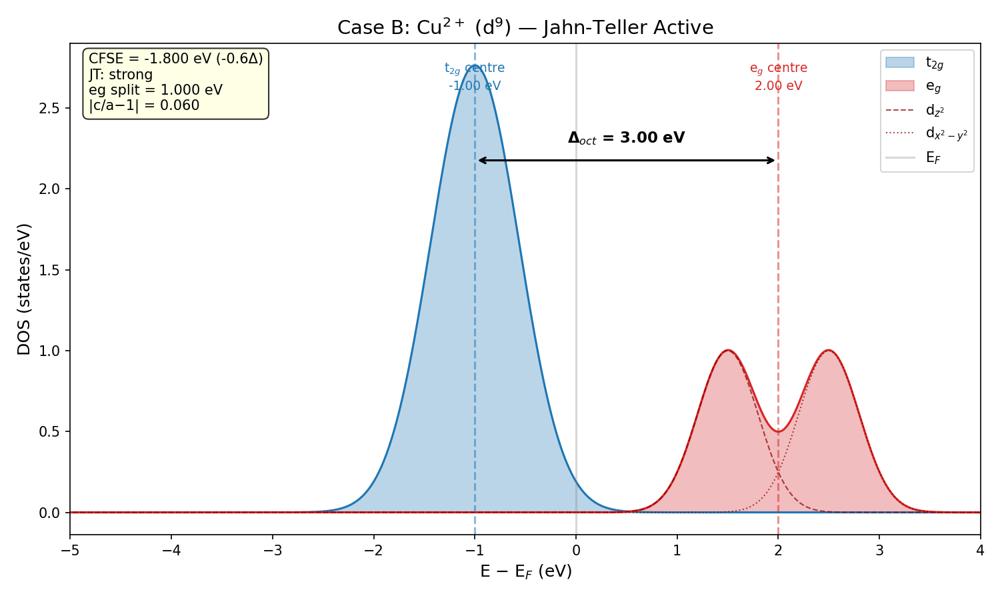
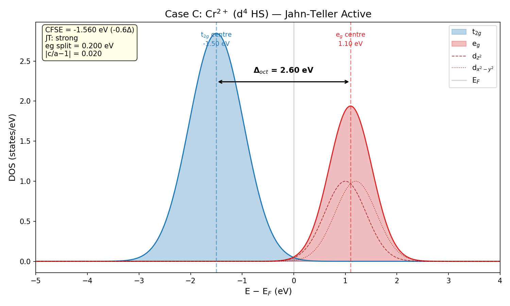

# Validation 2: Synthetic VASP Data — Pipeline Verification

End-to-end verification of t2vasp against synthetic VASP outputs
with known ground-truth values.

## Case A: Cubic Ni FCC (d$^8$) — Parsing & Energy

| Check | Expected | Actual | Result |
|-------|----------|--------|--------|
| A1: Lattice constant | 3.524 Å | 3.524 Å | PASS |
| A2: Number of atoms | 4 | 4 | PASS |
| A3: Volume | 43.763 ų | 43.763 ų | PASS |
| A4: Total energy | -21.568 eV | -21.568 eV | PASS |
| A5: Convergence | True | True | PASS |
| A6: Energy per atom | -5.3920 eV/atom | -5.3920 eV/atom | PASS |
| A7: c/a ratio (cubic → 1.0) | 1.000 | 1.000 | PASS |
| A8: CFSE(d8) in units of Δ | -1.2 | -1.2 | PASS |
| A9: JT activity (d8 → inactive) | None | None | PASS |

## Case B: Cu$^{2+}$ (d$^9$) — Strong Jahn-Teller

| Check | Expected | Actual | Result |
|-------|----------|--------|--------|
| B1: Δ_oct (splitting) > 0 | > 0 | 3.000 eV | PASS |
| B2: JT active (d9) | True | True | PASS |
| B3: JT strength (d9 → strong) | strong | strong | PASS |
| B4: CFSE(d9) = -0.6Δ | -0.6 | -0.6 | PASS |
| B5: eg splitting (dz²/dx²-y² separation) > 0 (Measures magnitude of Jahn-Teller distortion in DOS) | > 0 | 1.000 eV | PASS |
| B6: Tetragonality |c/a - 1| | 0.060 | 0.060 | PASS |

## Case C: Cr$^{2+}$ (d$^4$ HS) — Strong Jahn-Teller

| Check | Expected | Actual | Result |
|-------|----------|--------|--------|
| C1: JT active (d4 HS) | True | True | PASS |
| C2: JT strength (d4 HS → strong) | strong | strong | PASS |
| C3: CFSE(d4 HS) = -0.6Δ | -0.6 | -0.6 | PASS |
| C4: Tetragonality |c/a - 1| = 0.02 | 0.020 | 0.020 | PASS |

## Case D: Jahn-Teller Stabilisation Energy (Paired)

| Check | Expected | Actual | Result |
|-------|----------|--------|--------|
| D1: JTSE > 0 (distortion is favorable) | > 0 | 0.3500 eV | PASS |
| D2: JTSE value | 0.350 eV | 0.350 eV | PASS |
| D3: JTSE per atom | 0.0437 eV/atom | 0.0438 eV/atom | PASS |
| D4: Δ(c/a) | 0.060 | 0.060 | PASS |

## Case E: Export Pipeline

| Check | Expected | Actual | Result |
|-------|----------|--------|--------|
| E1: CSV export creates file | True | True | PASS |
| E2: JSON export creates file | True | True | PASS |
| E3: Summary export non-empty | True | True | PASS |
| E4: CSV has correct number of rows | 2 | 2 | PASS |

## Figures

### Case B Cu D9 Dos

### Case C Cr D4 Dos

## Summary

**27/27** checks passed.

All validation checks match expected values.
