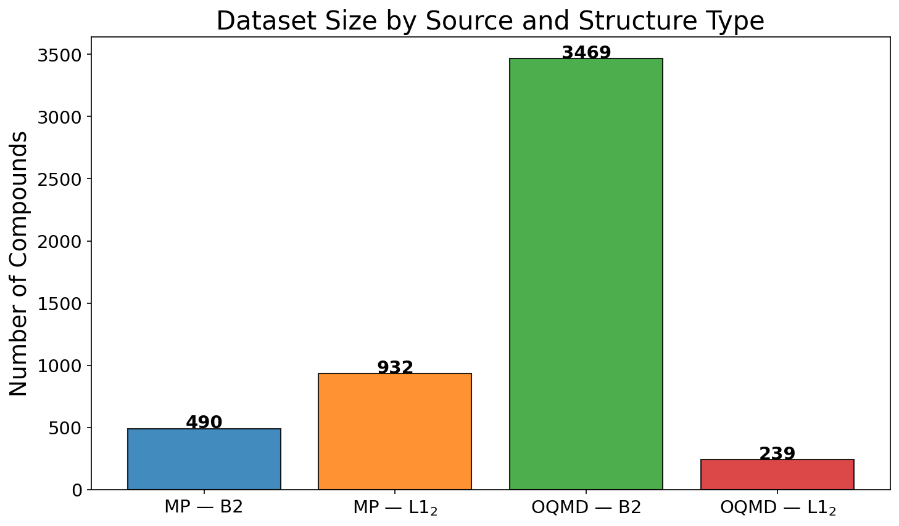
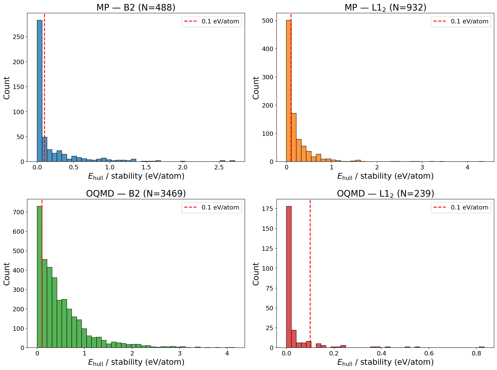
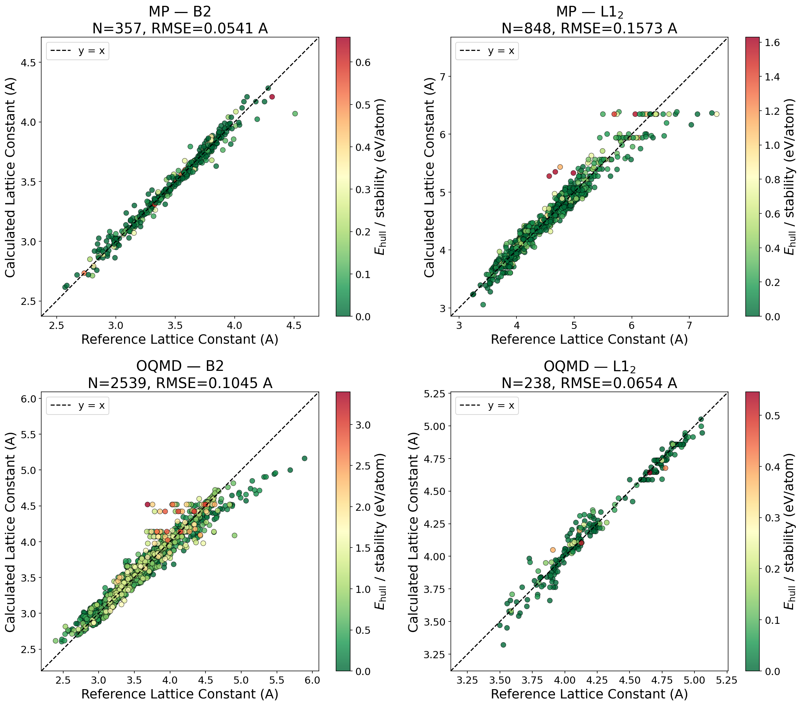
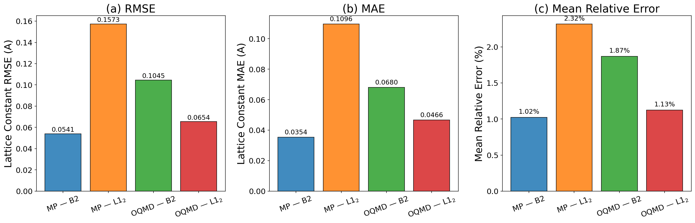
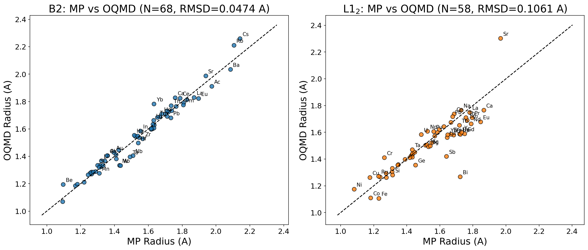
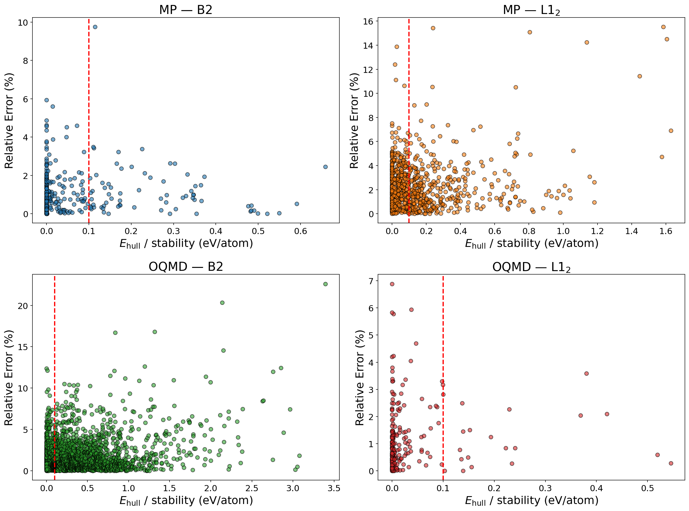

# 4ケース比較レポート: MP/OQMD $\times$ B2/L1$_2$

## 1. 概要

Materials Project (MP) および OQMD から B2 (CsCl型) と L1$_2$ (AuCu$_3$型) の
二元系化合物を抽出し、$E_{\mathrm{hull}}$ フィルタなしで有効原子半径を
TRF 最適化により算出した。4ケースの比較を行う。

## 2. データセット比較

| ケース | データソース | 構造タイプ | 化合物数 | 元素数 |
|:---|:---:|:---:|:---:|:---:|
| MP — B2 | MP | B2 | 357 | 68 |
| MP — L1$_2$ | MP | L1$_2$ | 848 | 72 |
| OQMD — B2 | OQMD | B2 | 2539 | 72 |
| OQMD — L1$_2$ | OQMD | L1$_2$ | 238 | 58 |

**図1**: ケース別の化合物数。

## 3. 安定性分布

**図5**: 各ケースの $E_{\mathrm{hull}}$ / stability 分布。赤破線は 0.1 eV/atom。

## 4. 有効原子半径と格子定数の再現性

| ケース | 半径 RMSE (A) | 半径 MAE (A) | 格子定数 RMSE (A) | 格子定数 MAE (A) | 平均相対誤差 (%) | 中央値相対誤差 (%) |
|:---|:---:|:---:|:---:|:---:|:---:|:---:|
| MP — B2 | 0.0541 | 0.0354 | 0.0541 | 0.0354 | 1.02 | 0.68 |
| MP — L1$_2$ | 0.1573 | 0.1096 | 0.1573 | 0.1096 | 2.32 | 1.81 |
| OQMD — B2 | 0.1045 | 0.0680 | 0.1045 | 0.0680 | 1.87 | 1.28 |
| OQMD — L1$_2$ | 0.0654 | 0.0466 | 0.0654 | 0.0466 | 1.13 | 0.73 |

**図2**: 各ケースの格子定数パリティプロット。色は $E_{\mathrm{hull}}$ / stability。

**図3**: (a) 格子定数 RMSE, (b) MAE, (c) 平均相対誤差 の比較。

## 5. MP vs OQMD 有効原子半径の比較

### B2

- 共通元素数: 68
- 半径 RMSD (MP vs OQMD): 0.0474 A
- 最大差: 0.1504 A (Yb)

| 元素 | $r_{\mathrm{MP}}$ (A) | $r_{\mathrm{OQMD}}$ (A) | $\Delta r$ (A) |
|:---:|:---:|:---:|:---:|
| Yb | 1.6331 | 1.7836 | +0.1504 |
| Cs | 2.1414 | 2.2593 | +0.1178 |
| Rb | 2.1051 | 2.2109 | +0.1058 |
| Nb | 1.5086 | 1.4062 | -0.1024 |
| W | 1.4346 | 1.3328 | -0.1018 |
| Be | 1.0967 | 1.1948 | +0.0981 |
| Mo | 1.4298 | 1.3343 | -0.0955 |
| Ta | 1.4914 | 1.3973 | -0.0941 |
| Eu | 1.8968 | 1.8226 | -0.0742 |
| Ca | 1.7580 | 1.8280 | +0.0699 |

### L1$_2$

- 共通元素数: 58
- 半径 RMSD (MP vs OQMD): 0.1061 A
- 最大差: 0.4539 A (Bi)

| 元素 | $r_{\mathrm{MP}}$ (A) | $r_{\mathrm{OQMD}}$ (A) | $\Delta r$ (A) |
|:---:|:---:|:---:|:---:|
| Bi | 1.7227 | 1.2688 | -0.4539 |
| Sr | 1.9665 | 2.3027 | +0.3361 |
| Sb | 1.6400 | 1.4202 | -0.2198 |
| Eu | 1.8459 | 1.6792 | -0.1667 |
| Gd | 1.7502 | 1.5900 | -0.1602 |
| Cr | 1.2638 | 1.4112 | +0.1474 |
| Ho | 1.7237 | 1.5853 | -0.1384 |
| Dy | 1.7198 | 1.5872 | -0.1325 |
| Y | 1.7312 | 1.5999 | -0.1313 |
| Fe | 1.2308 | 1.1057 | -0.1251 |

**図4**: MP vs OQMD の有効原子半径比較。B2 (左) と L1$_2$ (右)。

## 6. 予測誤差と安定性の関係

**図6**: 各ケースの格子定数相対誤差 vs $E_{\mathrm{hull}}$ / stability。

## 7. 結論

1. **データ量**: OQMD は B2 構造で MP より多くのデータを提供するが、L1$_2$ は MP の方が豊富。
2. **精度比較**: 4ケース間の格子定数 RMSE と相対誤差を比較し、データソースと構造タイプによる精度差を定量化した。
3. **半径整合性**: MP と OQMD で得られた有効原子半径の一致度を評価した。
4. **安定性の影響**: 不安定化合物を含めた場合の精度への影響を各ケースで確認した。
