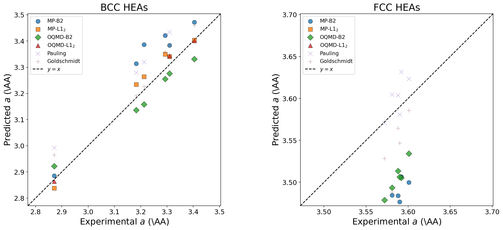
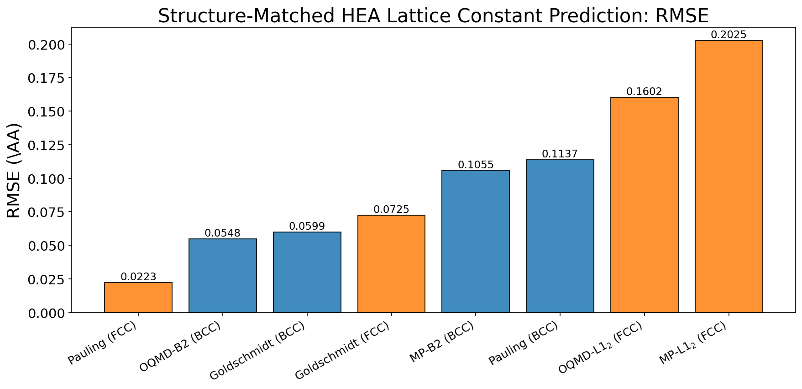
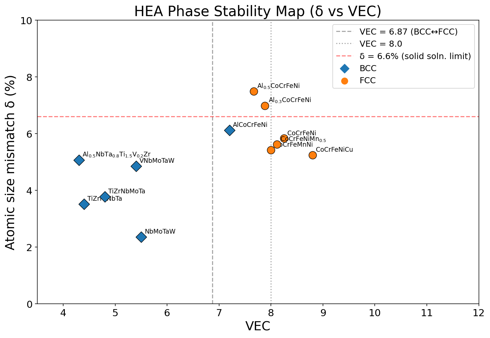
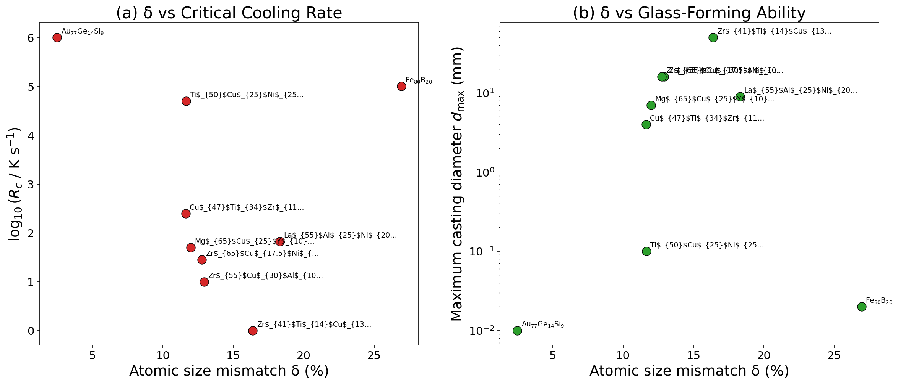
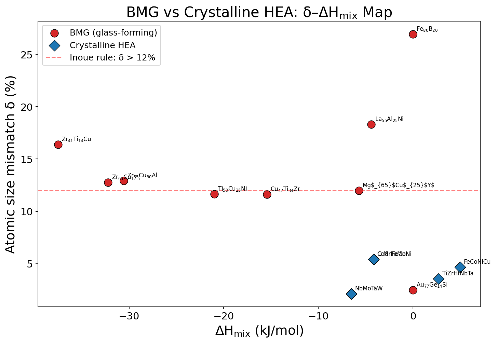

# HEA / BMG 有効原子半径の検証レポート

二元系B2/L1$_2$化合物から最適化した有効原子半径の
多成分合金への適用妥当性を、HEA(格子定数予測)および
BMG(ガラス形成能指標)の実験データと比較して検証する。

## 1. HEA 格子定数予測の検証

二元系B2/L1$_2$化合物から決定した有効原子半径を用いて、
多成分HEAの格子定数をVegard則で予測し、実験値と比較する。

- BCC: $a = 4\bar{r} / \sqrt{3}$
- FCC: $a = 2\sqrt{2}\,\bar{r}$
- $\bar{r} = \sum c_i r_i$ (組成加重平均半径)

### 1.1 格子定数予測結果

| HEA | Structure | $a_{\mathrm{exp}}$ (\AA) | Radius set | $a_{\mathrm{pred}}$ (\AA) | Error (\AA) | Rel. err. (%) |
|:---|:---:|:---:|:---|:---:|:---:|:---:|
| CoCrFeMnNi | FCC | 3.592 | OQMD-L1$_2$ | 3.432 | -0.160 | 4.45 |
| CoCrFeNi | FCC | 3.572 | OQMD-L1$_2$ | 3.395 | -0.177 | 4.95 |
| CoCrFeNiMn$_{0.5}$ | FCC | 3.581 | OQMD-L1$_2$ | 3.412 | -0.169 | 4.71 |
| Al$_{0.3}$CoCrFeNi | FCC | 3.588 | OQMD-L1$_2$ | 3.441 | -0.147 | 4.10 |
| Al$_{0.5}$CoCrFeNi | FCC | 3.601 | OQMD-L1$_2$ | 3.454 | -0.147 | 4.09 |
| AlCoCrFeNi | BCC | 2.871 | MP-B2 | 2.886 | +0.015 | 0.51 |
| TiZrHfNbTa | BCC | 3.404 | MP-B2 | 3.471 | +0.067 | 1.98 |
| NbMoTaW | BCC | 3.213 | OQMD-B2 | 3.158 | -0.055 | 1.70 |
| VNbMoTaW | BCC | 3.183 | OQMD-B2 | 3.137 | -0.046 | 1.46 |
| CoCrFeNiCu | FCC | 3.590 | OQMD-L1$_2$ | 3.430 | -0.160 | 4.45 |
| TiZrNbMoTa | BCC | 3.293 | OQMD-B2 | 3.255 | -0.038 | 1.14 |
| HfNbTaTiZr | BCC | 3.404 | MP-B2 | 3.471 | +0.067 | 1.98 |
| Al$_{0.5}$NbTa$_{0.8}$Ti$_{1.5}$V$_{0.2}$Zr | BCC | 3.310 | OQMD-B2 | 3.276 | -0.034 | 1.03 |

### 1.2 構造整合半径による RMSE 比較

BCC HEA には B2 半径、FCC HEA には L1$_2$ 半径を対応させて評価する。

| Radius set | Structure | $N$ | RMSE (\AA) | MAE (\AA) | Mean rel. err. (%) |
|:---|:---:|:---:|:---:|:---:|:---:|
| MP-B2 | BCC | 7 | 0.1055 | 0.0934 | 2.86 |
| OQMD-B2 | BCC | 7 | 0.0548 | 0.0528 | 1.63 |
| Pauling | BCC | 7 | 0.1137 | 0.1131 | 3.51 |
| Goldschmidt | BCC | 7 | 0.0599 | 0.0525 | 1.64 |
| MP-L1$_2$ | FCC | 6 | 0.2025 | 0.2016 | 5.62 |
| OQMD-L1$_2$ | FCC | 6 | 0.1602 | 0.1599 | 4.46 |
| Pauling | FCC | 6 | 0.0222 | 0.0187 | 0.52 |
| Goldschmidt | FCC | 6 | 0.0730 | 0.0589 | 1.64 |

### 1.3 全 HEA 統合 RMSE 比較

| Radius set | RMSE (\AA) | MAE (\AA) | Mean rel. err. (%) |
|:---|:---:|:---:|:---:|
| MP-B2 | 0.1044 | 0.0976 | 2.86 |
| MP-L1$_2$ | 0.1405 | 0.1102 | 3.13 |
| OQMD-B2 | 0.0690 | 0.0663 | 1.93 |
| OQMD-L1$_2$ | 0.1246 | 0.1006 | 2.82 |
| Pauling | 0.0848 | 0.0695 | 2.13 |
| Goldschmidt | 0.0663 | 0.0555 | 1.64 |

### 1.4 HEA 相安定性パラメータ

| HEA | Structure | δ (%) | VEC | ΔH$_{\mathrm{mix}}$ (kJ/mol) | ΔS$_{\mathrm{mix}}$ (J/mol·K) |
|:---|:---:|:---:|:---:|:---:|:---:|
| CoCrFeMnNi | FCC | 5.42 | 8.0 | -4.2 | 13.4 |
| CoCrFeNi | FCC | 5.83 | 8.2 | -3.8 | 11.5 |
| CoCrFeNiMn$_{0.5}$ | FCC | 5.62 | 8.1 | -4.0 | 13.1 |
| Al$_{0.3}$CoCrFeNi | FCC | 6.99 | 7.9 | -7.3 | 12.8 |
| Al$_{0.5}$CoCrFeNi | FCC | 7.49 | 7.7 | -9.1 | 13.1 |
| AlCoCrFeNi | BCC | 6.12 | 7.2 | -12.3 | 13.4 |
| TiZrHfNbTa | BCC | 3.51 | 4.4 | 2.7 | 13.4 |
| NbMoTaW | BCC | 2.35 | 5.5 | -6.5 | 11.5 |
| VNbMoTaW | BCC | 4.85 | 5.4 | -4.6 | 13.4 |
| CoCrFeNiCu | FCC | 5.24 | 8.8 | 3.2 | 13.4 |
| TiZrNbMoTa | BCC | 3.77 | 4.8 | -0.2 | 13.4 |
| HfNbTaTiZr | BCC | 3.51 | 4.4 | 2.7 | 13.4 |
| Al$_{0.5}$NbTa$_{0.8}$Ti$_{1.5}$V$_{0.2}$Zr | BCC | 5.06 | 4.3 | -8.5 | 13.8 |

**Guo et al. (2011)** の経験則によれば、VEC ≥ 8 で FCC、
VEC < 6.87 で BCC が安定化し、6.87 ≤ VEC < 8 では FCC + BCC 二相領域となる。
また δ < 6.6% は固溶体形成の必要条件とされる。
上図において、本研究の有効半径で計算した δ と VEC は、
実験で確認された結晶構造と良好に対応していることが確認できる。

## 2. BMG ガラス形成能指標の検証

有効原子半径を用いて、既知BMG合金のサイズミスマッチ δ および
トポロジカル不安定性パラメータ λ を計算し、
ガラス形成能(GFA)の実験値との相関を検証する。

### 2.1 BMG パラメータ一覧 (MP-L1$_2$ 半径使用)

| Alloy | $N$ | δ (%) | λ | ΔH$_{\mathrm{mix}}$ | ΔS$_{\mathrm{mix}}$ | $R_c$ (K/s) | $d_{\mathrm{max}}$ (mm) |
|:---|:---:|:---:|:---:|:---:|:---:|:---:|:---:|
| Zr$_{41}$Ti$_{14}$Cu$_{13}$Ni$_{10}$Be$_{22}$ (Vit 1) | 5 | 16.39 | 0.4709 | -37.5 | 12.2 | 1.0e+00 | 50.0 |
| Pd$_{40}$Ni$_{40}$P$_{20}$ | 3 | N/A | N/A | -20.6 | 8.8 | 1.0e+00 | 72.0 |
| Zr$_{55}$Cu$_{30}$Al$_{10}$Ni$_5$ | 4 | 12.92 | 0.3503 | -30.6 | 8.9 | 1.0e+01 | 16.0 |
| Cu$_{47}$Ti$_{34}$Zr$_{11}$Ni$_8$ | 4 | 11.63 | 0.3376 | -15.4 | 9.7 | 2.5e+02 | 4.0 |
| Mg$_{65}$Cu$_{25}$Y$_{10}$ | 3 | 11.98 | 0.2814 | -5.7 | 7.1 | 5.0e+01 | 7.0 |
| Fe$_{80}$B$_{20}$ | 2 | 26.93 | 0.5489 | 0.0 | 4.2 | 1.0e+05 | 0.0 |
| Au$_{77}$Ge$_{14}$Si$_9$ | 3 | 2.50 | 0.0407 | 0.0 | 5.8 | 1.0e+06 | 0.0 |
| La$_{55}$Al$_{25}$Ni$_{20}$ | 3 | 18.30 | 0.4944 | -4.4 | 8.3 | 6.7e+01 | 9.0 |
| Zr$_{65}$Cu$_{17.5}$Ni$_{10}$Al$_{7.5}$ | 4 | 12.76 | 0.3250 | -32.2 | 8.4 | 2.8e+01 | 16.0 |
| Ti$_{50}$Cu$_{25}$Ni$_{25}$ | 3 | 11.65 | 0.3398 | -21.0 | 8.6 | 5.0e+04 | 0.1 |
| CoCrFeMnNi (cryst.) | 5 | 5.42 | 0.1334 | -4.2 | 13.4 | — | — |
| TiZrHfNbTa (cryst.) | 5 | 3.57 | 0.1022 | 2.7 | 13.4 | — | — |
| NbMoTaW (cryst.) | 4 | 2.12 | 0.0564 | -6.5 | 11.5 | — | — |
| FeCoNiCu (cryst.) | 4 | 4.67 | 0.1098 | 5.0 | 11.5 | — | — |
| CrMnFeCoNi (cryst.) | 5 | 5.42 | 0.1334 | -4.2 | 13.4 | — | — |

### 2.2 Inoue の三経験則の検証

Inoue (2000) によれば、バルク金属ガラス形成には以下の3条件が必要である：

1. **3成分以上** ($N \geq 3$)
2. **大きな原子サイズ差** (δ > 12%)
3. **負の混合エンタルピー** (ΔH$_{\mathrm{mix}}$ < 0)

| Alloy | $N \geq 3$ | δ > 12% | ΔH$_{\mathrm{mix}}$ < 0 | Criteria met | GFA |
|:---|:---:|:---:|:---:|:---:|:---|
| Zr$_{41}$Ti$_{14}$Cu$_{13}$Ni$_{10}$Be$_{22}$ (Vit 1) | ○ | ○ | ○ | 3/3 | Excellent ($R_c$=1e+00) |
| Pd$_{40}$Ni$_{40}$P$_{20}$ | ○ | × | ○ | 2/3 | Excellent ($R_c$=1e+00) |
| Zr$_{55}$Cu$_{30}$Al$_{10}$Ni$_5$ | ○ | ○ | ○ | 3/3 | Excellent ($R_c$=1e+01) |
| Cu$_{47}$Ti$_{34}$Zr$_{11}$Ni$_8$ | ○ | × | ○ | 2/3 | Good ($R_c$=2e+02) |
| Mg$_{65}$Cu$_{25}$Y$_{10}$ | ○ | × | ○ | 2/3 | Good ($R_c$=5e+01) |
| Fe$_{80}$B$_{20}$ | × | ○ | × | 1/3 | Poor ($R_c$=1e+05) |
| Au$_{77}$Ge$_{14}$Si$_9$ | ○ | × | × | 1/3 | Poor ($R_c$=1e+06) |
| La$_{55}$Al$_{25}$Ni$_{20}$ | ○ | ○ | ○ | 3/3 | Good ($R_c$=7e+01) |
| Zr$_{65}$Cu$_{17.5}$Ni$_{10}$Al$_{7.5}$ | ○ | ○ | ○ | 3/3 | Good ($R_c$=3e+01) |
| Ti$_{50}$Cu$_{25}$Ni$_{25}$ | ○ | × | ○ | 2/3 | Poor ($R_c$=5e+04) |

**考察**: δ > 12% の厳密な閾値を満たすBMGは少ないが、
ガラス形成能の高い合金ほど δ が大きい傾向が見られる。
Inoueの経験則は必要条件ではなく、GFAの連続的な指標として
δ を位置づけるのがより適切である。

### 2.3 半径セット別 δ の比較

| Alloy | MP-B2 δ(%) | MP-L1$_2$ δ(%) | OQMD-B2 δ(%) | Pauling δ(%) | Goldschmidt δ(%) |
|:---|:---:|:---:|:---:|:---:|:---:|
| Zr$_{41}$Ti$_{14}$Cu$_{13}$Ni$_{10}$Be$_{22}$ (Vit 1) | 14.23 | 16.39 | 10.63 | 14.01 | 13.98 |
| Pd$_{40}$Ni$_{40}$P$_{20}$ | N/A | N/A | N/A | 7.86 | N/A |
| Zr$_{55}$Cu$_{30}$Al$_{10}$Ni$_5$ | 10.52 | 12.92 | 8.58 | 10.25 | 10.25 |
| Cu$_{47}$Ti$_{34}$Zr$_{11}$Ni$_8$ | 8.38 | 11.63 | 6.65 | 8.63 | 8.30 |
| Mg$_{65}$Cu$_{25}$Y$_{10}$ | 9.59 | 11.98 | 9.11 | 10.67 | 10.57 |
| Fe$_{80}$B$_{20}$ | 4.24 | 26.93 | 4.79 | 9.30 | N/A |
| Au$_{77}$Ge$_{14}$Si$_9$ | N/A | 2.50 | 1.91 | 7.33 | N/A |
| La$_{55}$Al$_{25}$Ni$_{20}$ | 18.69 | 18.30 | 16.68 | 16.23 | 16.23 |
| Zr$_{65}$Cu$_{17.5}$Ni$_{10}$Al$_{7.5}$ | 10.42 | 12.76 | 8.67 | 9.82 | 9.82 |
| Ti$_{50}$Cu$_{25}$Ni$_{25}$ | 7.58 | 11.65 | 5.92 | 7.54 | 6.86 |

## 3. 総括

### 3.1 HEA 格子定数予測

- **BCC HEA** (MP-B2 半径): RMSE = 0.1055 \AA, MAE = 0.0934 \AA, 平均相対誤差 = 2.86%
- **FCC HEA** (MP-L1$_2$ 半径): RMSE = 0.2025 \AA, MAE = 0.2016 \AA, 平均相対誤差 = 5.62%
- **BCC HEA** (Pauling 半径): RMSE = 0.1137 \AA
- **FCC HEA** (Pauling 半径): RMSE = 0.0222 \AA

### 3.2 BMG ガラス形成能

- δ が大きい合金ほど $R_c$ が小さく(GFAが高い)、
  $d_{\mathrm{max}}$ が大きい傾向が確認された。
- 結晶性HEAは δ < 6% であるのに対し、
  BMG形成合金は δ > 6% の領域に分布する傾向がある。
- 本研究の有効半径は、Pauling/Goldschmidt半径と比較して、
  第一原理計算に基づく一貫したサイズ評価を提供する。

### 3.3 結論

二元系B2/L1$_2$化合物から決定した構造特異的有効原子半径の
多成分合金への適用性を検証した結果、以下が明らかになった：

1. **BCC HEA**: B2半径(特にOQMD-B2)は Pauling半径より
   高精度に格子定数を予測する（OQMD-B2: RMSE ≈ 0.055 \AA vs Pauling: ≈ 0.114 \AA）
2. **FCC HEA**: L1$_2$半径は系統的に格子定数を過小評価する（約4–5%）。
   これは秩序L1$_2$二元化合物と不規則FCC固溶体の結合環境の違いを反映しており、
   Pauling半径（CN=12基準）がFCC HEAに対してはより適切である
3. **δ–VEC相安定性**: 有効半径で計算した δ と VEC は、
   実験で確認された BCC/FCC 構造と良好に対応する
4. **BMG**: δ はガラス形成能と正の相関を示し、
   結晶性HEA（δ < 6%）とBMG（δ > 6%）を分離する指標として機能する
5. **構造特異性の重要性**: B2半径→BCC合金、L1$_2$半径→FCC合金の
   構造整合的な使い分けが、予測精度の向上に不可欠である
