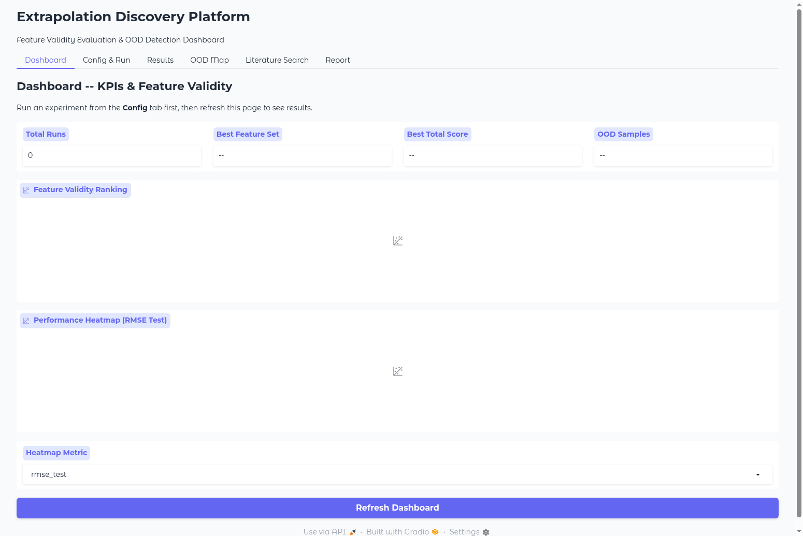
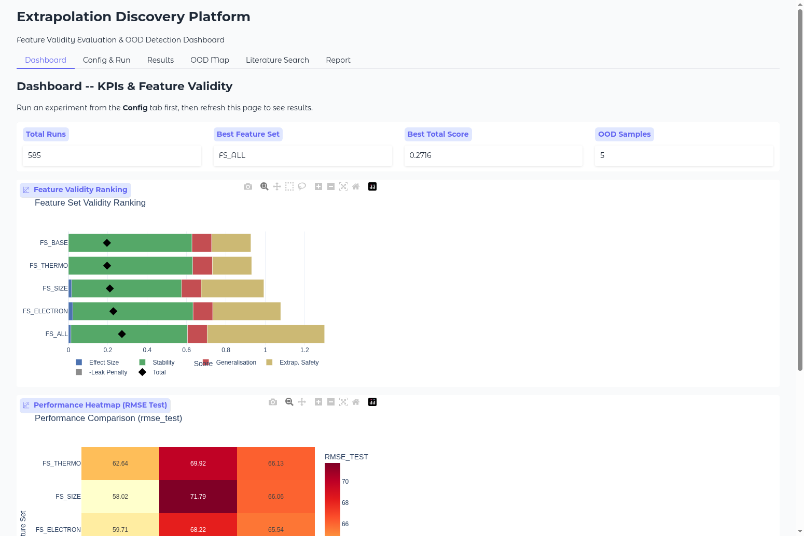
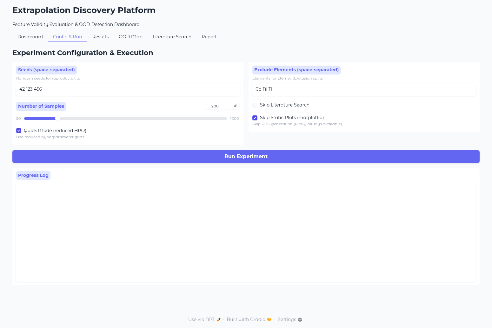
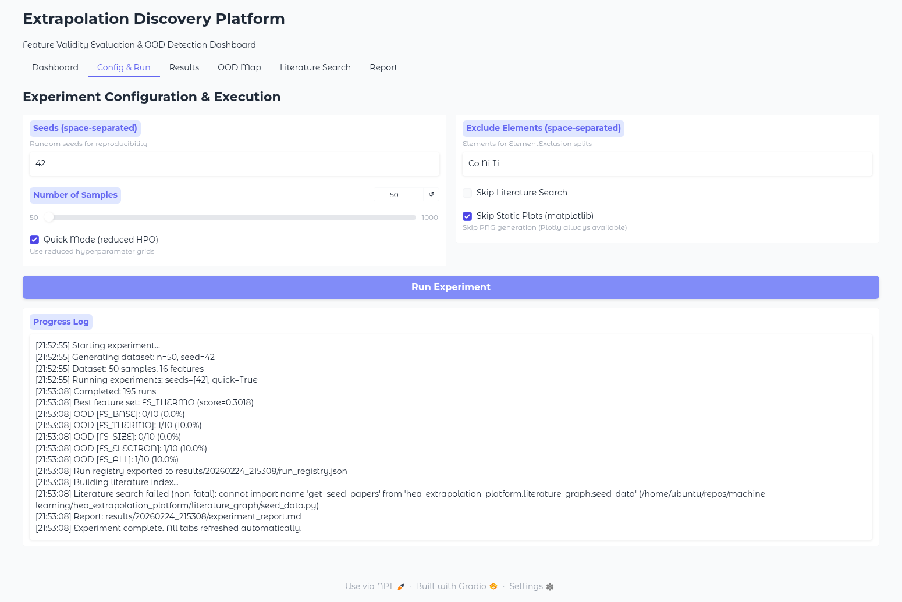
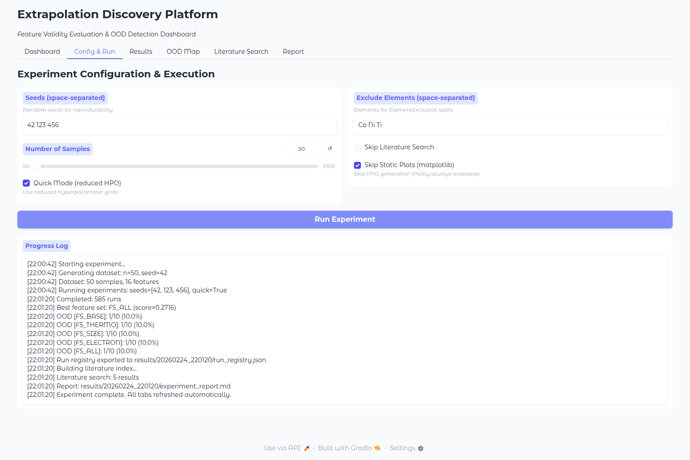
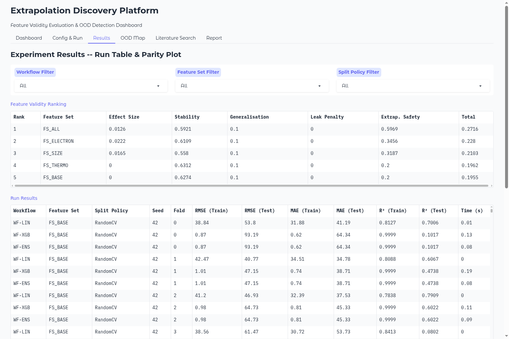
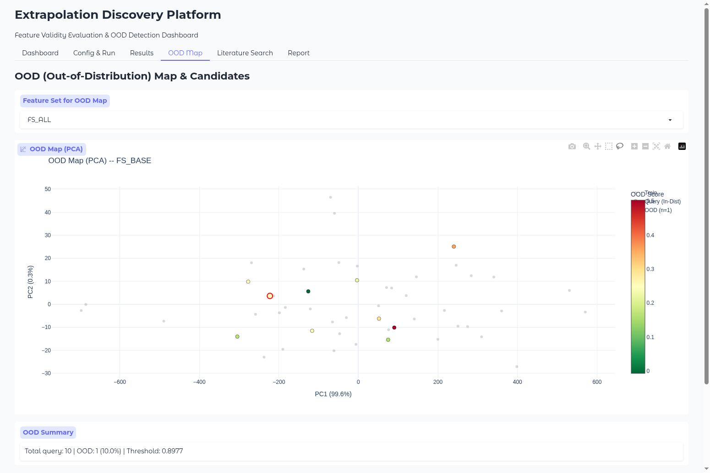
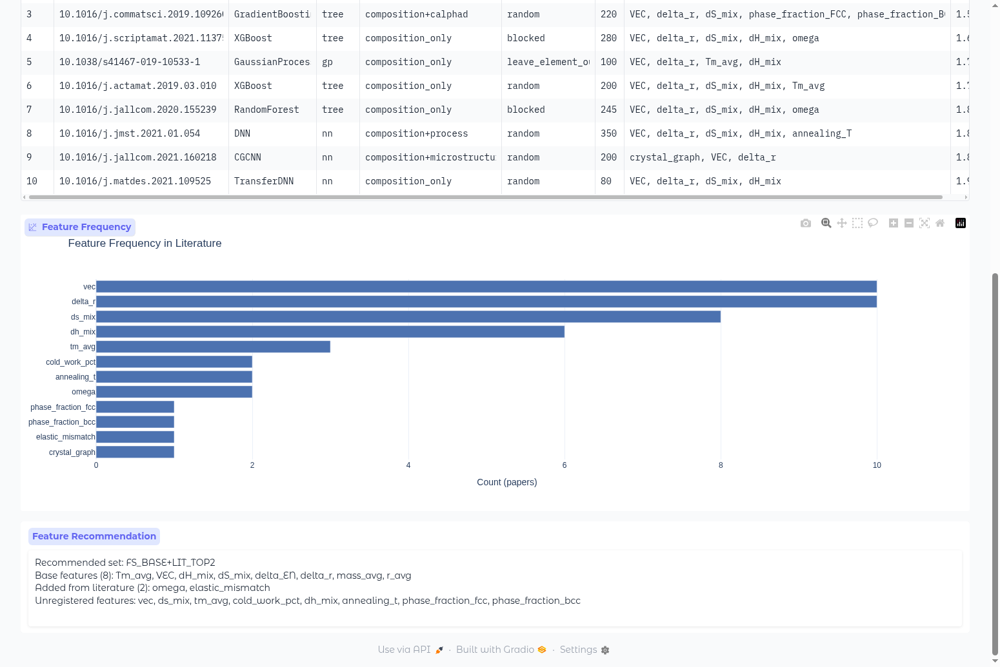
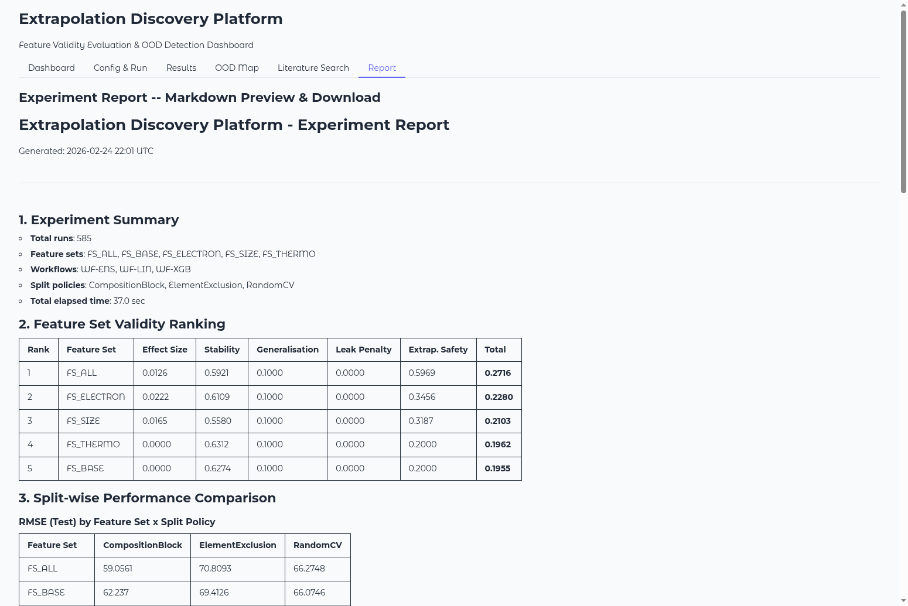
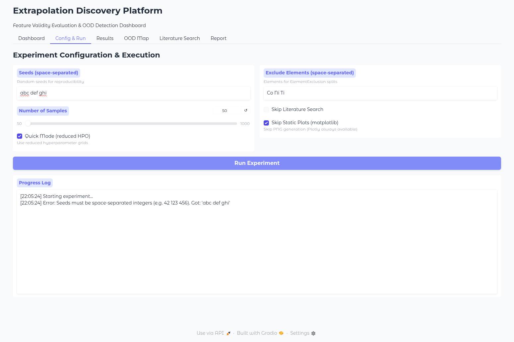

# Extrapolation Discovery Platform 取扱説明書

**バージョン**: 1.0  
**最終更新**: 2026-02-24  
**対象ユーザー**: 材料科学研究者・データサイエンティスト（初心者向け）

---

## 目次

1. [はじめに](#1-はじめに)
2. [動作環境・前提条件](#2-動作環境前提条件)
3. [インストール](#3-インストール)
4. [起動方法](#4-起動方法)
5. [GUI操作ガイド（タブ別詳細）](#5-gui操作ガイドタブ別詳細)
   - [5.1 Dashboard（ダッシュボード）](#51-dashboardダッシュボード)
   - [5.2 Config & Run（設定・実行）](#52-config--run設定実行)
   - [5.3 Results（実験結果）](#53-results実験結果)
   - [5.4 OOD Map（外挿マップ）](#54-ood-map外挿マップ)
   - [5.5 Literature Search（文献検索）](#55-literature-search文献検索)
   - [5.6 Report（レポート）](#56-reportレポート)
6. [CLI（コマンドライン）操作ガイド](#6-cliコマンドライン操作ガイド)
7. [設定パラメータ詳細](#7-設定パラメータ詳細)
8. [結果の読み方・解釈ガイド](#8-結果の読み方解釈ガイド)
9. [エラー対処・トラブルシューティング](#9-エラー対処トラブルシューティング)
10. [FAQ（よくある質問）](#10-faqよくある質問)

---

## 1. はじめに

### 1.1 このプラットフォームについて

**Extrapolation Discovery Platform** は、材料科学における機械学習モデルの**特徴量妥当性**を定量的に評価し、**外挿（OOD: Out-of-Distribution）領域**を可視化するツールです。

HEA（高エントロピー合金）を例題として、以下を自動で実行します：

1. **複数ワークフロー**（線形モデル、XGBoost、アンサンブル）の実行
2. **5種類の特徴量セット**の体系的な比較
3. **3種類の分割方式**（ランダム、組成ブロック、元素除外）での交差検証
4. **OOD検出**と次に取得すべき合金組成の提案
5. **文献データベース**との照合と特徴量推薦

### 1.2 用語説明

| 用語 | 説明 |
|------|------|
| **Feature Set（特徴量セット）** | モデルに入力する変数の組み合わせ（例：VEC, delta_r, dH_mix 等） |
| **Workflow（ワークフロー）** | 機械学習モデルの種類。WF-LIN（線形）、WF-XGB（XGBoost）、WF-ENS（アンサンブル） |
| **Split Policy（分割方式）** | データの訓練/テスト分割方法 |
| **OOD（Out-of-Distribution）** | 訓練データの分布から外れたサンプル（外挿領域） |
| **Validity Score（妥当性スコア）** | 特徴量セットの総合的な品質スコア（0〜1、高いほど良い） |
| **Parity Plot** | 予測値 vs 実測値の散布図（対角線に近いほど精度が高い） |

---

## 2. 動作環境・前提条件

### 2.1 必要環境

| 項目 | 要件 |
|------|------|
| OS | Windows 10/11, macOS 12+, Linux (Ubuntu 20.04+) |
| Python | 3.9 以上 |
| メモリ | 4GB 以上（推奨 8GB） |
| ディスク | 500MB 以上の空き容量 |
| ブラウザ | Chrome, Firefox, Safari, Edge（最新版推奨） |

### 2.2 必須パッケージ

- numpy, pandas, scikit-learn, scipy
- matplotlib, plotly
- xgboost, tabulate
- gradio (GUI使用時)

---

## 3. インストール

### 3.1 リポジトリの取得

```bash
git clone https://github.com/minimumtone/machine-learning.git
cd machine-learning
```

### 3.2 依存パッケージのインストール

```bash
pip install -r hea_extrapolation_platform/requirements.txt
```

### 3.3 インストールの確認

以下のコマンドでインポートが正常に動作するか確認してください：

```bash
python -c "from hea_extrapolation_platform.runner import ExperimentRunner; print('OK')"
```

`OK` と表示されれば、インストール成功です。

### 3.4 オプション依存（高速化）

文献検索の高速化に以下をインストールできます（なくても動作します）：

```bash
# FAISS: ベクトル検索高速化（なければnumpy cosine類似度で代替）
pip install faiss-cpu

# Sentence Transformers: 高品質embedding（なければTF-IDFで代替）
pip install sentence-transformers
```

---

## 4. 起動方法

### 4.1 GUI（グラフィカルユーザーインターフェース）の起動

```bash
python -m hea_extrapolation_platform gui --port 7860
```

起動後、ブラウザで **http://localhost:7860** を開いてください。

> **ヒント**: `--share` オプションを付けると、インターネット経由でアクセスできる一時的な公開URLが生成されます（チームメンバーとの共有に便利です）。

### 4.2 CLI（コマンドライン）での実行

GUIを使わずに直接実行することもできます：

```bash
# クイック実行（小規模テスト）
python -m hea_extrapolation_platform run --quick --n-samples 50

# 本番実行（フルスケール）
python -m hea_extrapolation_platform run --seeds 42 123 456 --n-samples 200
```

---

## 5. GUI操作ガイド（タブ別詳細）

GUIは6つのタブで構成されています。以下、各タブの操作方法を画面キャプチャ付きで詳しく説明します。

---

### 5.1 Dashboard（ダッシュボード）

ダッシュボードは、実験結果の**全体概要**を確認する画面です。

#### 初期状態（実験実行前）

起動直後は、まだ実験が実行されていないため、KPIカードは「0」や「--」と表示されます。



**画面構成**:
- **KPIカード**（上部4つ）: 
  - **Total Runs**: 実行されたランの総数
  - **Best Feature Set**: 最も良い特徴量セット名
  - **Best Total Score**: 最高の妥当性スコア
  - **OOD Samples**: OODと判定されたサンプル数
- **Feature Validity Ranking**（グラフ）: 特徴量セットごとの妥当性スコアの横棒グラフ
- **Performance Heatmap**（グラフ）: 特徴量セット×分割方式の性能ヒートマップ
- **Heatmap Metric**（ドロップダウン）: ヒートマップに表示するメトリクスの選択

#### データ表示状態（実験実行後）

実験を実行した後のダッシュボードです。KPIカードに実際の数値が表示され、グラフも描画されます。



**操作方法**:
1. **Heatmap Metric** ドロップダウンを変更すると、ヒートマップの表示メトリクスが切り替わります
   - `rmse_test`: テストRMSE（デフォルト）
   - `r2_test`: テストR$^2$
   - `mae_test`: テストMAE
   - その他: `rmse_train`, `mae_train`, `r2_train`
2. **Refresh Dashboard** ボタンをクリックすると、最新データで再描画されます

> **ポイント**: 実験完了時に全タブが自動更新されるため、通常はRefreshボタンを押す必要はありません。

---

### 5.2 Config & Run（設定・実行）

実験のパラメータを設定し、実行を開始する画面です。

#### 設定画面



**設定項目**:

| 項目 | デフォルト値 | 説明 |
|------|-------------|------|
| **Seeds** | `42 123 456` | 乱数シード（スペース区切り）。再現性の確保に使用。シード数が多いほど結果が安定しますが、実行時間も増加します |
| **Number of Samples** | 200 | 生成するHEAデータセットのサンプル数（50〜1000） |
| **Quick Mode** | ON | ハイパーパラメータ探索を簡略化して高速実行 |
| **Exclude Elements** | `Co Ni Ti` | ElementExclusion分割で除外する元素 |
| **Skip Literature Search** | OFF | 文献検索をスキップ（高速化したい場合にON） |
| **Skip Static Plots** | ON | matplotlib PNG生成をスキップ（Plotlyは常に利用可能） |

#### 実験の実行手順

1. 上記の設定項目を必要に応じて変更します
2. **Run Experiment** ボタンをクリックします
3. **Progress Log** に実行状況がリアルタイムで表示されます

#### 実行中の画面

実験が実行されると、Progress Logに進捗がストリーミング表示されます。



#### 実行完了の画面

全ての処理が完了すると、最終行に `Experiment complete. All tabs refreshed automatically.` と表示されます。



**Progress Log の読み方**:

```
[22:00:42] Starting experiment...           ← 実験開始
[22:00:42] Generating dataset: n=50, seed=42  ← データ生成
[22:00:42] Dataset: 50 samples, 16 features   ← データセット情報
[22:00:42] Running experiments: seeds=[42, 123, 456], quick=True  ← 実験パラメータ
[22:01:20] Completed: 585 runs              ← 完了したラン数
[22:01:20] Best feature set: FS_ALL (score=0.2716)  ← 最良の特徴量セット
[22:01:20] OOD [FS_BASE]: 1/10 (10.0%)     ← 各特徴量セットのOOD検出結果
[22:01:20] Literature search: 5 results     ← 文献検索結果
[22:01:20] Experiment complete.             ← 実験完了
```

> **注意**: 実験実行中はブラウザを閉じないでください。実行は中断されませんが、Progress Logの更新が止まります。

---

### 5.3 Results（実験結果）

実験結果の詳細データとParity Plotを確認する画面です。



**画面構成**:

#### Feature Validity Ranking テーブル

特徴量セットごとの妥当性スコアをランキング形式で表示します。

| カラム | 説明 |
|--------|------|
| **Rank** | 順位（Totalスコアの降順） |
| **Feature Set** | 特徴量セット名 |
| **Effect Size** | ベースラインからの改善効果 |
| **Stability** | シード間の安定性（高いほど安定） |
| **Generalisation** | 汎化性能 |
| **Leak Penalty** | OODリーク減点（0が理想） |
| **Extrap. Safety** | 外挿安全性スコア |
| **Total** | 総合スコア（上記の加重平均） |

#### Run Results テーブル

個々のランの詳細メトリクスを表示します。585ランすべてのデータが確認できます。

| カラム | 説明 |
|--------|------|
| **Workflow** | WF-LIN / WF-XGB / WF-ENS |
| **Feature Set** | FS_BASE / FS_THERMO / FS_SIZE / FS_ELECTRON / FS_ALL |
| **Split Policy** | RandomCV / CompositionBlock / ElementExclusion |
| **Seed** | 乱数シード |
| **Fold** | 交差検証のフォールド番号 |
| **RMSE/MAE (Train/Test)** | 訓練・テストの誤差 |
| **R$^2$ (Train/Test)** | 決定係数 |
| **Time (s)** | 実行時間 |

#### フィルタ機能

テーブル上部の3つのドロップダウンで結果をフィルタリングできます：

- **Workflow Filter**: ワークフロー（モデル種類）でフィルタ
- **Feature Set Filter**: 特徴量セットでフィルタ
- **Split Policy Filter**: 分割方式でフィルタ

フィルタを変更すると、テーブルとParity Plotが自動的に更新されます。

#### Parity Plot

Parity Plot（予測値 vs 実測値の散布図）は、Run Results テーブルの下に表示されます。対角線に近いほど予測精度が高いことを意味します。

---

### 5.4 OOD Map（外挿マップ）

訓練データの分布と外挿（OOD）領域を可視化する画面です。



**画面構成**:

- **Feature Set for OOD Map**（ドロップダウン）: 表示する特徴量セットの選択
  - `FS_BASE`, `FS_THERMO`, `FS_SIZE`, `FS_ELECTRON`, `FS_ALL`
- **OOD Map (PCA)**（散布図）: PCA（主成分分析）で2次元に射影した散布図
  - **青色の点**: 訓練データ
  - **緑色の点**: テストデータ（分布内）
  - **赤色の点**: OODサンプル（外挿領域）
- **OOD Summary**: OOD検出の概要統計
  - `Total query`: テストサンプル数
  - `OOD`: OODと判定されたサンプル数と割合
  - `Threshold`: OOD判定の閾値
- **Top OOD Candidates**: OODスコアの高い合金組成の一覧

**操作方法**:

1. **Feature Set** ドロップダウンで特徴量セットを変更すると、OODマップが自動更新されます
2. グラフ上でマウスをホバーすると、各点の詳細情報が表示されます
3. ドラッグで範囲選択、スクロールでズームが可能です

> **ポイント**: OOD Candidatesテーブルに表示される合金組成が、次に実験すべき候補です。OODスコアが高いほど、既存データから離れた未知領域にあります。

---

### 5.5 Literature Search（文献検索）

文献データベースから類似ワークフローを検索し、特徴量推薦を受ける画面です。

#### 検索画面と結果


**入力項目**:

| 項目 | デフォルト値 | 説明 |
|------|-------------|------|
| **Search Query** | `composition only yield strength HEA` | 自然言語での検索クエリ |
| **Domain** | `HEA` | 材料ドメインフィルタ |
| **Task** | `yield_strength` | 予測タスクフィルタ |
| **Inputs Scope** | （空白） | 入力スコープフィルタ（composition_only, composition+process 等） |
| **Top N** | 10 | 表示する上位結果数 |

**操作手順**:

1. **Search Query** に検索したいキーワードを入力します（日本語でも英語でも可）
2. 必要に応じて **Domain**, **Task**, **Inputs Scope** フィルタを設定します
3. **Search Literature** ボタンをクリックします
4. 検索結果テーブル、Feature Frequencyグラフ、Feature Recommendationが表示されます

#### Feature Frequency グラフと Feature Recommendation

検索結果の下には、文献で頻出する特徴量の頻度グラフと、推薦特徴量セットが表示されます。



**Feature Frequency**（横棒グラフ）:
- 検索でヒットした文献ワークフローで使われている特徴量の出現頻度
- 横軸: 出現論文数、縦軸: 特徴量名

**Feature Recommendation**（テキストボックス）:
- 文献データに基づく推薦特徴量セット
- 例: `Recommended set: FS_BASE+LIT_TOP2` = ベース8特徴量 + 文献上位2特徴量

> **ポイント**: 実験完了後に自動的に文献検索が実行されるため、Literature Searchタブに切り替えるだけで結果が表示されます。追加の検索条件で再検索することも可能です。

---

### 5.6 Report（レポート）

実験結果のMarkdownレポートをプレビュー・ダウンロードする画面です。



**レポート内容**:

1. **Experiment Summary**: 実験の概要（ラン数、特徴量セット、ワークフロー、分割方式、実行時間）
2. **Feature Set Validity Ranking**: 特徴量妥当性ランキングテーブル
3. **Split-wise Performance Comparison**: 分割方式ごとの性能比較テーブル
4. **OOD Analysis**: OOD検出の統計
5. **OOD Region Candidate Compositions**: OOD候補組成テーブル
6. **Figures**: 生成された図表
7. **Literature Near-Neighbour WF Evidence**: 文献近傍ワークフロー
8. **Literature-Derived Feature Recommendations**: 文献由来の特徴量推薦
9. **Next Experiment Proposal**: 次回実験の提案

**操作方法**:

1. レポートタブを開くと、自動的にMarkdown形式のレポートが表示されます
2. **Download Report (.md)** ボタンでMarkdownファイルをダウンロードできます
3. ダウンロードしたファイルは、任意のMarkdownビューアやエディタで閲覧・編集できます

---

## 6. CLI（コマンドライン）操作ガイド

GUIを使わず、コマンドラインから直接実験を実行できます。

### 6.1 基本コマンド一覧

```
usage: hea_extrapolation_platform [-h] [-v] {run,search,report,gui} ...

positional arguments:
  {run,search,report,gui}
    run                 実験グリッドの実行
    search              文献検索
    report              レポート再生成
    gui                 Gradioダッシュボードの起動
```

### 6.2 実験の実行 (`run`)

```bash
# クイック実行（テスト用・小規模）
python -m hea_extrapolation_platform run --quick --n-samples 50

# 本番実行（3シード、200サンプル）
python -m hea_extrapolation_platform run --seeds 42 123 456 --n-samples 200

# フルオプション指定
python -m hea_extrapolation_platform run \
    --seeds 42 123 456 789 \
    --n-samples 300 \
    --quick \
    --exclude-elements Co Ni Ti \
    --out results/my_experiment \
    --no-plots \
    --no-literature
```

**オプション一覧**:

| オプション | デフォルト | 説明 |
|-----------|----------|------|
| `--seeds` | `42 123 456` | 乱数シード（複数指定可） |
| `--n-samples` | `200` | データセットサイズ |
| `--quick` | OFF | 高速モード（HPO簡略化） |
| `--exclude-elements` | なし | ElementExclusion用の除外元素 |
| `--out` | `results` | 出力ディレクトリ |
| `--no-plots` | OFF | 図表生成をスキップ |
| `--no-literature` | OFF | 文献検索をスキップ |

### 6.3 文献検索 (`search`)

```bash
# 基本検索
python -m hea_extrapolation_platform search \
    --query "composition only yield strength HEA"

# フィルタ付き検索
python -m hea_extrapolation_platform search \
    --query "yield strength prediction" \
    --domain HEA \
    --task yield_strength \
    --inputs composition_only \
    --top 5
```

### 6.4 GUI起動 (`gui`)

```bash
# ローカル起動
python -m hea_extrapolation_platform gui --port 7860

# 公開リンク付き起動（チーム共有用）
python -m hea_extrapolation_platform gui --port 7860 --share
```

---

## 7. 設定パラメータ詳細

### 7.1 特徴量セット（Feature Set）

| セット名 | 含まれる特徴量 | 説明 |
|----------|---------------|------|
| **FS_BASE** | VEC, delta_r, dH_mix, dS_mix, delta_EN, Tm_avg, r_avg, mass_avg | 基本的な熱力学・構造パラメータ |
| **FS_THERMO** | FS_BASE + omega, lambda_param | 熱力学安定性パラメータ追加 |
| **FS_SIZE** | FS_BASE + elastic_mismatch | 格子歪みパラメータ追加 |
| **FS_ELECTRON** | FS_BASE + d_elec | 電子構造パラメータ追加 |
| **FS_ALL** | 上記すべて | 全特徴量 |

### 7.2 ワークフロー（Workflow）

| ワークフロー | モデル | 特徴 |
|-------------|--------|------|
| **WF-LIN** | Ridge回帰 | 線形モデル。解釈性が高い。ベースライン |
| **WF-XGB** | XGBoost | 勾配ブースティング。高精度だが過学習リスクあり |
| **WF-ENS** | Stacking Ensemble | WF-LIN + WF-XGB の組み合わせ |

### 7.3 分割方式（Split Policy）

| 分割方式 | 説明 | 用途 |
|---------|------|------|
| **RandomCV** | ランダム5分割交差検証 | 一般的な汎化性能評価 |
| **CompositionBlock** | 組成空間でブロック分割 | 組成外挿性能の評価 |
| **ElementExclusion** | 特定元素を含むデータを除外 | 未知元素系への汎化評価（最も厳しいテスト） |

---

## 8. 結果の読み方・解釈ガイド

### 8.1 妥当性スコア（Total Score）の解釈

Total Score は以下の5つのサブスコアの加重平均です：

| サブスコア | ウェイト | 良い値 | 説明 |
|-----------|---------|--------|------|
| Effect Size | 0.30 | 高い | ベースラインからの改善度 |
| Stability | 0.20 | 高い | シード間の安定性 |
| Generalisation | 0.30 | 高い | 分割方式間の汎化性能 |
| Leak Penalty | -0.15 | 0 | OODリークによる減点 |
| Extrap. Safety | 0.20 | 高い | 外挿領域での安全性 |

**スコアの目安**:
- **0.3以上**: 良好（特徴量セットとして推奨）
- **0.2〜0.3**: 普通（改善の余地あり）
- **0.2未満**: 要検討（特徴量の追加・変更を推奨）

### 8.2 OOD結果の解釈

- **OOD比率が高い**（>30%）: テストデータの多くが訓練分布外 → モデルの予測が信頼できない領域が多い
- **OOD比率が低い**（<10%）: 訓練データがテスト領域をよくカバー → 予測の信頼性が高い
- **OOD候補組成**: 次に実験・合成すべき合金組成。OODスコアが高いほど優先度が高い

### 8.3 R$^2$（決定係数）の読み方

- **R$^2$ > 0.8**: 良好な予測精度
- **R$^2$ = 0.5〜0.8**: 中程度の予測精度
- **R$^2$ < 0.5**: 予測精度が低い（特徴量やモデルの改善が必要）
- **R$^2$ < 0**: モデルが平均値より悪い予測をしている（問題あり）

### 8.4 Train vs Test の乖離に注意

- **Train R$^2$ ≈ 1.0 かつ Test R$^2$ ≪ 1.0**: 過学習の兆候（特にXGBoost）
- **Train R$^2$ ≈ Test R$^2$**: 適切なフィッティング
- CompositionBlockやElementExclusion分割でTest R$^2$が大きく低下する場合、モデルの外挿能力に限界があることを示しています

---

## 9. エラー対処・トラブルシューティング

### 9.1 Seeds入力エラー

Seeds欄に整数以外の値（文字列など）を入力して実行すると、以下のエラーメッセージが表示されます：



**エラーメッセージ**: `Seeds must be space-separated integers (e.g. 42 123 456). Got: 'abc def ghi'`

**対処法**: Seeds欄にスペース区切りの整数を入力してください（例: `42 123 456`）

### 9.2 よくあるエラーと対処法

| エラー | 原因 | 対処法 |
|--------|------|--------|
| `ModuleNotFoundError: No module named 'gradio'` | gradioが未インストール | `pip install gradio` を実行 |
| `ModuleNotFoundError: No module named 'xgboost'` | xgboostが未インストール | `pip install xgboost` を実行 |
| `ModuleNotFoundError: No module named 'tabulate'` | tabulateが未インストール | `pip install tabulate` を実行 |
| `Address already in use` | ポート7860が使用中 | 別のポートを指定: `--port 7861` |
| `Seeds must be space-separated integers` | Seeds欄に不正な値 | 整数をスペース区切りで入力 |
| テーブルが空 / グラフが表示されない | 実験未実行 | Config & Run タブで実験を実行してください |

### 9.3 実行が遅い場合

- **`--quick` モードを使用**: ハイパーパラメータ探索を簡略化
- **`--n-samples` を小さくする**: サンプル数を50〜100に設定
- **`--no-plots` を指定**: matplotlib図表生成をスキップ
- **`--no-literature` を指定**: 文献検索をスキップ

### 9.4 全依存パッケージの一括インストール

問題が続く場合は、requirements.txt から一括インストールし直してください：

```bash
pip install -r hea_extrapolation_platform/requirements.txt
```

---

## 10. FAQ（よくある質問）

### Q1. 実験にどのくらい時間がかかりますか？

| 設定 | サンプル数 | シード数 | 目安時間 |
|------|-----------|---------|---------|
| Quick + 50サンプル | 50 | 3 | 約30秒〜1分 |
| Quick + 200サンプル | 200 | 3 | 約2〜5分 |
| Full + 200サンプル | 200 | 3 | 約10〜30分 |
| Full + 500サンプル | 500 | 5 | 約1〜2時間 |

### Q2. 結果はどこに保存されますか？

結果は `results/YYYYMMDD_HHMMSS/` ディレクトリに自動保存されます。

```
results/20260224_220120/
  ├── experiment_report.md    # Markdownレポート
  ├── run_registry.json       # 全ランの詳細データ
  └── figures/                # 生成された図表（--no-plotsを指定しない場合）
```

### Q3. HEA以外の材料にも使えますか？

はい。このプラットフォームは汎用設計です。`dataset.py` のデータ生成部分を変更すれば、任意の材料系に適用できます。HEAはデモ用の例題です。

### Q4. 文献データベースを拡張できますか？

はい。`literature_graph/seed_data.py` にワークフロー定義を追加することで、文献データを拡張できます。各ワークフローは `WorkflowSchema` 形式で定義します。

### Q5. 複数人で同時にGUIを使えますか？

はい。Gradioの `gr.State` によるセッション分離が実装されているため、複数ブラウザタブ（複数ユーザー）で同時にアクセスしても、お互いのデータが干渉しません。

### Q6. 途中で実験を中断できますか？

現在、GUI上での中断機能はありません。ブラウザを閉じても、サーバー側の処理は続行します。サーバーを停止するには、ターミナルで `Ctrl+C` を押してください。

### Q7. カスタム特徴量セットを追加できますか？

`features.py` の `FeatureSetName` enum と `FeatureCatalog` クラスに新しい特徴量セットを定義することで追加可能です。

---

## 付録: ファイル構成

```
hea_extrapolation_platform/
  ├── __init__.py              # パッケージ初期化
  ├── __main__.py              # CLIエントリポイント
  ├── dataset.py               # HEAデータ生成
  ├── features.py              # 特徴量計算・カタログ
  ├── splitters.py             # データ分割方式
  ├── workflows.py             # MLワークフロー定義
  ├── evaluation.py            # 妥当性評価
  ├── ood.py                   # OOD検出
  ├── runner.py                # 実験オーケストレーション
  ├── visualization.py         # matplotlib可視化
  ├── report.py                # Markdownレポート生成
  ├── requirements.txt         # 依存パッケージ一覧
  ├── gui/
  │   ├── __init__.py
  │   ├── app.py               # Gradioアプリ本体
  │   └── plotly_charts.py     # Plotlyインタラクティブチャート
  ├── literature_graph/
  │   ├── __init__.py
  │   ├── schemas.py           # データスキーマ定義
  │   ├── seed_data.py         # 文献シードデータ（30論文）
  │   ├── workflow_text.py     # ワークフローテキスト生成
  │   ├── vector_index.py      # ベクトルインデックス
  │   ├── search.py            # 2段階検索エンジン
  │   └── feature_recommender.py  # 特徴量推薦
  └── docs/
      ├── user_manual.md       # この取扱説明書
      └── manual_screenshots/  # スクリーンショット
```

---

**お問い合わせ**: 不明点やバグ報告は、[GitHub Issues](https://github.com/minimumtone/machine-learning/issues) にてお知らせください。
