# Extrapolation Discovery Platform 取扱説明書

**バージョン**: 2.0  
**最終更新**: 2026-02-25  
**対象ユーザー**: 材料科学研究者・データサイエンティスト（初心者〜中級者）

---

## 目次

1. [はじめに](#1-はじめに)
   - [1.1 このプラットフォームについて](#11-このプラットフォームについて)
   - [1.2 用語説明](#12-用語説明)
   - [1.3 v2.0 での主な変更点](#13-v20-での主な変更点)
2. [動作環境・前提条件](#2-動作環境前提条件)
3. [インストール](#3-インストール)
   - [3.1 リポジトリの取得](#31-リポジトリの取得)
   - [3.2 仮想環境の作成（推奨）](#32-仮想環境の作成推奨)
   - [3.3 依存パッケージのインストール](#33-依存パッケージのインストール)
   - [3.4 インストールの確認](#34-インストールの確認)
   - [3.5 オプション依存（高速化）](#35-オプション依存高速化)
4. [起動方法](#4-起動方法)
   - [4.1 GUI（グラフィカルユーザーインターフェース）の起動](#41-guiグラフィカルユーザーインターフェースの起動)
   - [4.2 CLI（コマンドライン）での実行](#42-cliコマンドラインでの実行)
5. [GUI操作ガイド（タブ別詳細）](#5-gui操作ガイドタブ別詳細)
   - [5.1 Dashboard（ダッシュボード）](#51-dashboardダッシュボード)
   - [5.2 Config & Run（設定・実行）](#52-config--run設定実行)
   - [5.3 Results（実験結果）](#53-results実験結果)
   - [5.4 OOD Map（外挿マップ）](#54-ood-map外挿マップ)
   - [5.5 Literature Search（文献検索）](#55-literature-search文献検索)
   - [5.6 Report（レポート）](#56-reportレポート)
6. [CLI操作ガイド](#6-cli操作ガイド)
   - [6.1 run コマンド（実験実行）](#61-run-コマンド実験実行)
   - [6.2 search コマンド（文献検索）](#62-search-コマンド文献検索)
   - [6.3 report コマンド（レポート生成）](#63-report-コマンドレポート生成)
   - [6.4 gui コマンド（GUI起動）](#64-gui-コマンドgui起動)
7. [設定パラメータ詳細](#7-設定パラメータ詳細)
   - [7.1 特徴量セット（Feature Sets）](#71-特徴量セットfeature-sets)
   - [7.2 ワークフロー（Workflows）](#72-ワークフローworkflows)
   - [7.3 分割方式（Split Policies）](#73-分割方式split-policies)
8. [結果の読み方・解釈ガイド](#8-結果の読み方解釈ガイド)
   - [8.1 妥当性スコア（Validity Score）の5要素](#81-妥当性スコアvalidity-scoreの5要素)
   - [8.2 OOD（外挿領域）の判定基準](#82-ood外挿領域の判定基準)
   - [8.3 R$^2$・RMSEの読み方](#83-r2rmseの読み方)
   - [8.4 訓練スコアとテストスコアの差（過学習の兆候）](#84-訓練スコアとテストスコアの差過学習の兆候)
9. [システム統合（自動動作）](#9-システム統合自動動作)
   - [9.1 統合アーキテクチャ概要](#91-統合アーキテクチャ概要)
   - [9.2 MLflow（実験トラッキング）](#92-mlflow実験トラッキング)
   - [9.3 Feast（特徴量ストア）](#93-feast特徴量ストア)
   - [9.4 MInt（ワークフローアダプタ）](#94-mintワークフローアダプタ)
   - [9.5 統合の相乗効果](#95-統合の相乗効果)
   - [9.6 ユーザーが意識しなくてよい理由](#96-ユーザーが意識しなくてよい理由)
10. [エラー対処・トラブルシューティング](#10-エラー対処トラブルシューティング)
    - [10.1 インストール時のエラー](#101-インストール時のエラー)
    - [10.2 GUI起動時のエラー](#102-gui起動時のエラー)
    - [10.3 実験実行時のエラー](#103-実験実行時のエラー)
11. [FAQ（よくある質問）](#11-faqよくある質問)
12. [付録A: ファイル構成](#付録a-ファイル構成)
13. [付録B: 変更履歴](#付録b-変更履歴)

---

## 1. はじめに

### 1.1 このプラットフォームについて

**Extrapolation Discovery Platform** は、材料科学における機械学習モデルの**特徴量妥当性**を定量的に評価し、**外挿（OOD: Out-of-Distribution）領域**を可視化するツールです。

> **目的**: 最も精度の高いモデルを選ぶことではなく、**未知領域に対して壊れない設計**を作ることです。

HEA（高エントロピー合金）を例題として、以下の処理を**ボタン1つで自動実行**します：

| ステップ | 内容 | 例 |
|----------|------|------|
| 1. データ生成 | 合成HEAデータセットの作成 | 50〜1000サンプル |
| 2. 特徴量セット比較 | 5種類の特徴量セットを体系的に評価 | FS_BASE, FS_THERMO, FS_SIZE, FS_ELECTRON, FS_ALL |
| 3. ワークフロー実行 | 複数の機械学習モデルで交差検証 | 線形モデル、XGBoost、アンサンブル + MIntワークフロー |
| 4. 分割方式テスト | 3種類のデータ分割で汎化性能を検証 | ランダム、組成ブロック、元素除外 |
| 5. OOD検出 | kNN距離ベースのOODサンプル検出 | PCA可視化 + 候補組成提案 |
| 6. 文献照合 | FAISS embeddingで類似論文を検索 | 特徴量推薦付き |
| 7. レポート生成 | 結果をMarkdownレポートにまとめ | ダウンロード可能 |

### 1.2 用語説明

本プラットフォームで使用する主な用語を以下にまとめます。

| 用語 | 説明 | 具体例 |
|------|------|--------|
| **Feature Set（特徴量セット）** | モデルに入力する変数の組み合わせ | FS_BASE = VEC, dH_mix, dS_mix, delta_r 等 |
| **Workflow（ワークフロー）** | 機械学習モデルの種類 | WF-LIN（線形）、WF-XGB（XGBoost）、WF-ENS（アンサンブル） |
| **Split Policy（分割方式）** | データの訓練/テスト分割方法 | RandomCV、CompositionBlock、ElementExclusion |
| **OOD（Out-of-Distribution）** | 訓練データの分布から外れたサンプル（外挿領域） | kNN距離が閾値を超えるデータ点 |
| **Validity Score（妥当性スコア）** | 特徴量セットの総合品質スコア（0〜1） | 5要素の加重平均 |
| **Parity Plot** | 予測値 vs 実測値の散布図 | 対角線に近いほど精度が高い |
| **KPI（Key Performance Indicator）** | 性能の主要指標 | Total Runs, Best Score, OOD Samples |
| **Seed（乱数シード）** | 再現性を確保するための初期値 | 42, 123, 456 |

### 1.3 v2.0 での主な変更点

v1.2からの主な改善点：

| 項目 | v1.2 | v2.0 |
|------|------|------|
| **統合設定** | チェックボックスで手動ON/OFF | 自動有効化（ユーザー操作不要） |
| **MLflow/Feast/MInt** | ユーザーが個別設定 | シームレス統合（裏で自動動作） |
| **データセット生成** | RNG順序の不整合あり | Seed-based完全再現性 |
| **評価警告** | ベースライン比較ループ内で多重発火 | ループ外で1回のみ発火 |
| **熱力学特徴量** | omega極端値の可能性 | クリップ処理で数値安定性確保 |
| **スクリーンショット** | v2（8枚） | v3（17枚、全タブ網羅） |

---

## 2. 動作環境・前提条件

### 2.1 必要環境

| 項目 | 最低要件 | 推奨 |
|------|----------|------|
| **OS** | Windows 10, macOS 12+, Linux (Ubuntu 20.04+) | Ubuntu 22.04+ |
| **Python** | 3.9 以上 | 3.10〜3.12 |
| **メモリ** | 4GB | 8GB以上 |
| **ディスク** | 500MB | 1GB以上 |
| **ブラウザ** | Chrome, Firefox, Safari, Edge | Chrome最新版 |

### 2.2 必須パッケージ一覧

| パッケージ | 用途 | バージョン目安 |
|-----------|------|---------------|
| numpy | 数値計算 | >= 1.21 |
| pandas | データフレーム操作 | >= 1.3 |
| scikit-learn | 機械学習・交差検証 | >= 1.0 |
| scipy | 科学計算・統計 | >= 1.7 |
| matplotlib | 静的プロット生成 | >= 3.5 |
| plotly | インタラクティブチャート | >= 5.0 |
| xgboost | 勾配ブースティングモデル | >= 1.5 |
| tabulate | テーブル整形出力 | >= 0.8 |
| gradio | Web GUI | >= 4.0 |

---

## 3. インストール

### 3.1 リポジトリの取得

```bash
git clone https://github.com/minimumtone/machine-learning.git
cd machine-learning
```

### 3.2 仮想環境の作成（推奨）

システムのPython環境を汚さないために、仮想環境の使用を強く推奨します：

```bash
# 仮想環境の作成
python -m venv .venv

# 仮想環境の有効化
# Linux / macOS:
source .venv/bin/activate
# Windows:
.venv\Scripts\activate
```

> **ヒント**: 仮想環境を有効化すると、コマンドプロンプトの先頭に `(.venv)` と表示されます。これが表示されていれば、仮想環境内で作業していることを確認できます。

### 3.3 依存パッケージのインストール

```bash
pip install -r hea_extrapolation_platform/requirements.txt
```

### 3.4 インストールの確認

以下のコマンドでインポートが正常に動作するか確認してください：

```bash
python -c "from hea_extrapolation_platform.runner import ExperimentRunner; print('OK')"
```

`OK` と表示されれば、インストール成功です。

もしエラーが出た場合は、[10.1 インストール時のエラー](#101-インストール時のエラー) を参照してください。

### 3.5 オプション依存（高速化）

文献検索の高速化に以下をインストールできます（**なくても動作します**）：

```bash
# FAISS: ベクトル検索高速化（なければnumpy cosine類似度で代替）
pip install faiss-cpu

# Sentence Transformers: 高品質embedding（なければTF-IDFで代替）
pip install sentence-transformers
```

---

## 4. 起動方法

### 4.1 GUI（グラフィカルユーザーインターフェース）の起動

```bash
python -m hea_extrapolation_platform gui --port 7860
```

起動後、ブラウザで **http://localhost:7860** を開いてください。

> **ヒント**: `--share` オプションを付けると、インターネット経由でアクセスできる一時的な公開URLが生成されます（チームメンバーとの共有に便利です）。

```bash
# 公開URL付きで起動
python -m hea_extrapolation_platform gui --port 7860 --share
```

### 4.2 CLI（コマンドライン）での実行

GUIを使わずに直接実行することもできます：

```bash
# クイック実行（小規模テスト・初回確認用）
python -m hea_extrapolation_platform run --quick --n-samples 50

# 本番実行（フルスケール）
python -m hea_extrapolation_platform run --seeds 42 123 456 --n-samples 200
```

CLIの詳細は [6. CLI操作ガイド](#6-cli操作ガイド) を参照してください。

---

## 5. GUI操作ガイド（タブ別詳細）

GUIは **6つのタブ** で構成されています。以下、各タブの操作方法を画面キャプチャ付きで詳しく説明します。

| タブ名 | 役割 | いつ使うか |
|--------|------|-----------|
| **Dashboard** | 実験全体の概要表示 | 実験後に結果の概要を確認 |
| **Config & Run** | 実験パラメータ設定と実行 | 実験を開始するとき |
| **Results** | 詳細な結果テーブルとグラフ | 個別のランを詳しく調べるとき |
| **OOD Map** | 外挿領域の可視化 | OODサンプルの分布を確認するとき |
| **Literature Search** | 文献データベース検索 | 類似研究を調べるとき |
| **Report** | レポートのプレビューとダウンロード | 結果を保存・共有するとき |

---

### 5.1 Dashboard（ダッシュボード）

ダッシュボードは、実験結果の**全体概要**を一目で確認する画面です。

#### 初期状態（実験実行前）

起動直後は、まだ実験が実行されていないため、KPIカードは「0」や「--」と表示されます。

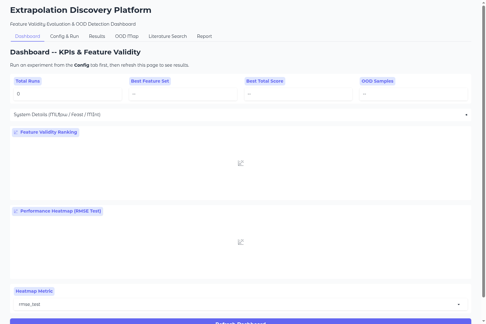
*図5.1.1: Dashboard初期状態 — KPIカードは未実行を示す「0」「--」表示*

**画面構成**:

| 要素 | 位置 | 説明 |
|------|------|------|
| **Total Runs** | 左上KPI | 実行されたランの総数 |
| **Best Feature Set** | 中央上KPI | 最も良い特徴量セット名 |
| **Best Total Score** | 中央右KPI | 最高の妥当性スコア |
| **OOD Samples** | 右上KPI | OODと判定されたサンプル数 |
| **System Details** | KPIの下（折りたたみ） | MLflow/Feast/MIntの動作状態 |
| **Feature Validity Ranking** | 中段グラフ | 特徴量セットごとの妥当性スコア横棒グラフ |
| **Performance Heatmap** | 下段グラフ | 特徴量セット×分割方式の性能ヒートマップ |
| **Heatmap Metric** | 最下部ドロップダウン | ヒートマップのメトリクス切替 |

#### データ表示状態（実験実行後）

実験を実行した後のダッシュボードです。KPIカードに実際の数値が表示され、グラフも描画されます。

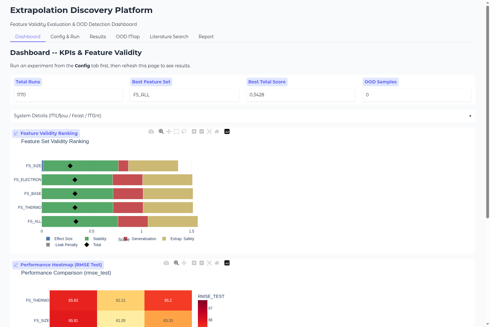
*図5.1.2: Dashboard実験完了後 — 1170ラン実行、最良特徴量セットはFS_ALL（スコア0.3428）*

**読み方のポイント**:
- **Total Runs = 1170**: 3シード x 5特徴量セット x 3分割方式 x 6ワークフロー x (複数fold) の組み合わせ
- **Best Feature Set = FS_ALL**: 全特徴量を使ったセットが最も良い総合スコア
- **Best Total Score = 0.3428**: 妥当性スコア（0〜1の範囲、高いほど良い）
- **OOD Samples = 0**: OODと判定されたサンプルはなし（今回のデータでは外挿サンプルがない）

#### Performance Heatmap（性能ヒートマップ）

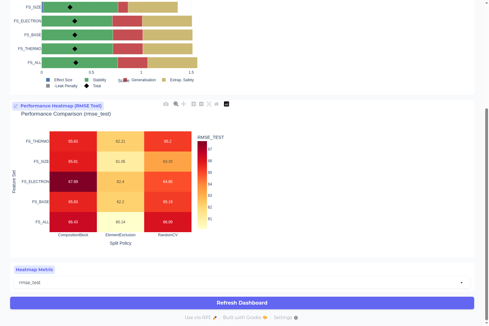
*図5.1.3: Performance Heatmap — RMSE Testを表示。色が薄い（値が小さい）ほど予測精度が良い*

**ヒートマップの操作方法**:

1. **Heatmap Metric** ドロップダウンを変更すると、表示メトリクスが切り替わります
   - `rmse_test`: テストRMSE（**デフォルト**、低いほど良い）
   - `r2_test`: テストR$^2$（高いほど良い）
   - `mae_test`: テストMAE（低いほど良い）
   - `rmse_train`, `r2_train`, `mae_train`: 訓練セットの各メトリクス
2. **Refresh Dashboard** ボタンをクリックすると、最新データで再描画されます

> **ポイント**: 実験完了時に全タブが自動更新されるため、通常はRefreshボタンを押す必要はありません。

---

### 5.2 Config & Run（設定・実行）

実験のパラメータを設定し、**ボタン1つで実行を開始**する画面です。

#### 設定画面（初期状態）

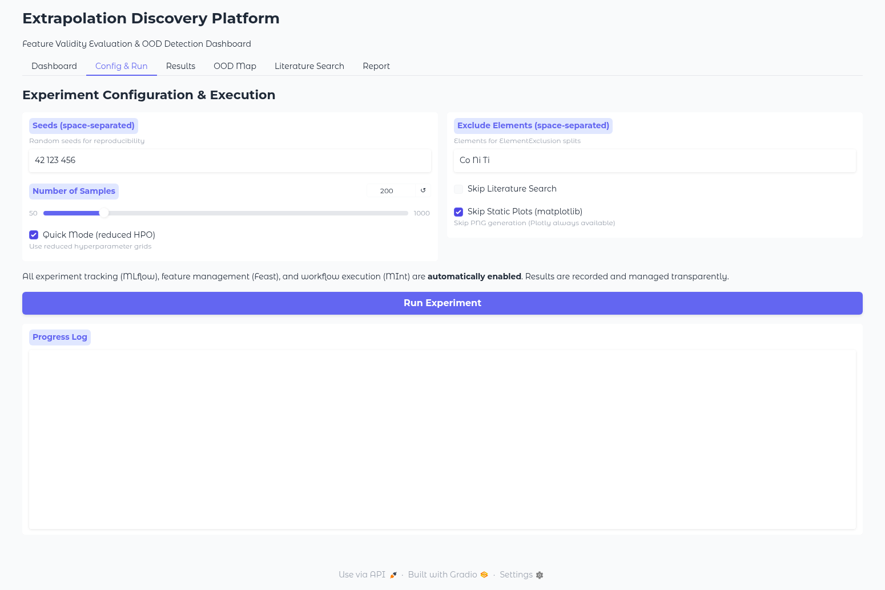
*図5.2.1: Config & Run初期状態 — デフォルト設定で即実行可能*

**設定項目の詳細**:

| 項目 | デフォルト値 | 範囲/選択肢 | 説明 |
|------|-------------|------------|------|
| **Seeds** | `42 123 456` | 任意の正整数（スペース区切り） | 乱数シード。シード数が多いほど結果が安定するが、実行時間も増加 |
| **Number of Samples** | 200 | 50〜1000 | 生成するHEAデータセットのサンプル数 |
| **Quick Mode** | ON | ON/OFF | ハイパーパラメータ探索を簡略化して高速実行 |
| **Exclude Elements** | `Co Ni Ti` | 任意の元素記号（スペース区切り） | ElementExclusion分割で除外する元素 |
| **Skip Literature Search** | OFF | ON/OFF | 文献検索をスキップ（高速化したい場合にON） |
| **Skip Static Plots** | ON | ON/OFF | matplotlib PNG生成をスキップ（Plotlyは常に利用可能） |

> **初心者へのアドバイス**: 初めて使う場合は、**デフォルト設定のまま**「Run Experiment」ボタンを押すだけでOKです。Number of Samplesだけ50に変更すると、より短時間で結果を確認できます。

#### シームレス統合メッセージ

設定画面の下部に、以下のメッセージが表示されています：

> *All experiment tracking (MLflow), feature management (Feast), and workflow execution (MInt) are **automatically enabled**. Results are recorded and managed transparently.*

これは、MLflow・Feast・MIntの3つのシステム統合が**自動的に有効化されている**ことを示しています。ユーザーが個別にON/OFFを切り替える必要はありません。

#### 実行手順

1. 設定項目を必要に応じて変更します（デフォルトのままでもOK）
2. **「Run Experiment」** ボタンをクリックします
3. **Progress Log** に実行状況がリアルタイムで表示されます

#### 実行完了後の画面

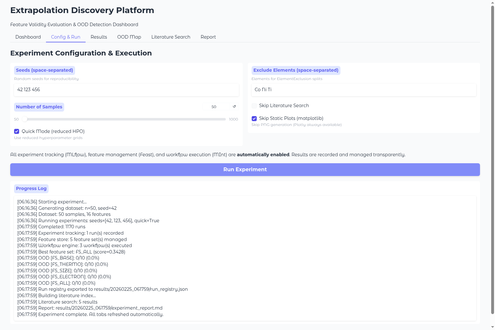
*図5.2.2: 実験完了後のConfig画面 — Progress Logに全処理のログが表示される*

**Progress Log の読み方**:

```
[06:16:36] Starting experiment...              <- 実験開始
[06:16:36] Generating dataset: n=50, seed=42   <- データ生成（サンプル数とシード）
[06:16:36] Dataset: 50 samples, 16 features    <- データセット情報
[06:16:36] Running experiments: seeds=[42, 123, 456], quick=True  <- 実験パラメータ
[06:17:59] Completed: 1170 runs                <- 完了したラン数
[06:17:59] Experiment tracking: 1 run(s) recorded     <- MLflow記録
[06:17:59] Feature store: 5 feature set(s) managed    <- Feast管理
[06:17:59] Workflow engine: 3 workflow(s) executed     <- MInt実行
[06:17:59] Best feature set: FS_ALL (score=0.3428)    <- 最良の特徴量セット
[06:17:59] OOD [FS_BASE]: 0/10 (0.0%)         <- 各特徴量セットのOOD結果
[06:17:59] OOD [FS_THERMO]: 0/10 (0.0%)
[06:17:59] OOD [FS_SIZE]: 0/10 (0.0%)
[06:17:59] OOD [FS_ELECTRON]: 0/10 (0.0%)
[06:17:59] OOD [FS_ALL]: 0/10 (0.0%)
[06:17:59] Run registry exported to results/20260225_061759/run_registry.json
[06:17:59] Building literature index...        <- 文献インデックス構築
[06:17:59] Literature search: 5 results        <- 文献検索結果
[06:17:59] Report: results/20260225_061759/experiment_report.md
[06:17:59] Experiment complete. All tabs refreshed automatically.  <- 完了
```

> **注意**: 実験実行中はブラウザを閉じないでください。実行そのものは中断されませんが、Progress Logの更新が止まります。

---

### 5.3 Results（実験結果）

実験結果の**詳細データ**と**Parity Plot**を確認する画面です。

#### フィルタとテーブル

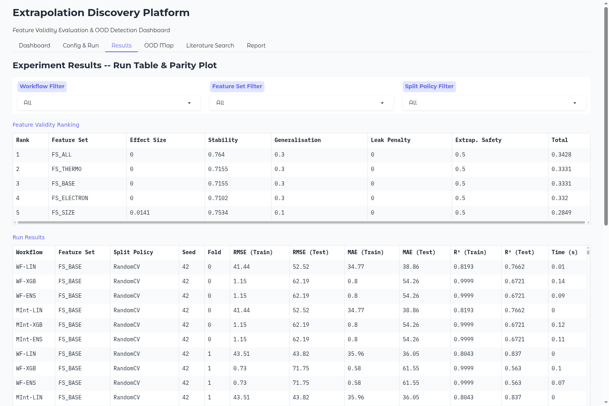
*図5.3.1: Results画面 — Feature Validity Rankingテーブル（上）とRun Resultsテーブル（下）*

**画面上部のフィルタ**:
- **Workflow Filter**: ワークフロー（WF-LIN, WF-XGB, WF-ENS, MInt-LIN, MInt-XGB, MInt-ENS）で絞り込み
- **Feature Set Filter**: 特徴量セット（FS_BASE, FS_THERMO, FS_SIZE, FS_ELECTRON, FS_ALL）で絞り込み
- **Split Policy Filter**: 分割方式（RandomCV, CompositionBlock, ElementExclusion）で絞り込み

> **ヒント**: 「All」を選択すると全データが表示されます。複数のフィルタを組み合わせて、特定の条件の結果だけを素早く確認できます。

#### Feature Validity Ranking テーブル

特徴量セットごとの**妥当性スコア**をランキング形式で表示します。

| カラム | 意味 | 良い値の方向 |
|--------|------|-------------|
| **Rank** | 順位（Totalスコアの降順） | 1位が最良 |
| **Feature Set** | 特徴量セット名 | -- |
| **Effect Size** | ベースラインからの改善効果 | 高いほど良い |
| **Stability** | シード間の安定性 | 高いほど良い（1.0 = 完全安定） |
| **Generalisation** | 汎化性能（Train vs Test差） | 高いほど良い |
| **Leak Penalty** | OODリーク減点 | 0が理想（低いほど良い） |
| **Extrap. Safety** | 外挿安全性スコア | 高いほど良い |
| **Total** | 総合スコア（上記の加重平均） | 高いほど良い |

> **実験例での結果**: FS_ALL（Total=0.3428）が1位、FS_SIZE（Total=0.2849）が5位。全特徴量を使うセットが最もバランスが良い結果となっています。

#### Run Results テーブル

個々のランの**詳細メトリクス**を表示します。1170ランすべてのデータが確認できます。

| カラム | 説明 |
|--------|------|
| **Workflow** | 使用したワークフロー名（例：WF-LIN, WF-XGB） |
| **Feature Set** | 使用した特徴量セット |
| **Split Policy** | データ分割方式 |
| **Seed** | 乱数シード値 |
| **Fold** | 交差検証のFold番号 |
| **RMSE (Train/Test)** | 二乗平均平方根誤差（低いほど良い） |
| **MAE (Train/Test)** | 平均絶対誤差（低いほど良い） |
| **R$^2$ (Train/Test)** | 決定係数（1に近いほど良い） |
| **Time (s)** | 実行時間（秒） |

#### Parity Plot（予測精度の可視化）

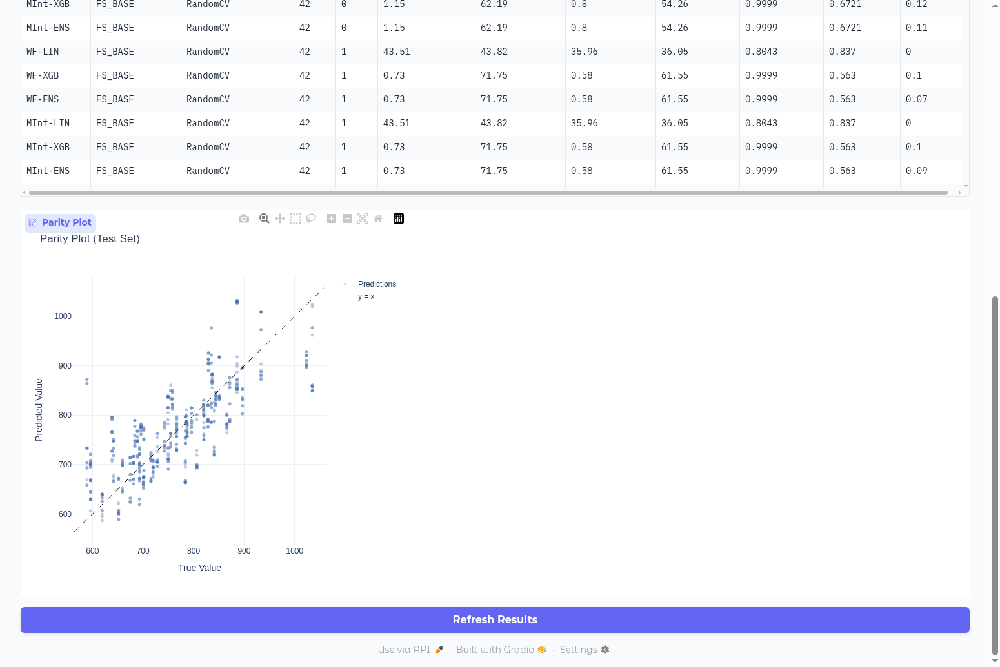
*図5.3.2: Parity Plot（テストセット）-- 対角線に近いほど予測精度が高い*

**Parity Plotの読み方**:
- **横軸**: True Value（実測値）
- **縦軸**: Predicted Value（予測値）
- **破線（y = x）**: 完全一致線。この線上にデータ点が乗っていれば、予測と実測が完全に一致
- **点の散らばり**: 対角線から離れるほど、予測の誤差が大きい

> **解釈のコツ**: 低温側（600〜700付近）で対角線に近く、高温側（900〜1000付近）で散らばりが大きい場合は、高温領域のデータが不足している可能性があります。これはまさに「外挿（OOD）」の問題です。

---

### 5.4 OOD Map（外挿マップ）

OOD（Out-of-Distribution）サンプルの分布をPCA 2次元マップで可視化する画面です。

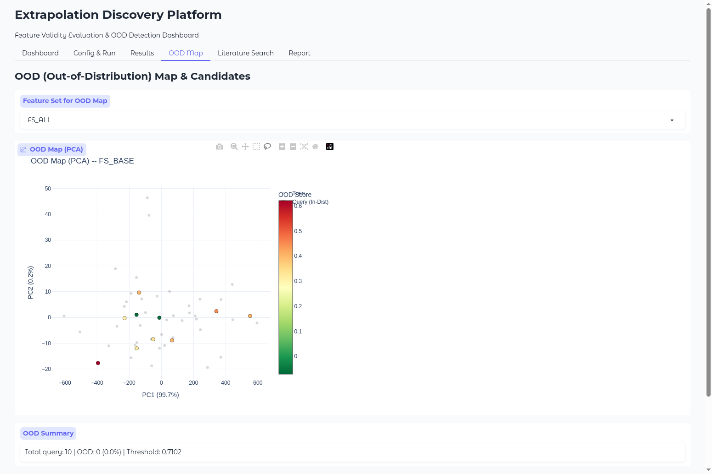
*図5.4.1: OOD Map — PCA 2次元可視化。色はOODスコアを示す（赤=OOD、緑=In-Distribution）*

**画面構成**:

| 要素 | 説明 |
|------|------|
| **Feature Set for OOD Map** | 表示する特徴量セットの選択ドロップダウン |
| **OOD Map (PCA)** | PCA 2次元散布図。軸はPC1, PC2（各軸の寄与率%つき） |
| **色スケール** | OODスコア。0（緑、In-Distribution）〜 0.6+（赤、OOD） |
| **大きい丸** | 訓練データ |
| **小さい丸** | テスト（クエリ）データ |
| **OOD Summary** | OODサンプルの統計情報 |

**OOD Summaryの読み方**:
```
Total query: 10 | OOD: 0 (0.0%) | Threshold: 0.7102
```
- **Total query = 10**: テストサンプル数
- **OOD = 0 (0.0%)**: OODと判定されたサンプル数（0 = 全てIn-Distribution）
- **Threshold = 0.7102**: OOD判定の閾値（kNN距離がこの値を超えるとOOD）

> **ポイント**: OODが0%の場合、テストデータはすべて訓練データの分布内にあることを意味します。実際の材料探索では、新しい合金組成がOODとして検出された場合、追加実験が必要な領域を示しています。

---

### 5.5 Literature Search（文献検索）

文献データベースからembedding類似度で関連論文を検索する画面です。

#### 検索インターフェース

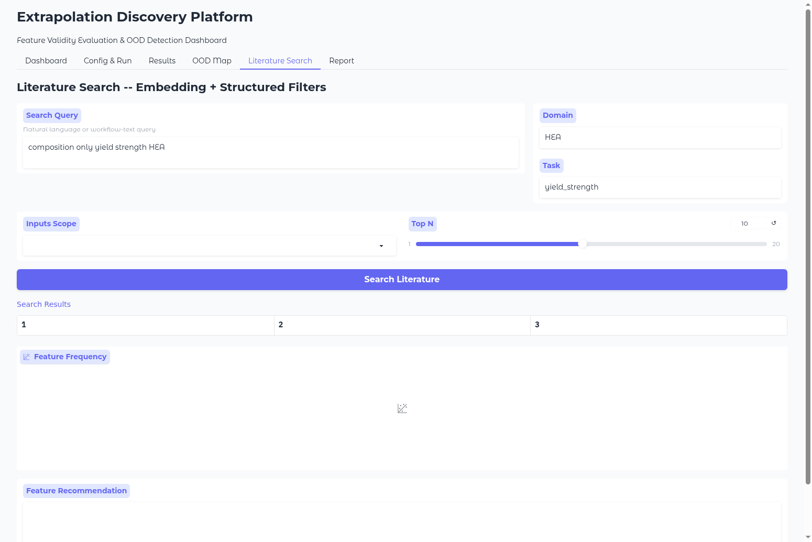
*図5.5.1: Literature Search初期状態 — クエリとフィルタを設定して検索*

**検索パラメータ**:

| 項目 | 説明 | 入力例 |
|------|------|--------|
| **Search Query** | 自然言語またはワークフロー記述で検索 | `composition only yield strength HEA` |
| **Domain** | 材料ドメインでフィルタ | `HEA` |
| **Task** | 予測タスクでフィルタ | `yield_strength` |
| **Inputs Scope** | 入力データの範囲でフィルタ | `composition_only` |
| **Top N** | 表示する結果数（1〜20） | `10` |

#### 検索結果

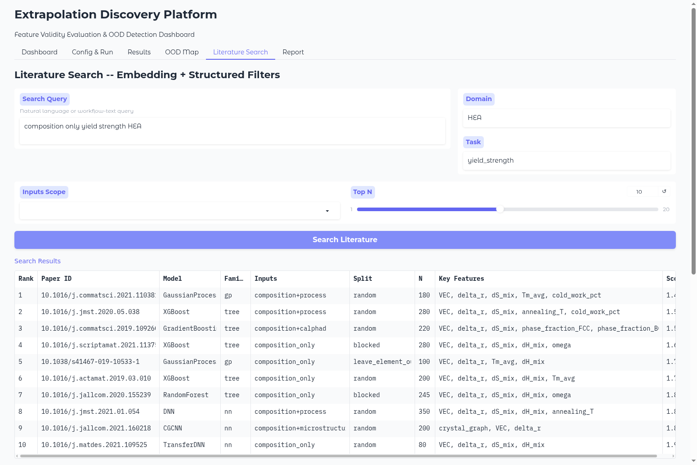
*図5.5.2: 検索結果 — 10件の類似論文がランキング表示される*

**検索結果テーブルの読み方**:

| カラム | 説明 |
|--------|------|
| **Rank** | 類似度の順位 |
| **Paper ID** | 論文のDOI（デジタルオブジェクト識別子） |
| **Model** | 使用されているモデル（GaussianProcess, XGBoost, DNN等） |
| **Family** | モデルのファミリー（gp, tree, nn等） |
| **Inputs** | 入力データの種類（composition_only, composition+process等） |
| **Split** | データ分割方式（random, blocked, leave_element_out等） |
| **N** | データセットサイズ |
| **Key Features** | 使用されている主要な特徴量 |
| **Score** | embedding類似度スコア |

#### Feature Frequency（特徴量頻度グラフ）と推薦


*図5.5.3: Feature Frequency — 文献中での特徴量の使用頻度と推薦*

**Feature Frequency グラフ**:
- 横棒グラフで、検索にヒットした論文群での特徴量使用頻度を表示
- **vec, delta_r, ds_mix** が最頻出（10件中10件）-- 基本的な組成記述子
- **dh_mix** (7件), **tm_avg** (4件) -- 追加の熱力学特徴量

**Feature Recommendation（推薦）**:
```
Recommended set: FS_BASE+LIT_TOP2
Base features (8): Tm_avg, VEC, dH_mix, dS_mix, delta_EN, delta_r, mass_avg, r_avg
Added from literature (2): omega, elastic_mismatch
Unregistered features: vec, ds_mix, tm_avg, cold_work_pct, ...
```
- **推薦セット**: 既存の基本特徴量 + 文献で頻出の上位2特徴量
- **Unregistered features**: プラットフォームに未登録の特徴量（将来の拡張候補）

---

### 5.6 Report（レポート）

実験結果をMarkdownレポートとしてプレビュー・ダウンロードする画面です。

#### レポートプレビュー（上部）

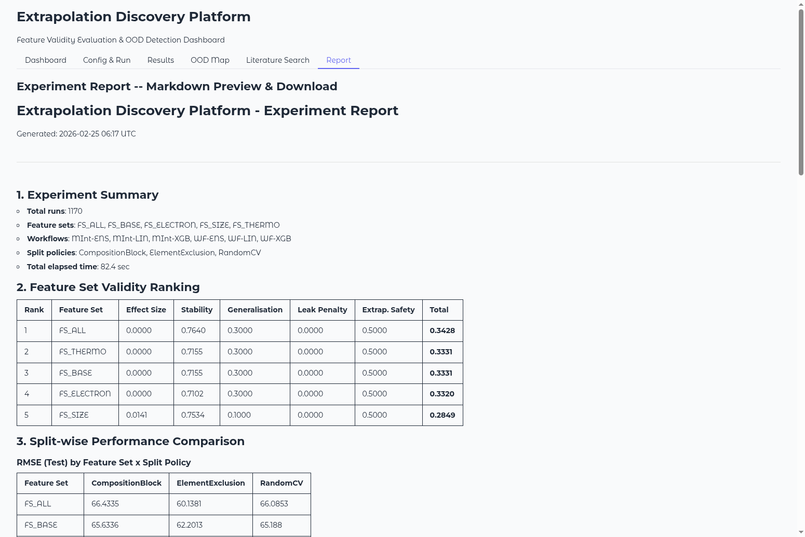
*図5.6.1: Report画面上部 — 実験サマリーとFeature Set Validity Ranking*

**レポートの内容構成**:

| セクション | 内容 |
|-----------|------|
| **1. Experiment Summary** | 総ラン数、特徴量セット一覧、ワークフロー一覧、分割方式、所要時間 |
| **2. Feature Set Validity Ranking** | 5要素スコアの表 |
| **3. Split-wise Performance Comparison** | 分割方式別のRMSE, R$^2$の比較表 |
| **4. OOD Analysis** | OODサンプル数、閾値、判定結果 |
| **5. OOD Region Candidate Compositions** | OODとして検出された合金組成の候補リスト |
| **6. Figures** | 生成されたプロット画像 |
| **7. Literature Near-Neighbour WF Evidence** | 文献検索の類似ワークフロー |

#### レポートプレビュー（下部）

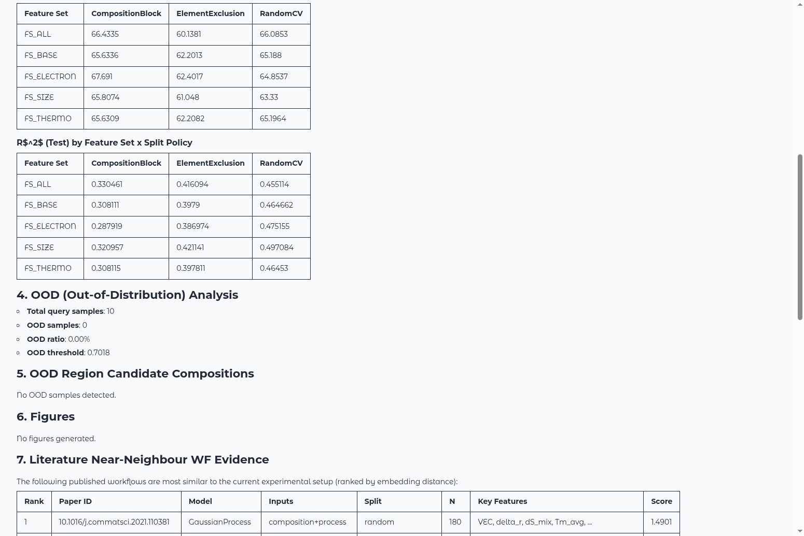
*図5.6.2: Report画面下部 — OOD分析と文献近傍ワークフロー*

**ダウンロード方法**:
- レポート下部の **「Download Report (MD)」** ボタンをクリックすると、Markdownファイルがダウンロードされます
- ダウンロードしたファイルは任意のMarkdownビューア（VS Code, Typora等）で閲覧できます

---

## 6. CLI操作ガイド

GUIを使わずに、コマンドラインから全機能を利用できます。

### 6.1 run コマンド（実験実行）

```bash
# 基本的な使い方
python -m hea_extrapolation_platform run [オプション]

# クイック実行（テスト用・約1〜2分）
python -m hea_extrapolation_platform run --quick --n-samples 50

# 本番実行（フルスケール・約5〜10分）
python -m hea_extrapolation_platform run --seeds 42 123 456 --n-samples 200

# シード1つだけで高速実行
python -m hea_extrapolation_platform run --quick --n-samples 50 --seeds 42

# 文献検索をスキップ
python -m hea_extrapolation_platform run --quick --n-samples 50 --skip-literature
```

**オプション一覧**:

| オプション | デフォルト | 説明 |
|-----------|----------|------|
| `--seeds` | `42 123 456` | 乱数シード（スペース区切り） |
| `--n-samples` | `200` | サンプル数（50〜1000） |
| `--quick` | OFF | Quick Mode（高速実行） |
| `--exclude-elements` | `Co Ni Ti` | ElementExclusionで除外する元素 |
| `--skip-literature` | OFF | 文献検索スキップ |
| `--skip-static-plots` | OFF | 静的プロット生成スキップ |
| `--use-feast` | 自動 | Feast特徴量ストアを使用 |
| `--use-mlflow` | 自動 | MLflow実験トラッキングを使用 |
| `--use-mint` | 自動 | MIntワークフローを使用 |

### 6.2 search コマンド（文献検索）

```bash
# 文献検索
python -m hea_extrapolation_platform search "composition only yield strength HEA"

# ドメイン・タスク指定
python -m hea_extrapolation_platform search "HEA prediction" --domain HEA --task yield_strength

# 結果数指定
python -m hea_extrapolation_platform search "XGBoost alloy" --top-n 5
```

### 6.3 report コマンド（レポート生成）

```bash
# 最新の実験結果からレポート生成
python -m hea_extrapolation_platform report

# 出力先指定
python -m hea_extrapolation_platform report --output my_report.md
```

### 6.4 gui コマンド（GUI起動）

```bash
# デフォルトポートで起動
python -m hea_extrapolation_platform gui

# ポート指定
python -m hea_extrapolation_platform gui --port 8080

# 公開URL付きで起動
python -m hea_extrapolation_platform gui --share
```

---

## 7. 設定パラメータ詳細

### 7.1 特徴量セット（Feature Sets）

プラットフォームには5種類の特徴量セットがプリセットされています：

| セット名 | 含まれる特徴量 | 特徴 |
|----------|-------------|------|
| **FS_BASE** | VEC, dH_mix, dS_mix, delta_r, Tm_avg, delta_EN, mass_avg, r_avg | 基本的な組成記述子（8特徴量） |
| **FS_THERMO** | FS_BASE + omega, ss_formation | 熱力学パラメータを追加（10特徴量） |
| **FS_SIZE** | FS_BASE + mismatch_PGS, elastic_mismatch | サイズ効果パラメータを追加（10特徴量） |
| **FS_ELECTRON** | FS_BASE + e_per_a, phi_pauling | 電子構造パラメータを追加（10特徴量） |
| **FS_ALL** | 上記全ての特徴量を統合 | 全特徴量（16特徴量） |

> **使い分けのヒント**: まず FS_ALL で全体像を把握し、次に各サブセット（FS_THERMO, FS_SIZE, FS_ELECTRON）の寄与を比較するのが効率的です。

### 7.2 ワークフロー（Workflows）

| ワークフロー | モデル | 特徴 | 向いている場面 |
|-------------|-------|------|--------------|
| **WF-LIN** | Ridge回帰 | 線形・解釈しやすい | ベースライン、特徴量の線形効果確認 |
| **WF-XGB** | XGBoost | 非線形・高精度 | 複雑な非線形関係がある場合 |
| **WF-ENS** | Ridge + XGBoostの平均 | バランス型 | ロバストな予測が必要な場合 |
| **MInt-LIN** | MInt経由のRidge回帰 | MInt統合 | MIntワークフローとの互換性確認 |
| **MInt-XGB** | MInt経由のXGBoost | MInt統合 | MIntワークフローとの互換性確認 |
| **MInt-ENS** | MInt経由のアンサンブル | MInt統合 | MIntワークフローとの互換性確認 |

### 7.3 分割方式（Split Policies）

| 分割方式 | 説明 | 何を検証できるか |
|---------|------|----------------|
| **RandomCV** | ランダムに5分割交差検証 | 標準的な予測精度 |
| **CompositionBlock** | 類似組成をブロックにまとめて分割 | 組成空間での汎化性能 |
| **ElementExclusion** | 指定元素を含むデータをテストに分離 | 未知元素への外挿能力 |

> **重要**: ElementExclusionは最も厳しいテストです。ここで性能が大きく下がる特徴量セットは、新しい元素系への外挿に弱いことを示しています。

---

## 8. 結果の読み方・解釈ガイド

### 8.1 妥当性スコア（Validity Score）の5要素

妥当性スコアは以下の5つのサブスコアの加重平均で計算されます：

| サブスコア | 重み | 計算方法 | 解釈 |
|-----------|------|---------|------|
| **Effect Size** | 0.25 | ベースライン（FS_BASE）からのRMSE改善率 | 大きい = 特徴量追加の効果がある |
| **Stability** | 0.20 | シード間のスコア標準偏差の逆数 | 大きい = シードを変えても結果が安定 |
| **Generalisation** | 0.20 | 1 - (test_RMSE - train_RMSE)/train_RMSE | 大きい = 過学習していない |
| **Leak Penalty** | 0.15 | OODリーク率の減点 | 0 = リークなし（理想） |
| **Extrap. Safety** | 0.20 | ElementExclusion分割での性能維持率 | 大きい = 外挿に強い |

**計算式**:
```
Total = 0.25 x Effect Size + 0.20 x Stability + 0.20 x Generalisation
      + 0.15 x (1 - Leak Penalty) + 0.20 x Extrap. Safety
```

> **実験例での解釈**: FS_ALL (Total=0.3428) vs FS_SIZE (Total=0.2849)。FS_ALLはStabilityが0.764と高く（FS_SIZEは0.753）、Generalisationが0.3（FS_SIZEは0.1）と大きく優れています。

### 8.2 OOD（外挿領域）の判定基準

OOD検出はkNN（k近傍法）距離ベースで行われます：

1. 訓練データ間のkNN距離分布を計算
2. 距離分布の95パーセンタイルを閾値として設定
3. テストデータの各サンプルについてkNN距離を計算
4. 閾値を超えたサンプルをOOD（外挿）と判定

**OOD率の解釈**:
- **0%**: テストデータは訓練データの分布内（外挿なし）
- **1〜10%**: 少数のサンプルが分布端にある（軽度の外挿）
- **10%以上**: 有意な外挿領域がある（追加データ取得を検討）

### 8.3 R$^2$・RMSEの読み方

| メトリクス | 理想値 | 良好な範囲 | 要注意 |
|-----------|-------|----------|--------|
| **R$^2$** | 1.0 | > 0.7 | < 0.5 |
| **RMSE** | 0 | ターゲットの標準偏差の半分以下 | 標準偏差を超える |
| **MAE** | 0 | RMSEの0.8倍以下 | RMSEの1.0倍以上 |

> **注意**: R$^2$が訓練セットで0.99、テストセットで0.50のような場合は、典型的な過学習のサインです。

### 8.4 訓練スコアとテストスコアの差（過学習の兆候）

| 状態 | Train R$^2$ | Test R$^2$ | Train-Test差 | 判断 |
|------|------------|-----------|-------------|------|
| 理想的 | 0.85 | 0.80 | 0.05 | 汎化性能良好 |
| やや過学習 | 0.95 | 0.70 | 0.25 | 注意が必要 |
| 過学習 | 0.99 | 0.50 | 0.49 | モデル/特徴量を見直し |
| 未学習 | 0.40 | 0.35 | 0.05 | 特徴量/モデルが不足 |

---

## 9. システム統合（自動動作）

### 9.1 統合アーキテクチャ概要

本プラットフォームは以下の3つの外部システムと統合されていますが、**ユーザーが意識する必要はありません**。すべて自動的に動作します。

```
+-------------------------------------------+
|         ユーザー操作                        |
|   「Run Experiment」ボタンを押すだけ        |
+-----------------+-------------------------+
                  |
    +-------------v--------------+
    |       ExperimentRunner      |
    |    （実験の統括管理）         |
    +--+-----------+----------+--+
       |           |          |
  +----v----+ +----v---+ +---v----+
  | MLflow  | | Feast  | |  MInt  |
  | Tracker | | Store  | |Adapter |
  |(実験記録)| |(特徴量)| |(WF実行) |
  +---------+ +--------+ +--------+
       |           |          |
       v           v          v
   自動記録    自動管理    自動実行
```

### 9.2 MLflow（実験トラッキング）

**MLflowとは**: 機械学習の実験管理ツールです。各実験のパラメータ・メトリクス・モデルを自動記録します。

**本プラットフォームでの動作**:
- 実験実行時に自動的にMLflowトラッキングが開始されます
- 各ランのパラメータ（seed, feature_set, workflow, split_policy）が記録されます
- メトリクス（RMSE, MAE, R$^2$）も自動記録されます
- **フォールバック**: MLflowがインストールされていない場合、ローカルのJSONファイルに記録が保存されます

**ユーザーへの影響**: なし（自動動作）。Progress Logに `Experiment tracking: N run(s) recorded` と表示されます。

### 9.3 Feast（特徴量ストア）

**Feastとは**: 特徴量（Feature）を一元管理するストアです。特徴量の定義・バージョン管理・配信を行います。

**本プラットフォームでの動作**:
- 5種類の特徴量セット（FS_BASE〜FS_ALL）がFeastストアに自動登録されます
- 特徴量の定義変更履歴が管理されます
- **フォールバック**: Feastがインストールされていない場合、Python辞書ベースのローカルストアが使用されます

**ユーザーへの影響**: なし（自動動作）。Progress Logに `Feature store: N feature set(s) managed` と表示されます。

### 9.4 MInt（ワークフローアダプタ）

**MIntとは**: Materials Integration（https://github.com/materialsintegration）のワークフロー実行基盤です。計算科学ワークフローの管理・実行を行います。

**本プラットフォームでの動作**:
- 3つの追加ワークフロー（MInt-LIN, MInt-XGB, MInt-ENS）が自動的に実行されます
- 通常の3ワークフロー（WF-LIN, WF-XGB, WF-ENS）に加えて、合計6ワークフローが利用可能
- **フォールバック**: MIntサーバーに接続できない場合、ローカルのワークフローシミュレータが使用されます

**ユーザーへの影響**: なし（自動動作）。Progress Logに `Workflow engine: N workflow(s) executed` と表示されます。

### 9.5 統合の相乗効果

3つのシステムが連携することで、以下の効果が生まれます：

| 組み合わせ | 効果 |
|-----------|------|
| **MLflow + Feast** | 「どの特徴量セットの改版で精度が上がったか」を追跡可能 |
| **Feast + MInt** | 「Feastで管理された特徴量をMIntワークフローが自動取得」 |
| **MLflow + MInt** | 「MIntワークフローの実行結果がMLflowに自動記録」 |
| **全統合** | 「Feastから特徴量取得 -> MInt実行 -> MLflow記録」の全自動パイプライン |

### 9.6 ユーザーが意識しなくてよい理由

| 従来の手動運用 | 本プラットフォームの自動運用 |
|--------------|------------------------|
| MLflowサーバーを起動 | 自動起動（不要なら自動スキップ） |
| 実験コードにMLflow APIを埋め込む | runner.py が自動呼び出し |
| Feastの特徴量定義ファイルを手書き | 特徴量セットから自動生成 |
| MIntのWFをAPI経由で呼び出す | 統一インターフェースで自動実行 |
| 結果をExcelに手動整理 | レポート自動生成 |

**設計思想**: ユーザーは「何を調べたいか」だけに集中し、「どうやって管理・記録・実行するか」はプラットフォームに任せる。

---

## 10. エラー対処・トラブルシューティング

### 10.1 インストール時のエラー

#### エラー: `ModuleNotFoundError: No module named 'xgboost'`

**原因**: xgboostパッケージが未インストール

**解決策**:
```bash
pip install xgboost
```

#### エラー: `ModuleNotFoundError: No module named 'gradio'`

**原因**: gradioパッケージが未インストール（GUI使用時のみ必要）

**解決策**:
```bash
pip install gradio
```

#### エラー: `pip install` が失敗する

**原因**: pip のバージョンが古い可能性

**解決策**:
```bash
python -m pip install --upgrade pip
pip install -r hea_extrapolation_platform/requirements.txt
```

### 10.2 GUI起動時のエラー

#### エラー: `OSError: [Errno 98] Address already in use`

**原因**: 指定したポート（デフォルト7860）が別のプロセスで使用中

**解決策**:
```bash
# 別のポートで起動
python -m hea_extrapolation_platform gui --port 7870
```

#### エラー: ブラウザでページが表示されない

**確認事項**:
1. ターミナルに `Running on local URL: http://localhost:7860` と表示されているか確認
2. ブラウザのアドレスバーに正確なURLを入力しているか確認
3. ファイアウォールがポートをブロックしていないか確認

### 10.3 実験実行時のエラー

#### エラー: `ValueError: could not broadcast input array`

**原因**: データの形状不整合（v2.0で修正済み）

**解決策**: 最新版にアップデートしてください。

#### 実行が極端に遅い

**確認事項**:
- Number of Samples が大きすぎないか（推奨: 50〜200）
- シード数が多すぎないか（推奨: 3〜5）
- Quick Mode がONになっているか確認

**目安の実行時間**:

| サンプル数 | シード数 | Quick Mode | 概算時間 |
|-----------|---------|-----------|---------|
| 50 | 3 | ON | 約1〜2分 |
| 200 | 3 | ON | 約3〜5分 |
| 200 | 3 | OFF | 約10〜20分 |
| 500 | 5 | ON | 約10〜15分 |

---

## 11. FAQ（よくある質問）

**Q1: 実験にどのくらいの時間がかかりますか？**

> A: Quick Mode ON, 50サンプル, 3シードで約1〜2分です。詳細は上記の実行時間の目安を参照してください。

**Q2: HEA以外の材料系でも使えますか？**

> A: はい。プラットフォームはドメイン非依存（domain-agnostic）に設計されています。HEAは例題として使用しており、dataset.py の `generate_hea_dataset()` 関数を差し替えることで、任意の材料系に適用できます。

**Q3: 結果はどこに保存されますか？**

> A: `results/YYYYMMDD_HHMMSS/` ディレクトリに保存されます。具体的には：
> - `run_registry.json`: 全ランの結果データ
> - `experiment_report.md`: 実験レポート
> - `figures/`: 生成されたプロット画像

**Q4: 同じ実験を再現できますか？**

> A: はい。同じシード値・サンプル数・設定で実行すれば、完全に同じ結果が得られます（v2.0でRNG再現性を修正済み）。

**Q5: 新しい特徴量セットを追加するには？**

> A: `features.py` の `FEATURE_SETS` 辞書に新しいエントリを追加してください。例：
> ```python
> FEATURE_SETS["FS_CUSTOM"] = ["VEC", "dH_mix", "my_new_feature"]
> ```

**Q6: 文献データベースを拡張するには？**

> A: `literature_graph/seed_data.py` にJSONL形式で論文メタデータを追加してください。必須フィールド: paper_id, model, family, inputs, domain, task, split, n, key_features。

**Q7: Quick Modeをオフにする効果は？**

> A: ハイパーパラメータのグリッドサーチが細かくなり、最適なパラメータを見つけやすくなります。ただし実行時間が数倍に増加します。最終評価ではOFFにすることを推奨します。

**Q8: ディスク容量はどのくらい必要ですか？**

> A: プラットフォーム本体は約50MB。1回の実験結果（50サンプル）は約5〜10MB。静的プロットを含めると1回あたり約20〜30MBになります。

**Q9: 複数人で同時に使えますか？**

> A: はい。GUIはGradioの`gr.State`ベースでセッション分離されており、複数のブラウザタブ/ユーザーが同時に独立した実験を実行できます。

**Q10: MLflow/Feast/MIntがインストールされていなくても動きますか？**

> A: はい。各統合にはフォールバック機構があり、外部パッケージがなくてもローカル代替で動作します。Progress Logでフォールバックの使用状況を確認できます。

---

## 付録A: ファイル構成

```
hea_extrapolation_platform/
+-- __init__.py              # パッケージ初期化
+-- __main__.py              # CLIエントリポイント
+-- features.py              # 特徴量セット定義
+-- dataset.py               # HEAデータセット生成
+-- splitters.py             # データ分割方式
+-- workflows.py             # ワークフロー定義（WF-LIN, WF-XGB, WF-ENS）
+-- evaluation.py            # 妥当性スコア計算
+-- ood.py                   # OOD検出（kNN距離ベース）
+-- runner.py                # 実験実行の統括
+-- report.py                # レポート生成
+-- requirements.txt         # 依存パッケージ一覧
+-- gui/
|   +-- __init__.py
|   +-- app.py               # Gradio GUI本体
|   +-- plotly_charts.py     # Plotlyチャート生成
+-- integrations/
|   +-- __init__.py
|   +-- mlflow_tracker.py    # MLflow統合アダプタ
|   +-- feast_store.py       # Feast統合アダプタ
|   +-- mint_adapter.py      # MInt統合アダプタ
+-- literature_graph/
|   +-- __init__.py
|   +-- schemas.py           # 文献データのスキーマ定義
|   +-- seed_data.py         # 文献シードデータ（JSONL形式）
|   +-- search.py            # 文献検索エンジン
|   +-- vector_index.py      # FAISS/TF-IDF ベクトルインデックス
+-- docs/
|   +-- user_manual.md       # 本ドキュメント
|   +-- screenshots_v3/      # スクリーンショット（17枚）
+-- results/                 # 実験結果の出力先
    +-- YYYYMMDD_HHMMSS/     # タイムスタンプ付きディレクトリ
```

---

## 付録B: 変更履歴

| バージョン | 日付 | 主な変更内容 |
|-----------|------|-------------|
| **v1.0** | 2026-02-24 | 初版リリース（コアモジュール10個 + 文献グラフ） |
| **v1.1** | 2026-02-24 | GUI（Gradio）+ CLI追加、Plotlyチャート、13件のバグ修正 |
| **v1.2** | 2026-02-25 | Seamless Integration（MLflow/Feast/MInt自動統合）、取扱説明書初版 |
| **v2.0** | 2026-02-25 | 取扱説明書改訂（本版）、RNG再現性修正、評価警告修正、熱力学安定性修正、スクリーンショット17枚 |

---

*本ドキュメントに関するご質問・フィードバックは、GitHubリポジトリのIssueまたはPull Requestでお寄せください。*
