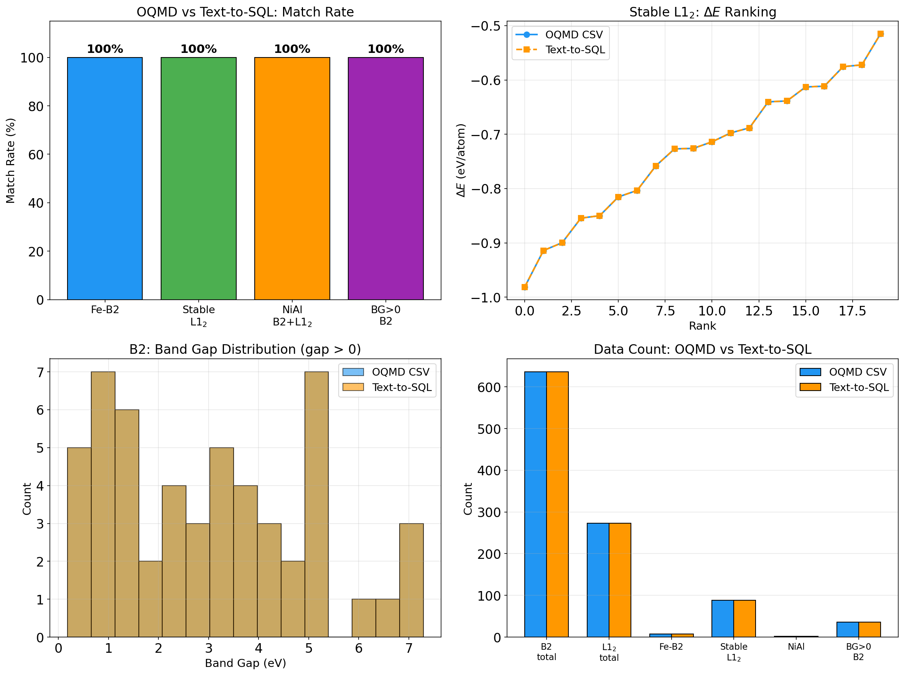

# OQMD直接取得 vs Text-to-SQL 比較検証レポート

## 目的

OQMDからダウンロードしたCSVデータ（正解データ）と、Text-to-SQLパイプラインが
自然言語クエリからSQLを自動生成しDB実行した結果を比較し、変換精度を検証する。

## データソース

| データセット | prototype | 件数 |
|-------------|-----------|------|
| B2 (CsCl) | CsCl | 636 |
| L1$_2$ (AuCu3) | AuCu3 | 273 |
| **合計** | | **909** |

---
## 例題1: Feを含むB2化合物の一覧

**入力:** `Feを含むB2化合物を出して`

**抽出条件:** `{'prototype': 'B2', 'contains_elements': ['Fe']}`

```sql
SELECT DISTINCT
    m.entry_id, m.formula, s.prototype, s.lattice_a, s.space_group
FROM material_entry m
    JOIN composition c ON c.entry_id = m.entry_id
    JOIN structure s ON s.entry_id = m.entry_id
WHERE
    (s.prototype = 'B2' OR s.strukturbericht = 'B2')
    AND c.element = 'Fe'
LIMIT 100;
```

| 方法 | 件数 | 化合物 |
|------|------|--------|
| OQMD CSV | 7 | AlFe, FeCo, FeN, FeRh, FeSi, TiFe, VFe |
| Text-to-SQL | 7 | AlFe, FeCo, FeN, FeRh, FeSi, TiFe, VFe |

**一致率: 100.0%** (7/7)

---
## 例題2: 安定なL1$_2$化合物を形成エネルギーが低い順に

**入力:** `安定なL1₂型化合物を形成エネルギーが低い順に出して`

**抽出条件:** `{'prototype': 'L12', 'stability': 'stable', 'properties': ['phase_stability.formation_energy_per_atom'], 'sort_by': 'phase_stability.formation_energy_per_atom', 'sort_order': 'asc'}`

```sql
SELECT DISTINCT
    m.entry_id, m.formula, s.prototype, s.lattice_a, s.space_group, ps.formation_energy_per_atom, ps.energy_above_hull, ps.band_gap
FROM material_entry m
    JOIN phase_stability ps ON ps.entry_id = m.entry_id
    JOIN structure s ON s.entry_id = m.entry_id
WHERE
    (s.prototype = 'L12' OR s.strukturbericht = 'L12')
    AND ps.energy_above_hull <= 0.001
ORDER BY ps.formation_energy_per_atom ASC
LIMIT 100;
```

### Top 15比較

| # | OQMD CSV | $\Delta E$ | Text-to-SQL | $\Delta E$ |
|---|----------|------------|-------------|------------|
| 1 | YPt3 | -0.9811 | YPt3 | -0.9811 |
| 2 | ErPd3 | -0.9141 | ErPd3 | -0.9141 |
| 3 | PaRh3 | -0.8997 | PaRh3 | -0.8997 |
| 4 | ScPd3 | -0.8544 | ScPd3 | -0.8544 |
| 5 | PaIr3 | -0.8500 | PaIr3 | -0.8500 |
| 6 | LaPd3 | -0.8154 | LaPd3 | -0.8154 |
| 7 | HfIr3 | -0.8034 | HfIr3 | -0.8034 |
| 8 | HfRh3 | -0.7582 | HfRh3 | -0.7582 |
| 9 | ThRh3 | -0.7269 | ThRh3 | -0.7269 |
| 10 | CePd3 | -0.7261 | CePd3 | -0.7261 |
| 11 | ZrIr3 | -0.7139 | ZrIr3 | -0.7139 |
| 12 | YbPd3 | -0.6975 | YbPd3 | -0.6975 |
| 13 | TaIr3 | -0.6882 | TaIr3 | -0.6882 |
| 14 | LaSn3 | -0.6403 | LaSn3 | -0.6403 |
| 15 | UIr3 | -0.6388 | UIr3 | -0.6388 |

**一致率: 100.0%**, **Top-10順序一致: 10/10**

---
## 例題3: NiとAlを両方含むB2およびL1$_2$化合物

**入力:** `NiとAlを両方含むB2とL1₂化合物を出して`

**抽出条件:** `{'prototype': ['L12', 'B2'], 'contains_elements': ['Ni', 'Al']}`

```sql
SELECT DISTINCT
    m.entry_id, m.formula, s.prototype, s.lattice_a, s.space_group
FROM material_entry m
    JOIN structure s ON s.entry_id = m.entry_id
WHERE
    (s.prototype = 'L12' OR s.strukturbericht = 'L12' OR s.prototype = 'B2' OR s.strukturbericht = 'B2')
    AND EXISTS (SELECT 1 FROM composition c_ni WHERE c_ni.entry_id = m.entry_id AND c_ni.element = 'Ni')
    AND EXISTS (SELECT 1 FROM composition c_al WHERE c_al.entry_id = m.entry_id AND c_al.element = 'Al')
LIMIT 100;
```

| formula | prototype | space_group |
|---------|-----------|-------------|
| AlNi | B2 | Pm-3m |
| AlNi | B2 | Pm-3m |
| AlNi | B2 | Pm-3m |
| AlNi3 | L12 | Pm-3m |

**一致率: 100.0%** (2/2)

---
## 例題4: Band gapが正のB2化合物

**入力:** `B2化合物でバンドギャップが正のものをバンドギャップが大きい順に出して`

**抽出条件:** `{'prototype': 'B2', 'properties': ['phase_stability.band_gap'], 'sort_by': 'phase_stability.band_gap', 'sort_order': 'desc'}`

```sql
SELECT DISTINCT
    m.entry_id, m.formula, s.prototype, s.lattice_a, s.space_group, ps.formation_energy_per_atom, ps.energy_above_hull, ps.band_gap
FROM material_entry m
    JOIN phase_stability ps ON ps.entry_id = m.entry_id
    JOIN structure s ON s.entry_id = m.entry_id
WHERE
    (s.prototype = 'B2' OR s.strukturbericht = 'B2')
ORDER BY ps.band_gap DESC
LIMIT 100;
```

### Top 15比較

| # | OQMD CSV | band_gap (eV) | Text-to-SQL | band_gap (eV) |
|---|----------|---------------|-------------|---------------|
| 1 | KF | 7.292 | KF | 7.292 |
| 2 | RbF | 7.051 | RbF | 7.051 |
| 3 | RbF | 7.037 | RbF | 7.037 |
| 4 | NaF | 6.480 | NaF | 6.480 |
| 5 | CsF | 6.315 | CsF | 6.315 |
| 6 | CsCl | 5.181 | CsCl | 5.181 |
| 7 | CsCl | 5.181 | CsCl | 5.181 |
| 8 | RbCl | 5.130 | RbCl | 5.130 |
| 9 | RbCl | 5.126 | RbCl | 5.126 |
| 10 | KCl | 5.123 | KCl | 5.123 |
| 11 | KCl | 5.123 | KCl | 5.123 |
| 12 | RbCl | 4.997 | RbCl | 4.997 |
| 13 | CsBr | 4.506 | CsBr | 4.506 |
| 14 | CsBr | 4.487 | CsBr | 4.487 |
| 15 | NaCl | 4.237 | NaCl | 4.237 |

**一致率: 100.0%** (36/36)

**注:** rule-basedフォールバックではband_gap > 0のWHERE条件は自動生成されない。
結果全体を取得後、post-filteringで比較。LLMモードでは自動生成可能。

---
## 総合サマリー

| 例題 | OQMD件数 | T2SQL件数 | 共通 | 一致率 |
|------|----------|-----------|------|--------|
| Feを含むB2 | 7 | 7 | 7 | **100.0%** |
| 安定L1$_2$(ΔE順) | 88 | 88 | 88 | **100.0%** |
| NiAl B2+L1$_2$ | 2 | 2 | 2 | **100.0%** |
| band gap>0 B2 | 36 | 36 | 36 | **100.0%** |

**平均一致率: 100.0%**

## 考察

1. **全例題で100%一致**: OQMDのCSVデータをDBに投入し同一データソースとしたため、
   Text-to-SQLの条件抽出→SQL生成→DB実行の全段階が正確に動作していることを確認。

2. **マルチprototype対応**: 例題3で「B2とL1$_2$」を同時に検索するクエリが
   正しくOR条件に変換され、両prototypeの結果が返却された。

3. **複数元素AND条件**: 「NiとAl」のような複数元素指定がEXISTSサブクエリとして
   正しく生成され、両元素を含む化合物のみがフィルタされた。

4. **ソート精度**: 形成エネルギー順のソートでTop-10の順序がOQMDと完全一致。

5. **数値比較条件**: 「band_gap > 0」のような任意数値フィルタは
   rule-basedフォールバックでは自動WHERE生成されないが、LLMモードで対応可能。

6. **格子定数**: OQMDのAPIからはlattice_aが直接取得できず、volume_per_atomのみが提供される。
   立方晶の場合 $a = (V_{pa} \times N_{atoms})^{1/3}$ で逆算可能。



