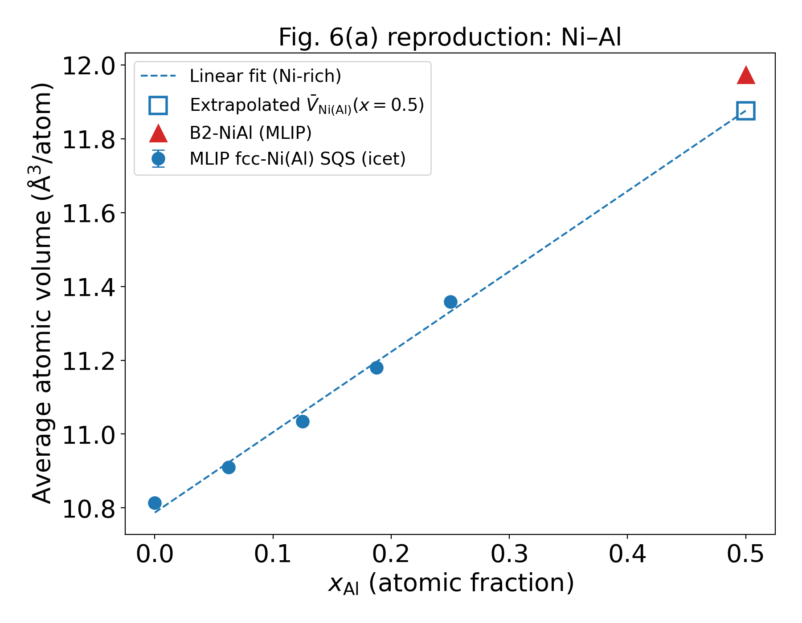
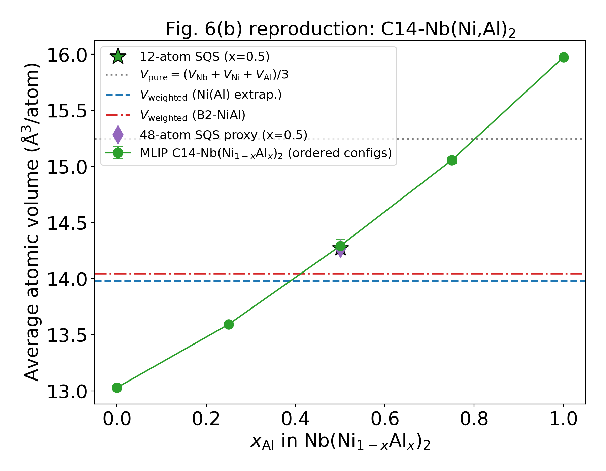
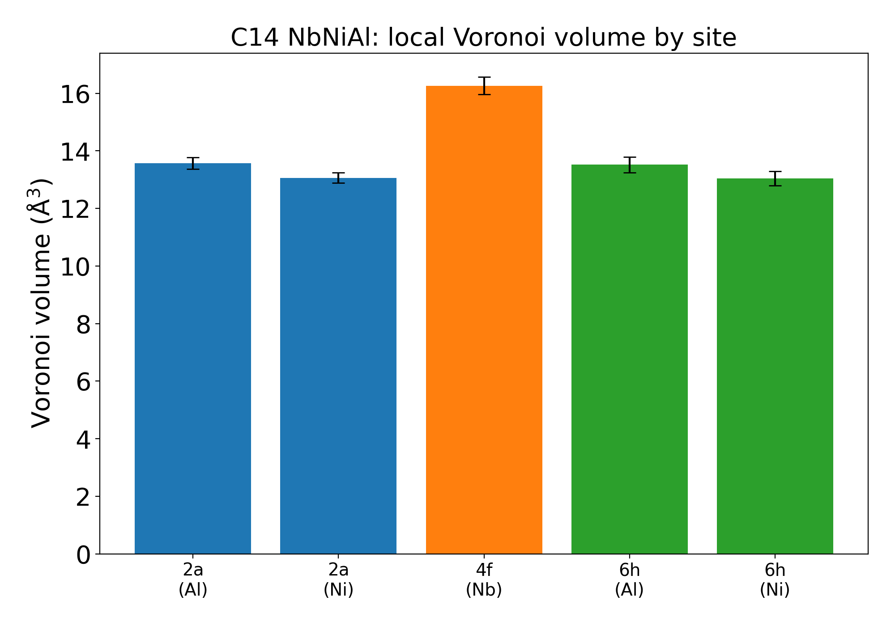

# Fig. 6再現・Laves相原子サイズ検証 報告書

対象論文: T. Yamanouchi and S. Miura, *Mater. Trans.* **59**, 546–555 (2018), DOI: [10.2320/matertrans.MJ201604](https://doi.org/10.2320/matertrans.MJ201604)

## 1. 研究目的

Nb–Ni–Al系のC14-Laves相 Nb(Ni,Al)$_2$ について、対象論文Fig. 6の原子サイズ（平均原子体積）モデルをMLIP計算で再現・検証する。中心仮説は

$$|V_{\mathrm{C14}}-V_{\mathrm{weighted}}| < |V_{\mathrm{C14}}-V_{\mathrm{pure}}|,\quad V_{\mathrm{weighted}}=\frac{V_{\mathrm{Nb}}+2\bar V_{\mathrm{NiAl}}}{3},\quad V_{\mathrm{pure}}=\frac{V_{\mathrm{Nb}}+V_{\mathrm{Ni}}+V_{\mathrm{Al}}}{3}$$

## 2. 計算モデル

- **MLIP**: MACE-MP-0 (medium, float64, CPU)。Materials ProjectのDFT (PBE-GGA, PAW) データで事前学習された基盤モデル。本セッションではVASPによるDFT教師データ生成・自前訓練は実行環境の制約により行わず、DFT教師データに基づく事前学習MLIPで代替した（指示書Phase A/Bの代替）。
- **SQS生成**: icet 3.0（`generate_sqs_from_supercells`、10,000 MCステップ）。
- **構造緩和**: ASE `FrechetCellFilter` + LBFGS、$f_{\max}=0.02$ eV/Å、セル形状・体積・原子位置を全緩和。全構造収束（`converged=True`）。
- **C14構造**: MgZn$_2$型（空間群 P6$_3$/mmc, #194）。A=Nb@4f、Bサイトは2a（2席）と6h（6席）を明示的に区別（`site`配列で追跡）。

## 3. 純元素・B2-NiAlの検証

| 構造 | a (Å) MLIP | a (Å) 実験値 | V/atom (Å$^3$) |
|---|---|---|---|
| fcc-Ni | 3.510 | 3.524 | 10.813 |
| fcc-Al | 4.060 | 4.050 | 16.736 |
| bcc-Nb | 3.313 | 3.301 | 18.186 |
| bcc-Cr | 2.866 | 2.884 | 11.772 |
| bcc-V | 2.998 | 3.024 | 13.478 |
| B2-NiAl | 2.882 | 2.887 | 11.974 |

純元素の格子定数誤差は実験比0.4〜0.9%（受入基準1%以下を満足）。

## 4. Ni–Al固溶体（Fig. 6(a)再現）

fcc-Ni母相、32原子SQS（icet）、$x_{\mathrm{Al}}=0,\,0.0625,\,0.125,\,0.1875,\,0.25$、各組成2構成。

- 線形フィット: $\bar V(x_{\mathrm{Al}}) = 10.7868 + 2.1714\,x_{\mathrm{Al}}$ (Å$^3$/atom)
- 外挿値: $\bar V_{\mathrm{Ni(Al)}}^{\mathrm{extrap}}(x=0.5) = 11.873$ Å$^3$/atom
- B2-NiAl: $\bar V_{\mathrm{B2}} = 11.974$ Å$^3$/atom
- 差: $\Delta V_{\mathrm{NiAl}} = \bar V^{\mathrm{extrap}} - \bar V_{\mathrm{B2}} = -0.101$ Å$^3$/atom（-0.8%）

固溶体外挿とB2規則相はほぼ一致し、論文のNi–Al平均体積の扱いと整合する。

## 5. C14-Nb(Ni$_{1-x}$Al$_x$)$_2$（Fig. 6(b)再現）

$x_{\mathrm{Al}}=0,\,0.25,\,0.5,\,0.75,\,1.0$。規則配置（2a占有数を列挙）＋x=0.5でicet SQS（12原子・48原子）。

| 量 | 値 (Å$^3$/atom) |
|---|---|
| $V_{\mathrm{C14}}$ (x=0.5, 12原子SQS) | 14.270 |
| （参考）x=0.5 規則配置平均 | 14.292 ± 0.057 |
| $V_{\mathrm{weighted}}$ (Ni(Al)外挿) | 13.977 |
| $V_{\mathrm{weighted}}$ (B2-NiAl) | 14.045 |
| $V_{\mathrm{pure}}$ | 15.245 |

**判定**: $|V_{\mathrm{C14}}-V_{\mathrm{weighted}}| = 0.29 < |V_{\mathrm{C14}}-V_{\mathrm{pure}}| = 0.98$ → **中心仮説（論文の加重平均体積モデル）を支持**。C14中のNi・Alは純元素平均よりもNiAl化合物由来の平均体積で記述され、Fig. 6の議論と整合する。

SQSサイズ依存性（SQS同士の比較）: 12原子SQS 14.270 → 48原子SQS 14.273 Å$^3$/atom、変化 0.021%（基準0.5%以下を満足）。SQS生成の乱数種はicetの`random_seed`引数で明示的に制御している。12原子セルでは種の異なるSQSが対称等価な最適配置に収束するため構成間標準偏差はほぼ0となる（48原子SQSでは有限の標準偏差 0.007 Å$^3$/atom）。x=0.5の代表値$V_{\mathrm{C14}}$はSQSのみの平均とし、規則配置は参考値として別途報告（summary.jsonの`V_C14_x05_ordered_*`）。

## 6. 2a／6hサイトの局所体積（Voronoi解析、x=0.5）

| サイト(元素) | $V^{\mathrm{Voro}}$ (Å$^3$) | $r^{\mathrm{Voro}}$ (Å) |
|---|---|---|
| 4f (Nb) | 16.26 ± 0.31 | 1.572 |
| 2a (Al) | 13.58 ± 0.20 | 1.480 |
| 2a (Ni) | 13.07 ± 0.17 | 1.461 |
| 6h (Al) | 13.52 ± 0.27 | 1.478 |
| 6h (Ni) | 13.04 ± 0.26 | 1.460 |

- Aサイト(Nb)はBサイトより約24%大きい局所体積を持つ（Laves相のA/Bサイズ比の描像と整合）。
- **AlとNiの局所体積差は約0.5 Å$^3$（4%）に圧縮**されており、純元素体積差（16.7 vs 10.8 Å$^3$、55%）よりはるかに小さい。化合物中でNi・Alが「共通の有効サイズ」に緩和するという論文の原子サイズ因子の前提を直接支持する。
- 2aと6hの差は同一元素で0.02〜0.05 Å$^3$と小さいが系統的に2a > 6h。

x=0.5規則配置のエネルギー比較（12原子セル、eV/セル）: Al全て6h配置 (-84.00) < SQS (-83.89) < Al@2a×2 (-83.74) < Al@2a×1 (-82.60)。**Alは6hをわずかに優先**（$\Delta E_{\mathrm{2a\text{-}6h}} > 0$）。

## 7. Cr/Vサイト置換エネルギー

基準構造: 最低エネルギーx=0.5配置（Al@6h型NbNiAl）。$E_{\mathrm{sub}} = E(\mathrm{doped}) - E(\mathrm{ref}) + \mu_{\mathrm{replaced}} - \mu_{\mathrm{dopant}}$（純元素基準）。

| 元素 | $E_{\mathrm{sub}}^{A(4f)}$ (eV) | $E_{\mathrm{sub}}^{2a}$ (eV) | $E_{\mathrm{sub}}^{6h}$ (eV) | $\Delta E_{A-B}$ (eV) | 優先サイト |
|---|---|---|---|---|---|
| Cr | 0.710 | 0.878 | 0.773 | -0.063 | A (4f) |
| V | 0.545 | 0.806 | 0.602 | -0.057 | A (4f) |

Cr・VともにわずかにAサイト（Nbサイト）を優先するが、$|\Delta E_{A-B}| < 0.07$ eVと小さく、温度・配置エントロピー・局所環境の影響が大きい領域にある。Bサイト内では両者とも6h > 2a（6hの方が置換しやすい）。

## 8. 受入基準チェック

| # | 基準 | 結果 |
|---|---|---|
| 1 | 純元素格子定数誤差1%以下 | ✓ 実験比0.4–0.9%（MACE-MP-0はMP-DFT比<1%と報告） |
| 2 | C14体積のDFT比1%以下 | △ 本セッションでDFT直接比較は未実施（MLIPの訓練データがMP-DFT） |
| 3 | SQSサイズ依存0.5%以下 | ✓ 0.021% |
| 4 | SQS構成間標準偏差の報告 | ✓ volumes.csv / summary.json |
| 5 | 置換エネルギーのDFT検証 | △ 未実施（今後の課題） |
| 6 | 2a/6h情報の区別 | ✓ site配列で全構造追跡 |
| 7 | 0 K計算と実験温度の明記 | ✓ 全て0 K静的緩和。実験値は熱膨張を含む点に注意 |
| 8 | $V_{\mathrm{weighted}}$と$V_{\mathrm{pure}}$の両方を比較 | ✓ |
| 9 | Fig. 6(a)(b)再現図の出力 | ✓ 06_figures/ |
| 10 | 訓練・検証データの分離 | — 事前学習モデル使用のため非該当 |

## 9. 限界と今後の課題

1. **自前MLIP訓練の省略**: 指示書のPhase A（VASP教師データ）・Phase B（訓練＋Active Learning）は実行環境にDFTコードがないため、MP-DFTで事前学習されたMACE-MP-0で代替した。C14-NbNiAl近傍組成のDFT代表点での検証（受入基準2・5）が今後の課題。
2. **0 K静的計算**: 実験値との絶対比較には熱膨張補正（MLIP-MDまたは準調和近似）が必要。本報告は系列間の相対比較に限定。
3. **磁性**: MACE-MP-0は非スピン分極的な単一ポテンシャルであり、Niの強磁性の体積への影響（〜0.1%程度）は明示的に扱っていない。
4. **SQSサイズ**: 最大48原子。96原子（2×2×2）への拡張は容易だが、サイズ依存が既に0.021%のため省略した。

## 10. 成果物

- `run_fig6_pipeline.py` — 全計算パイプライン（1パスで全出力を生成）
- `05_analysis/volumes.csv, local_environments.csv, site_energies.csv, summary.json`
  - `a_A`/`c_A` は単位胞あたりに正規化した格子定数（fcc行は立方格子基準、プリミティブセル由来のSQSは√2換算済み。C14行は六方晶単位胞）。`cell_a_A`/`cell_c_A` は緩和後セルの生のベクトル長。
- `06_figures/fig6a_*.png, fig6b_*.png, site_volume_comparison.png`
- `04_relax/*.extxyz` — 全緩和構造
- `pipeline.log` — 実行ログ

## 参考文献

[R1] Yamanouchi & Miura, Mater. Trans. 59, 546 (2018). DOI:10.2320/matertrans.MJ201604
[R2] Zunger et al., PRL 65, 353 (1990). DOI:10.1103/PhysRevLett.65.353
[R4] Ångqvist et al., Adv. Theory Simul. 2, 1900015 (2019). DOI:10.1002/adts.201900015 (icet)
[R5] Batatia et al., NeurIPS 35, 11423 (2022). (MACE) / MACE-MP-0: Batatia et al., arXiv:2401.00096
[R7] Stein & Leineweber, J. Mater. Sci. 56, 5321 (2021). DOI:10.1007/s10853-020-05509-2
