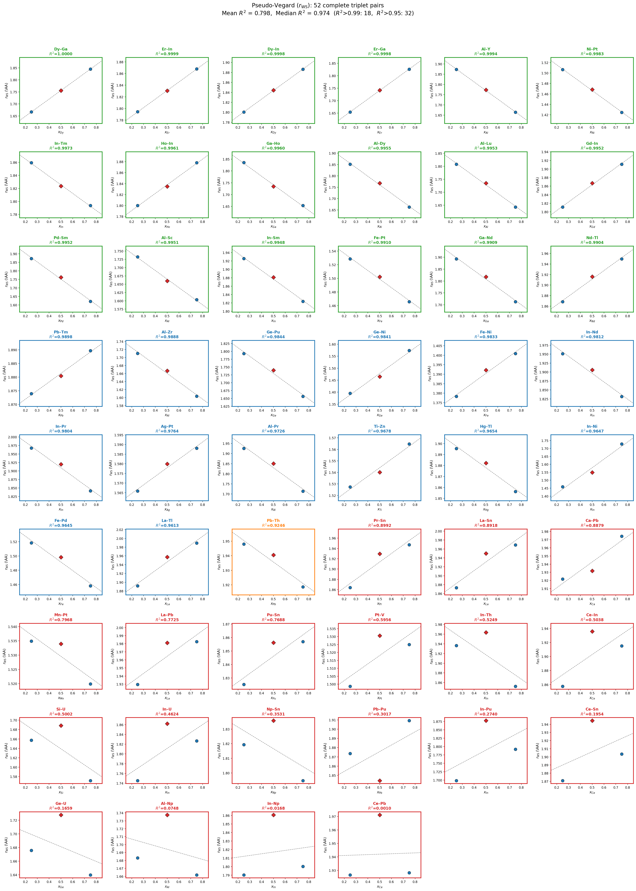
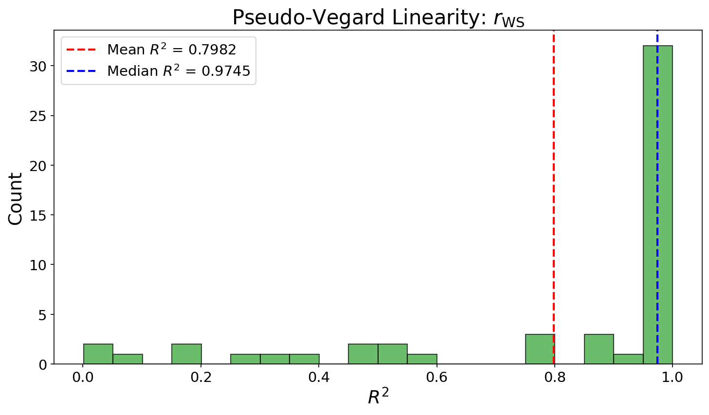
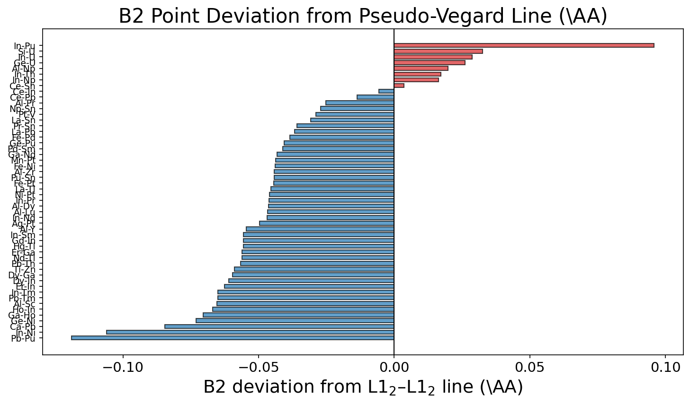
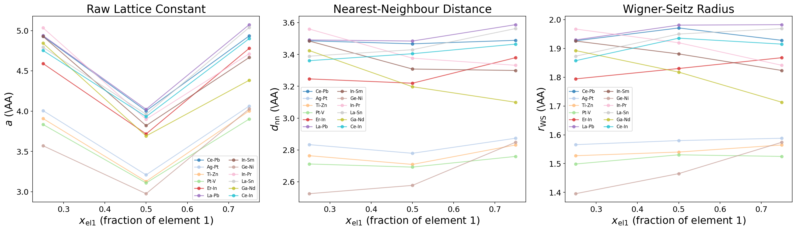

# 疑似Vegard則解析: B2 + L1$_2$ 組成スイープ

## 概要

二元系A–Bにおいて、L1$_2$ A$_3$B (75%A)、B2 AB (50%A)、
L1$_2$ AB$_3$ (25%A) の3つの秩序構造から得られる格子定数を用いて、
組成に対する線形性（疑似Vegard則）を検証する。

構造の違い（B2: BCC基盤 CN=8、L1$_2$: FCC基盤 CN=12）は
以下の3つの指標で評価する：

1. **生の格子定数 $a$** — 構造の違いを無視
2. **最近接原子間距離 $d_{\mathrm{nn}}$** — B2: $a\sqrt{3}/2$、L1$_2$: $a/\sqrt{2}$
3. **Wigner-Seitz半径 $r_{\mathrm{WS}}$** — $(V_{\mathrm{atom}})^{1/3}$

解析対象: **52 二元系** (MP + OQMD から L1$_2$ A$_3$B, B2 AB, L1$_2$ AB$_3$ すべてが利用可能なペア)

## 1. 線形性の統計

| Metric | Mean $R^2$ | Median $R^2$ | $R^2 > 0.99$ | $R^2 > 0.95$ | $R^2 < 0.90$ |
|:---|:---:|:---:|:---:|:---:|:---:|
| $a$ (raw) | 0.0652 | 0.0364 | 0 | 0 | 52 |
| $d_{\mathrm{nn}}$ | 0.6657 | 0.7777 | 1 | 5 | 39 |
| $r_{\mathrm{WS}}$ | 0.7982 | 0.9745 | 18 | 32 | 19 |

## 2. 最近接原子間距離 $d_{\mathrm{nn}}$ による解析

| Pair | $d_{\mathrm{nn}}$(25%) | $d_{\mathrm{nn}}$(50%) | $d_{\mathrm{nn}}$(75%) | $R^2$ | B2 deviation (\AA) |
|:---|:---:|:---:|:---:|:---:|:---:|
| Ce-In | 3.3610 | 3.4047 | 3.4651 | 0.9915 | -0.0055 |
| Ce-Sn | 3.3852 | 3.4202 | 3.4442 | 0.9886 | +0.0037 |
| Al-Pr | 3.4843 | 3.2549 | 3.1011 | 0.9872 | -0.0252 |
| Pd-Sm | 3.3880 | 3.0989 | 2.9330 | 0.9762 | -0.0411 |
| In-Th | 3.5036 | 3.4537 | 3.3517 | 0.9625 | +0.0173 |
| Ga-Nd | 3.4246 | 3.1974 | 3.0998 | 0.9496 | -0.0432 |
| Al-Dy | 3.3498 | 3.1096 | 3.0082 | 0.9479 | -0.0463 |
| Al-Y | 3.3892 | 3.1186 | 3.0116 | 0.9410 | -0.0546 |
| Al-Lu | 3.2715 | 3.0519 | 2.9721 | 0.9323 | -0.0466 |
| Ge-Pu | 3.2440 | 3.0596 | 2.9971 | 0.9249 | -0.0406 |
| La-Sn | 3.3893 | 3.4299 | 3.5628 | 0.9137 | -0.0308 |
| Er-Ga | 2.9922 | 3.0640 | 3.3042 | 0.9115 | -0.0561 |
| Dy-Ga | 3.0156 | 3.0874 | 3.3380 | 0.9070 | -0.0596 |
| In-U | 3.1581 | 3.2749 | 3.3052 | 0.8965 | +0.0288 |
| In-Pr | 3.5599 | 3.3768 | 3.3320 | 0.8908 | -0.0461 |
| Si-U | 2.9984 | 2.9699 | 2.8433 | 0.8825 | +0.0327 |
| Ga-Ho | 3.3209 | 3.0512 | 2.9928 | 0.8785 | -0.0705 |
| In-Nd | 3.5304 | 3.3519 | 3.3141 | 0.8765 | -0.0469 |
| In-Ni | 2.6393 | 2.7243 | 3.1273 | 0.8760 | -0.1060 |
| Ge-Ni | 2.5251 | 2.5771 | 2.8481 | 0.8671 | -0.0730 |
| Al-Zr | 3.0948 | 2.9318 | 2.9015 | 0.8643 | -0.0442 |
| Pr-Sn | 3.3727 | 3.3943 | 3.5234 | 0.8547 | -0.0359 |
| La-Tl | 3.4227 | 3.4430 | 3.5995 | 0.8346 | -0.0454 |
| Al-Sc | 3.1348 | 2.9200 | 2.9013 | 0.8097 | -0.0654 |
| In-Sm | 3.4845 | 3.3085 | 3.2994 | 0.7867 | -0.0556 |
| Gd-In | 3.2771 | 3.2840 | 3.4579 | 0.7787 | -0.0556 |
| Ni-Pt | 2.7259 | 2.5828 | 2.5775 | 0.7767 | -0.0460 |
| Fe-Pd | 2.7471 | 2.6351 | 2.6383 | 0.7280 | -0.0384 |
| La-Pb | 3.4914 | 3.4844 | 3.5874 | 0.6960 | -0.0366 |
| Nd-Tl | 3.3807 | 3.3699 | 3.5276 | 0.6954 | -0.0562 |
| Fe-Pt | 2.7658 | 2.6425 | 2.6523 | 0.6858 | -0.0444 |
| Dy-In | 3.2577 | 3.2439 | 3.4132 | 0.6841 | -0.0610 |
| Ge-U | 3.0322 | 3.0388 | 2.9670 | 0.6740 | +0.0262 |
| Er-In | 3.2465 | 3.2193 | 3.3798 | 0.6021 | -0.0625 |
| Ho-In | 3.2572 | 3.2276 | 3.3986 | 0.5982 | -0.0669 |
| Al-Np | 3.0454 | 3.0560 | 3.0067 | 0.5558 | +0.0199 |
| In-Tm | 3.3644 | 3.2073 | 3.2453 | 0.5282 | -0.0650 |
| In-Pu | 3.0734 | 3.3019 | 3.2427 | 0.5096 | +0.0959 |
| Pt-V | 2.7116 | 2.6921 | 2.7592 | 0.4745 | -0.0289 |
| Np-Sn | 3.2918 | 3.2289 | 3.2475 | 0.4700 | -0.0272 |
| Pu-Sn | 3.3023 | 3.2647 | 3.3599 | 0.3600 | -0.0443 |
| Hg-Tl | 3.4297 | 3.3107 | 3.3587 | 0.3512 | -0.0556 |
| Ti-Zn | 2.7637 | 2.7090 | 2.8311 | 0.3031 | -0.0590 |
| Ca-Pb | 3.4772 | 3.3979 | 3.5723 | 0.2963 | -0.0846 |
| In-Np | 3.2393 | 3.2727 | 3.2572 | 0.2870 | +0.0163 |
| Pb-Th | 3.5246 | 3.4132 | 3.4715 | 0.2270 | -0.0566 |
| Fe-Ni | 2.4939 | 2.4486 | 2.5347 | 0.2245 | -0.0438 |
| Ag-Pt | 2.8333 | 2.7790 | 2.8735 | 0.1798 | -0.0496 |
| Mn-Pt | 2.7772 | 2.6981 | 2.7501 | 0.1138 | -0.0437 |
| Pb-Pu | 3.3900 | 3.2439 | 3.4546 | 0.0898 | -0.1189 |
| Pb-Tm | 3.3907 | 3.3074 | 3.4191 | 0.0597 | -0.0650 |
| Ce-Pb | 3.4861 | 3.4670 | 3.4890 | 0.0147 | -0.0137 |

## 3. 生の格子定数 $a$ による解析

| Pair | $a$(25%) L1$_2$ | $a$(50%) B2 | $a$(75%) L1$_2$ | $R^2$ |
|:---|:---:|:---:|:---:|:---:|
| In-Ni | 3.7326 | 3.1457 | 4.4226 | 0.2914 |
| Pd-Sm | 4.7914 | 3.5783 | 4.1479 | 0.2811 |
| Al-Pr | 4.9275 | 3.7584 | 4.3856 | 0.2144 |
| Al-Y | 4.7930 | 3.6010 | 4.2591 | 0.1999 |
| Ge-Ni | 3.5710 | 2.9758 | 4.0279 | 0.1875 |
| Al-Dy | 4.7373 | 3.5906 | 4.2542 | 0.1760 |
| Ga-Nd | 4.8431 | 3.6920 | 4.3838 | 0.1571 |
| Ga-Ho | 4.6965 | 3.5232 | 4.2325 | 0.1541 |
| Dy-Ga | 4.2647 | 3.5651 | 4.7207 | 0.1534 |
| Er-Ga | 4.2316 | 3.5380 | 4.6729 | 0.1487 |
| Al-Lu | 4.6265 | 3.5240 | 4.2031 | 0.1449 |
| Ge-Pu | 4.5877 | 3.5329 | 4.2386 | 0.1055 |
| Al-Sc | 4.4333 | 3.3717 | 4.1030 | 0.0924 |
| In-Pu | 4.3464 | 3.8127 | 4.5859 | 0.0915 |
| In-Pr | 5.0344 | 3.8992 | 4.7121 | 0.0759 |
| Al-Zr | 4.3767 | 3.3853 | 4.1033 | 0.0713 |
| In-Nd | 4.9928 | 3.8705 | 4.6868 | 0.0695 |
| Si-U | 4.2404 | 3.4293 | 4.0210 | 0.0684 |
| Ni-Pt | 3.8550 | 2.9823 | 3.6451 | 0.0531 |
| In-Sm | 4.9279 | 3.8204 | 4.6661 | 0.0511 |
| In-U | 4.4663 | 3.7815 | 4.6742 | 0.0496 |
| Gd-In | 4.6345 | 3.7921 | 4.8902 | 0.0495 |
| La-Sn | 4.7932 | 3.9605 | 5.0386 | 0.0471 |
| La-Tl | 4.8405 | 3.9756 | 5.0904 | 0.0456 |
| In-Th | 4.9549 | 3.9879 | 4.7400 | 0.0448 |
| Dy-In | 4.6070 | 3.7457 | 4.8270 | 0.0370 |
| Pr-Sn | 4.7698 | 3.9194 | 4.9828 | 0.0359 |
| Nd-Tl | 4.7810 | 3.8912 | 4.9888 | 0.0318 |
| Fe-Pt | 3.9114 | 3.0513 | 3.7509 | 0.0308 |
| Ho-In | 4.6064 | 3.7269 | 4.8063 | 0.0303 |
| Fe-Pd | 3.8850 | 3.0427 | 3.7311 | 0.0294 |
| Er-In | 4.5913 | 3.7174 | 4.7797 | 0.0276 |
| In-Tm | 4.7579 | 3.7035 | 4.5895 | 0.0221 |
| Ce-In | 4.7532 | 3.9315 | 4.9004 | 0.0199 |
| La-Pb | 4.9375 | 4.0235 | 5.0733 | 0.0141 |
| Ca-Pb | 4.9175 | 3.9235 | 5.0519 | 0.0119 |
| Ge-U | 4.2881 | 3.5089 | 4.1960 | 0.0117 |
| Ti-Zn | 3.9085 | 3.1280 | 4.0038 | 0.0098 |
| Hg-Tl | 4.8503 | 3.8229 | 4.7500 | 0.0078 |
| Ce-Sn | 4.7874 | 3.9493 | 4.8709 | 0.0067 |
| Pt-V | 3.8348 | 3.1085 | 3.9021 | 0.0058 |
| Pu-Sn | 4.6702 | 3.7697 | 4.7516 | 0.0056 |
| Pb-Pu | 4.7941 | 3.7458 | 4.8856 | 0.0052 |
| Fe-Ni | 3.5269 | 2.8274 | 3.5846 | 0.0047 |
| Pb-Th | 4.9845 | 3.9412 | 4.9094 | 0.0042 |
| Al-Np | 4.3068 | 3.5287 | 4.2522 | 0.0040 |
| Np-Sn | 4.6554 | 3.7284 | 4.5927 | 0.0037 |
| Ag-Pt | 4.0068 | 3.2089 | 4.0637 | 0.0035 |
| Mn-Pt | 3.9276 | 3.1154 | 3.8892 | 0.0018 |
| Pb-Tm | 4.7952 | 3.8191 | 4.8353 | 0.0012 |
| In-Np | 4.5811 | 3.7789 | 4.6064 | 0.0007 |
| Ce-Pb | 4.9300 | 4.0033 | 4.9341 | 0.0000 |

## 4. 考察

### 4.1 構造の違いと指標の選択

生の格子定数 $a$ で比較した場合、B2（BCC基盤、$a \approx 3$–4 \AA）と
L1$_2$（FCC基盤、$a \approx 4$–5 \AA）のスケール差が大きいため、
$R^2$ は比較的低くなる傾向がある。

最近接原子間距離 $d_{\mathrm{nn}}$ またはWigner-Seitz半径 $r_{\mathrm{WS}}$ に
変換すると、構造の違いが正規化され、より意味のある比較が可能となる。

### 4.2 B2 点の偏差の意味

L1$_2$–L1$_2$ の2点を結ぶ直線からのB2点の偏差は、
CN=8（B2）とCN=12（L1$_2$）における原子サイズの違いを反映する。
B2点が直線より上（正の偏差）の場合、CN=8環境で原子間距離が
CN=12の外挿値より大きいことを意味し、配位数依存性を示唆する。
